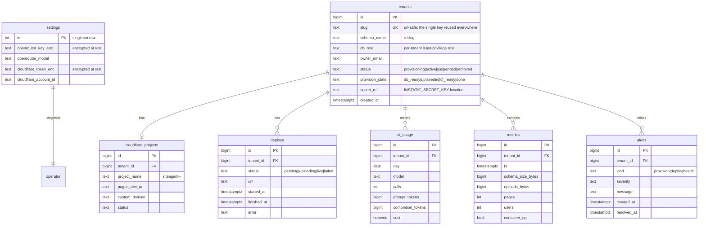

# DB Architecture: SiteAgent — Database Design
_Expands [`Architecture.md`](Architecture.md) §3. Authoritative for the data layer. The per-tenant content tables are **Instatic-owned**; this doc defines the **control-plane** schema and the **isolation model** SiteAgent enforces around Instatic._

## Goal
One Postgres server, **one shared database** (`siteagent`), carved into **one schema per Tenant** plus a **control-plane schema**. Tenant data isolation is **database-enforced** (per-tenant least-privilege role); the Operator/admin role sees everything. The control plane (Registry) is the source of truth for tenants, deploys, settings, usage, and alerts.

## Stores at a glance (what lives where)
| Store | What | Owner |
|---|---|---|
| `siteagent` DB → schema `<slug>` | One Tenant's Instatic tables (pages, media, users, drafts, audit…) | **Instatic** (its own migrations) |
| `siteagent` DB → schema `siteagent_control` | Registry: tenants, deploys, settings, usage, metrics, alerts | **SiteAgent** (our migrations) |
| Host disk `tenants/<slug>/uploads/` | Media + baked `published/` output | Bind-mounted into the container |
| Cloudflare Pages | The live, published static site | Cloudflare |

## Entity-relationship overview (control-plane)

## Tables (control-plane zone — `siteagent_control`)
**`settings`** — one row; the Operator's global config.

| Column | Type | Notes |
|---|---|---|
| `openrouter_key_enc` | text | OpenRouter key, **encrypted at rest**; only the AI Gateway decrypts |
| `openrouter_model` | text | selected model id |
| `cloudflare_token_enc` | text | CF API token, encrypted |
| `cloudflare_account_id` | text | CF account id |

**`tenants`** — one row per Tenant; the fleet registry.

| Column | Type | Notes |
|---|---|---|
| `slug` | text NOT NULL **UNIQUE** | the single key reused for schema/role/container/CF project/subdomain |
| `schema_name` | text NOT NULL | equals `slug` |
| `db_role` | text NOT NULL | the per-tenant least-privilege role |
| `owner_email` | text | Tenant Admin login |
| `status` | text | `provisioning` / `active` / `suspended` / `removed` |
| `provision_state` | text | saga checkpoint: `db_ready` → `up` → `seeded` → `cf_ready` → `done` |
| `secret_ref` | text | where this tenant's `INSTATIC_SECRET_KEY` lives |

**`deploys`** — one row per publish; drives the "last publish / live URL / deploy status" UI.
**`ai_usage`** — per Tenant × day × model token/cost rollup from the AI Gateway.
**`metrics`** — periodic per-Tenant storage/health samples from the Metrics Collector.
**`alerts`** — provision/deploy/health failures surfaced to the Operator.

> **Per-tenant content tables** (`<slug>.pages`, `<slug>.media`, `<slug>.users`, …) are created and migrated by **Instatic itself** when its container boots against the schema. SiteAgent never defines or writes them directly — it only provisions the empty schema + role and reads metadata (size, counts) for dashboards.

## Isolation model (defense in depth)
1. **Role privileges (the real wall).** `REVOKE ALL ON SCHEMA public FROM PUBLIC`; each tenant role gets `USAGE`/`CREATE` on **its own schema only**, never on another's. A tenant — and the AI inside it — gets `permission denied for schema <other>` when reaching across. *(Proven on real Postgres 18 — `PLAN-REVIEW-LOG.md` spike #9.)*
2. **`search_path` pinned at the role** — `ALTER ROLE <role> SET search_path = <schema>` (applies at login; survives pooled connections — unlike client-set state).
3. **Connection scoping** — each container's `DATABASE_URL` carries only its own role + schema.
4. **Admin visibility** — the owner/admin role (the single env credential) spans all schemas; that is how the Operator reads across tenants. It is the only hand-set credential; per-tenant roles are auto-minted.
5. **Least surprise on PG15+** — a fresh tenant role has **no** `CREATE` on `public` by default (verified), and cannot read `pg_authid` password hashes (verified).

> **Accepted gap — metadata name-leak.** Postgres system catalogs (`pg_namespace`, `pg_class`) are globally readable, so a Tenant can see other schemas'/tables' **names**, never their **data**. `information_schema` *is* privilege-filtered; raw `pg_catalog` is not. Stronger isolation (DB-per-tenant / SQLite-per-instance) is the documented upgrade path before competing tenants.

## Migrations &amp; ownership
- **Instatic-owned DDL** — runs inside each `<slug>` schema when the container boots; pinned to the image version.
- **SiteAgent-owned DDL** — the `siteagent_control` schema; our versioned migrations.
- **Extensions** — pre-installed once by the admin (a restricted tenant role can't `CREATE EXTENSION`).
- **Provisioning is idempotent** — mint = guarded `CREATE ROLE` + `CREATE SCHEMA IF NOT EXISTS` + `ALTER ROLE search_path` (re-running is a no-op — verified). **Deprovision** = `DROP SCHEMA … CASCADE` + `DROP ROLE` (leaves zero residue — verified).

## Index summary (hot paths)
| Index | Purpose |
|---|---|
| `tenants(slug)` UNIQUE | resolve a Tenant by its single key |
| `deploys(tenant_id, started_at DESC)` | "last publish / recent deploys" |
| `ai_usage(tenant_id, day, model)` UNIQUE | per-Tenant usage rollup (upsert) |
| `metrics(tenant_id, ts DESC)` | latest health sample + time series |
| `alerts(tenant_id, created_at DESC) WHERE resolved_at IS NULL` | open alerts |

## Capacity &amp; scaling
One Postgres at default `max_connections = 100` realistically serves **~5–8 Tenant containers** (each holds a pool) before you raise `max_connections` or front it with **PgBouncer**. Schema size + uploads size per Tenant feed the dashboard; central `pg_dump -n <schema>` + `uploads/` is the per-Tenant backup unit.

## Risks / open questions
- Does Instatic's migration tool honor a non-`public` schema, or hardcode `public`? → spike #9 Instatic half (needs Docker); fallback = DB-per-tenant.
- Single shared DB = one blast radius; mitigate with encrypted central backups + network isolation; guard the admin credential.
- Connection ceiling → pooler before the fleet grows.

## Out of scope
Sharding/partitioning; cross-region replication; per-tenant separate database servers (a documented upgrade, not the default); billing/metering enforcement.
