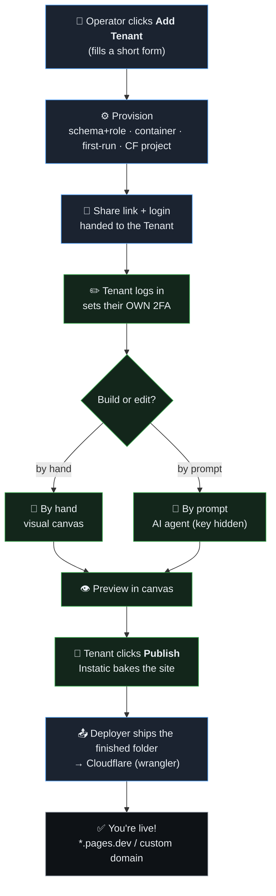

# SiteAgent — Simple Diagrams
_Two easy-to-read pictures: **what runs where**, and **the human journey**. Detail lives in [`Architecture.md`](Architecture.md) and [`UserFlow.md`](UserFlow.md)._

## 1. Architecture — What Runs Where
```mermaid
flowchart TB
  OPR["🔑 Operator (admin)"]:::actor

  subgraph CP["Control plane (Operator side)"]
    CON["🖥️ Operator Console<br/>settings · tenants · dashboards"]:::op
    PROV["⚙️ Provisioner"]:::op
    DEP["🚀 Publish Deployer"]:::op
    GW["🛡️ AI Gateway<br/>holds the ONE OpenRouter key"]:::op
    REG[("📚 Registry<br/>siteagent_control")]:::data
  end

  subgraph DB[("🗄️ ONE shared Postgres")]
    SA["schema: acme"]:::data
    SG["schema: globex"]:::data
  end

  subgraph FLEET["🏠 Tenant Instatic instances (Docker, pinned)"]
    T1["📦 acme :3001"]:::tenant
    T2["📦 globex :3001"]:::tenant
  end

  OR["🤖 OpenRouter"]:::ext
  CF["☁️ Cloudflare Pages<br/>live public sites"]:::ext

  OPR --> CON
  CON --> PROV
  CON --> DEP
  CON --> GW
  CON --- REG
  PROV --> T1
  PROV --> T2
  PROV --> DB
  T1 -- "own role only" --> SA
  T2 -- "own role only" --> SG
  T1 -- "AI call (no key)" --> GW
  T2 -- "AI call (no key)" --> GW
  GW -- "+ real key" --> OR
  T1 -- "bake" --> DEP
  T2 -- "bake" --> DEP
  DEP --> CF

  classDef actor fill:#2b2233,stroke:#d2a8ff,color:#e9eef3;
  classDef op fill:#1b2330,stroke:#58a6ff,color:#e9eef3;
  classDef tenant fill:#13261b,stroke:#2ea043,color:#e9eef3;
  classDef data fill:#23201a,stroke:#d29922,color:#e9eef3;
  classDef ext fill:#0e1216,stroke:#8b949e,color:#e9eef3;
```

### How to read it (the 5 rules that matter)
1. **The Operator Console is the only admin surface** — it drives the Provisioner, Deployer, and Gateway and reads the Registry.
2. **Every Tenant is its own container** and talks to Postgres **only as its own role** → it can reach **only its own schema**.
3. **The AI key never leaves the Operator** — tenants call the **AI Gateway**, which adds the key before OpenRouter.
4. **One shared Postgres**, many schemas — isolation is enforced by database privileges, not by convention.
5. **Cloudflare serves the public sites**, offloading the host; SiteAgent owns the deploys.

## 2. Workflow — The Human Journey


### How to read it (the Tenant's journey in 5 beats)
1. **Onboard** — the Operator adds the Tenant with a form; the system builds everything and returns a share link.
2. **First login** — the Tenant logs in with email + password and sets up their own 2FA.
3. **Build** — the Tenant edits the site two ways: by hand in the canvas, or by prompting the AI agent.
4. **Preview** — changes are reviewed in Instatic's canvas before going live.
5. **Publish → live** — one click bakes the site; the Deployer ships the finished folder to Cloudflare; a live URL appears.

### The two diagrams connect
| In the journey (human) | What actually happens (architecture) |
|---|---|
| Operator clicks "Add Tenant" | Provisioner mints schema+role, starts the container, runs first-run, creates the CF project |
| Tenant edits with AI | The instance calls the **AI Gateway**, which injects the hidden key and forwards to OpenRouter |
| Tenant clicks Publish | Instatic bakes to `uploads/published/<ts>/`; the **Deployer** confirms it's complete and uploads it |
| "You're live!" | The **Cloudflare Pages** project serves the static site at its URL; the Registry records the deploy |
