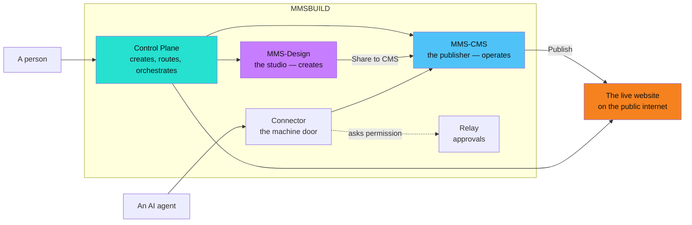
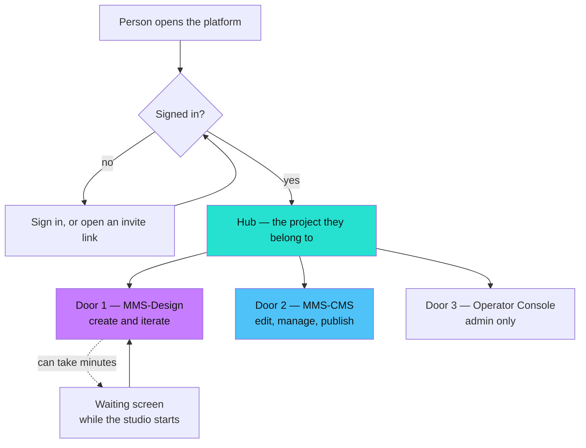
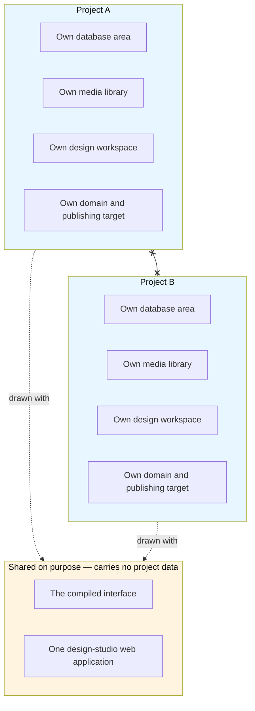
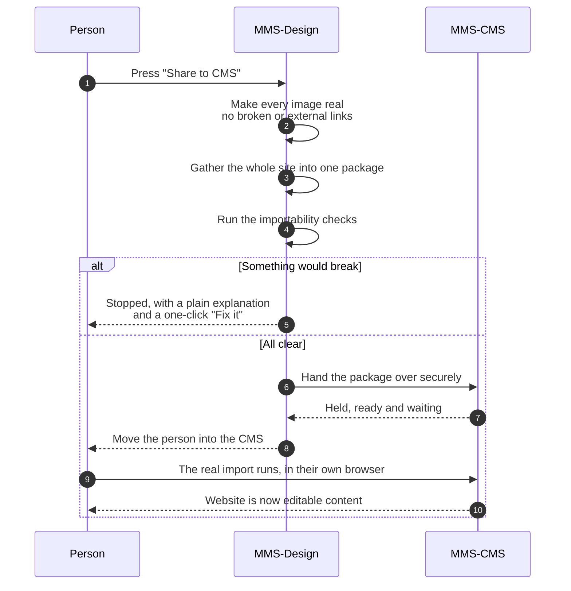
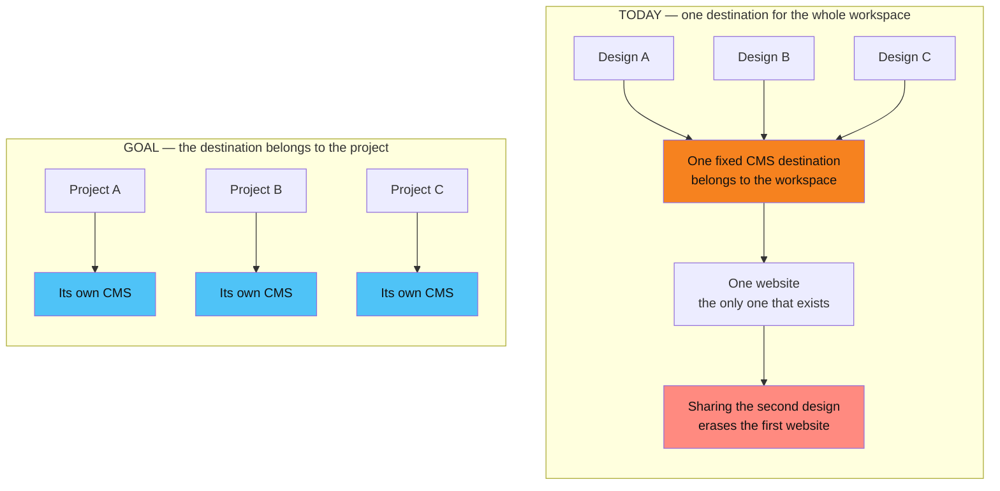
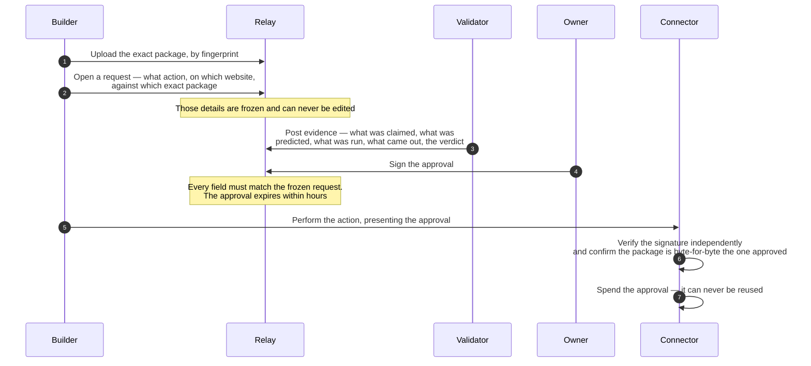
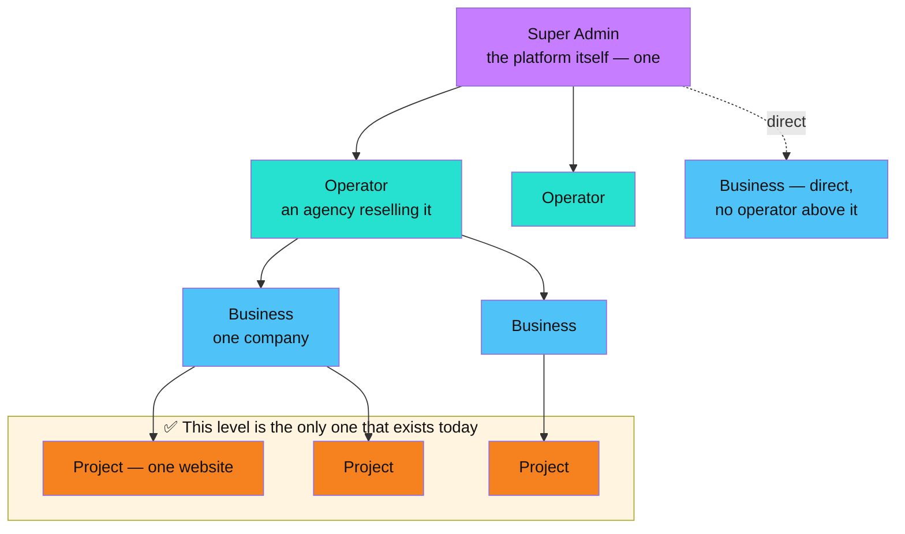

# MMSBUILD — Current-State Architecture

_What the platform is today, in plain language: the parts, how they fit together, what is isolated from what, how a website goes from a design to a live page, and exactly how many websites a project can hold today versus where we are heading. No code, no internals — this is the shareable picture. The same material, drawn: [`mmsbuild-current-state.html`](./mmsbuild-current-state.html)._

---

## 0. How to read this

This describes the platform **as it works today**, not as it is planned to work. Where today and the goal differ, both are shown side by side and clearly labelled.

**Legend:** ✅ working today · 🟡 partly there · ❌ not built yet

**The words used here**

| Term | What it means |
|---|---|
| **MMSBUILD** | The platform as a whole |
| **MMS-Design** | The AI design studio, where a website is created and iterated |
| **MMS-CMS** | The content system, where a website is edited and published |
| **Control Plane** | The orchestrator — creates workspaces, starts and stops everything, routes every visitor |
| **Operator Console** | The admin screen where workspaces are created and settings are held |
| **Connector** | The machine door — lets an external AI agent work on a website without a person clicking |
| **Relay** | The approval system — signed permission before anything risky happens |
| **Project** | One website. Today this is the unit of complete separation |
| **Operator** | An agency that resells the platform to businesses |
| **Business** | One company that owns one or more websites |

---

## 1. The platform at a glance

Five parts. Everything else is a detail of one of them.

**The Control Plane** is the spine. It creates a new project, starts and stops the software each project needs, decides where every incoming visitor is sent, handles sign-in, buys and holds the AI capacity every project draws on, and pushes finished websites out to the public internet. If it is down, nothing else is reachable.

**MMS-Design** is the studio. A person describes what they want, and an AI builds a real website — pages, styling, images, layout. It is where the creative work happens. **It never publishes anything.**

**MMS-CMS** is the operating surface and **the only thing that publishes**. Once a design arrives here, it becomes editable content: pages, text, images, blog posts, collections, SEO fields. Pressing Publish is what puts a website in front of the public.

**The Connector** is the same CMS capability exposed to machines instead of people — an external AI agent can list, create, edit, import and publish through it. It is how a website can be built or updated without anyone clicking through screens.

**The Relay** is the permission layer sitting in front of anything destructive. Risky actions cannot happen on a signature alone from the person doing the work; the owner has to sign off, and that signature is checked independently at the point of action.

### Diagram A — the five parts

> **The one rule that governs everything:** MMS-Design creates, MMS-CMS publishes. A design is not live until it has crossed into the CMS and someone has pressed Publish.

---

## 2. The Control Plane

Everything public enters through a single front door, and the Control Plane decides what happens next. Three jobs:

**It creates projects.** Creating a project is not one action — it is a chain: reserve the name, create an isolated database area with its own restricted credentials, start the content system for it, wait for it to be healthy, create its first login, then create its publishing target on the hosting provider. If any step fails the project is left marked as failed rather than half-built.

**It runs the software.** Each project needs its own running processes. The Control Plane starts them when the platform boots, restarts them if they crash, and starts one on demand the moment someone actually asks for it. A design studio takes a few minutes to become ready from cold — until then the platform shows a waiting screen rather than an error.

**It routes every request.** One address serves the admin console, every project's design studio, every project's CMS and the machine door. Which project a visitor lands in is decided entirely by who they are signed in as.

> 🔑 **One person is signed into one project at a time.** There is no separate web address per project — everyone uses the same address, and the sign-in decides which project they see. Working on two projects at once means two browsers or two profiles. This is a real limitation today, not a preference.

### Diagram B — how a person reaches their work

---

## 3. What a project is, and what is walled off

A project is the unit of complete separation, and that separation is genuinely enforced rather than merely intended.

| Each project has its own | Meaning |
|---|---|
| **Database area with its own credentials** | Separation is enforced by the database itself, not by application code remembering to filter. One project physically cannot read another's content. |
| **Media library on disk** | Uploaded images and files live in that project's own folder. |
| **Design workspace** | Its own design history, drafts, saved styles and generated assets. |
| **Running software** | Its own content-system process and its own design-studio process. |
| **Encrypted secrets** | Never shared, never handed down to the software that does not need them. |
| **Publishing target and domain** | Its own hosting project and its own custom domain. |

Exactly **two things are shared on purpose**, and neither carries any project's data: the compiled front-end application both products' screens are drawn with, and a single design-studio web application that serves every project's interface. Sharing these was a deliberate decision — a per-project copy meant a separate build and a separate running process for every project, which does not scale past a handful.

### Diagram C — the walls

**Two flavours of project exist.** A *lite* project gets the design studio only — it can create, but it has nowhere to publish to, so the Share-to-CMS button does nothing. A *full* project gets the whole chain and can go live.

---

## 4. From a design to a live website

This is the main pipeline, and it is the part that works end to end today.

### Diagram D — the full journey

```mermaid
flowchart LR
  A["1 — Describe it<br/>a person tells the AI what they want"]
  B["2 — MMS-Design builds it<br/>real pages, styling, images"]
  C["3 — Checks run<br/>is this importable?"]
  D["4 — Share to CMS<br/>the design crosses over"]
  E["5 — MMS-CMS<br/>fully editable content"]
  F["6 — Publish<br/>a deliberate human action"]
  G["7 — Live on the internet<br/>own domain"]

  A --> B --> C
  C -->|"problems found"| B
  C -->|"clean"| D --> E --> F --> G

  style B fill:#C77DFF,color:#111
  style E fill:#4FC3F7,color:#111
  style G fill:#F6821F,color:#111
```

**Step 3 deserves a note.** The CMS reads a website as a text file — it never runs the page's code. So a page can look perfect in a browser and still arrive in the CMS broken or empty. To prevent that, the design studio is held to a written build contract, and every share is checked against it before it is allowed through. Failing checks stop the share and offer a one-click "Fix it" that sends the problem back to the AI to correct. Warnings are recorded but never block.

Two things about those checks are worth knowing honestly:

- The contract the AI is *taught* and the checks that actually *block* are two separate things kept deliberately in step. If they ever drift, the AI can be taught something the gate still rejects.
- If the checking step itself crashes, the share **goes through unchecked**. A crash there looks like a success, not a block.

**Step 6 is deliberately heavy.** Publishing requires re-entering the password, and it is the only action that reaches the public internet. Saving, editing and importing never do.

---

## 5. Share to CMS — the handover

The design studio does not reinvent importing. Share to CMS automates, step for step, the same import a person could do by hand — that is the whole design principle behind it.

### Diagram E — what actually happens on a share

> ⚠️ **A re-share replaces; it does not merge.** MMS-Design is the source of truth. Sharing again wipes the current design in the CMS first and rebuilds it to match, so the two stay identical and no duplicate pages accumulate. Nothing is touched in storage until the import succeeds, so a failed share loses nothing.
>
> **The practical consequence:** a re-share also clears the site's colour tokens and installed fonts, because they are part of the design being replaced. Fonts must be reinstalled after any replace-style import. Re-installing is safe — an already-installed font is skipped.

---

## 6. ⚠️ How many websites can a project hold?

This is the question that prompted this document, so here is the direct answer.

> **A project's design studio can hold many separate website designs. Its CMS can hold exactly one website. All of the designs push into that same one.**

There is **no setting that limits this to one**, and no number to raise. The limit is structural — it comes from three independent facts that all have to change together:

1. **The design studio has one CMS destination, fixed for the whole workspace.** The destination belongs to the workspace, not to the individual design. Every design in that workspace points at the same place.
2. **The handover carries no destination.** The package that crosses over says *what* to import but never *where*. Where is decided entirely by which CMS received it.
3. **The CMS is a single-website product.** It holds one website, full stop. There is no concept of a second one to switch to.

**What this means in practice.** Build two websites in one project's studio. Share the first — it lands correctly. Share the second — the CMS blanks what is there and rebuilds it from the second design. **The first website is gone.** No warning, no conflict prompt, no duplicate — it reads exactly like a successful update. If both had a homepage, it looks even more convincing.

**Why nothing has gone wrong so far:** today we run one website per project, so the project boundary is doing all the protecting. Nothing in the handover itself is protecting anything.

**The supporting evidence is consistent with this:** creating a new website through the machine door does not add a website to an existing project — it creates a whole new project. Clearing a website clears the whole project. One login covers everything a project owns.

### Diagram F — today versus the goal

**The goal is one sentence:** *one project is one domain is one website*, and a design can only ever reach its own project's CMS.

**Two ways to get there:**

| Route | What it means | Cost |
|---|---|---|
| **A — a project stays the unit** | Keep today's complete separation and simply add the two levels above it, so a business can own several projects. One website per project, many projects per business. | **Smaller.** Everything expensive is already built; it is the levels above that are missing. |
| **B — several websites inside one project** | Attach the destination to each individual design, add a website identifier to the handover, and teach the CMS to hold more than one website. | **Larger.** Changes all three layers, in all three parts of the platform. |

Route A is what the platform is already shaped for, and it is what the plan describes. Route B is what it would take to genuinely run several websites inside a single project.

---

## 7. Machine access — the Connector and agent keys

There are **two separate machine doors**, and they are easy to confuse.

| | **Agent keys** | **The Connector** |
|---|---|---|
| Who it is for | An AI assistant working inside one website, day to day | A builder or automation setting a whole website up |
| Reach | One website per key | Any allowed project, chosen per call |
| Permissions | Fine-grained — read only, author, publisher, or full; can be narrowed to specific content types | None. Full access by design |
| What holds it back | The permission set on the key | An allow-list of projects, a full activity log, typed confirmation phrases, and owner-signed approval for anything risky |
| Typical use | "Write and publish this month's blog posts" | "Import this entire website, set up its content types, install its fonts, publish it" |

The Connector's tool set covers the whole lifecycle: connect to a project, preview an import before committing to it, import a site, create content types and fields, add SEO fields, install fonts, upload media, create and edit rows, publish a single page or the whole site, export everything back out, and create an entirely new project.

> **Known limitation on agent keys.** An agent key can sometimes see only the four standard content types and none of the website's custom ones. This is not a permissions problem — the agent's access list is fixed at the moment its bridge is installed, so a website whose custom content types were created afterwards is not on that list. The fix is to regenerate the list and reinstall the bridge, which requires an admin to re-approve it. The Connector is unaffected and always sees everything.

---

## 8. Approvals — the Relay

Anything destructive is gated. The gate is not a checkbox in the tool — it is a cryptographic signature from the owner, checked independently at the moment of action.

### Diagram G — the approval loop

Three properties make this more than a formality:

- **Nothing can be edited or deleted.** The record is append-only, enforced by the database itself. A request cannot be quietly reworded after approval.
- **One approval, one action, one website, one package.** An approval for a gentle action cannot be spent on a harsher one, and an approval for one website cannot be used on another.
- **The two ends do not trust each other.** The system that issues approvals and the system that acts on them share no code. They are kept honest by a shared set of test cases both must pass.

If the approval policy is missing or unreadable, **nothing gated runs at all** — it fails closed rather than open.

The eight gated actions are: importing a site, merging content in either mode, publishing a site, publishing a single page, taking a page back to draft, unpublishing a page, and deleting.

---

## 9. Where today sits against the plan

The plan describes four levels. Today, only the bottom one exists.

### Diagram H — the four levels

**This is better news than it sounds.** The expensive half is finished. Everything that makes one website genuinely independent of another — its own database, media, design workspace, domain, secrets and publishing target — is built and working. What is missing is the cheap half: the two organisational levels above it, and a notion of who is allowed to do what.

| What the plan describes | Today | Note |
|---|---|---|
| Complete separation per website | ✅ | Enforced by the database, not by convention |
| Design → CMS handover with no duplicates | ✅ | Working end to end |
| Publishing to a real domain | ✅ | Own domain per project |
| AI capacity supplied centrally, no per-project keys | ✅ | Projects draw on the platform's capacity |
| Machine access for AI agents | ✅ | Two doors, described above |
| Owner-signed approval for risky actions | ✅ | Independent verification at both ends |
| Operator and Business levels | ❌ | No concept of them exists |
| Roles and permissions for people | ❌ | Everyone signing in is treated the same |
| More than one person per project | ❌ | Exactly one login per project |
| Agency branding in place of the platform's | ❌ | One global brand |
| Several websites under one business, each with its own CMS | 🟡 | Many designs, one CMS — see §6 |
| A platform owner who can see counts but not open the work | ❌ | Not built |
| A single project hub with three doors into one website | ❌ | Today's hub is a tool launcher |
| An AI operator that maintains a live site — blogs, SEO, edits | ❌ | The machine doors exist; the orchestration does not |

**The order the remaining work has to happen in** is already settled and does not change here: the organisational levels first, then renaming the unit from a workspace to a project, then roles, then scoping what a signed-in person can see — and only then can a per-project CMS destination be attached, because it depends on all of them.

---

## 10. The honest list

Things that are true today and would surprise someone who has not worked on it:

1. **One person, one project, one browser.** Which project you are in is decided by your sign-in, not by the web address. Two projects at once means two browsers.
2. **A second design shared into the same project silently destroys the first website.** §6.
3. **The importability gate fails open.** If the checker crashes, the share goes through unchecked and looks successful.
4. **A re-share clears colour tokens and fonts** along with the design, because they are part of the design.
5. **A replace-style import also destroys the published history** of every page, not just the drafts.
6. **Published state lives in several places at once** — the database, the baked files on disk, an in-memory cache, and a collaboration log that can re-create pages you deleted. Clearing one does not clear the others; there is a dedicated script that clears all of them.
7. **The admin console has no sign-in.** Deliberate for the current testing phase, not safe for a real operator deployment.
8. **A design studio takes a few minutes to become ready from cold.** Every request to it fails until it is up, which historically got misread as "the software is not installed".

---

## 11. For the team — deeper internal docs

_Everything above stands on its own. This last section is internal navigation only: these are engineering documents inside the repository, not part of the shareable picture._

| For | Read |
|---|---|
| The full target — the four levels, the hub, the AI operator | [`../platform/mmsbuild-platform-vision.md`](../platform/mmsbuild-platform-vision.md) |
| The target placed next to the current code, point by point | [`../platform/mmsbuild-vision-vs-today.md`](../platform/mmsbuild-vision-vs-today.md) |
| How tenancy behaves as it grows — noisy neighbours, data tiers, cells | [`../platform/mmsbuild-scale-architecture.md`](../platform/mmsbuild-scale-architecture.md) |
| The Share-to-CMS contract and the acceptance bar it must meet | [`../integration/od-cms-vision.md`](../integration/od-cms-vision.md) |
| Why the importability checks exist and how to fix a new failure | [`../integration/od-cms-compliance.md`](../integration/od-cms-compliance.md) |
| The full machine-door tool reference | [`../connector/connector-guide-v2.md`](../connector/connector-guide-v2.md), [`../connector/mms-mcp-v2.md`](../connector/mms-mcp-v2.md) |
