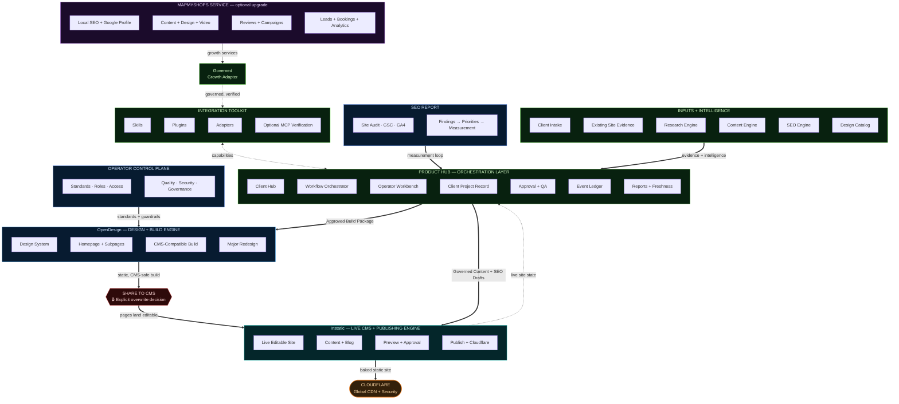
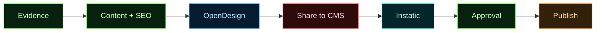
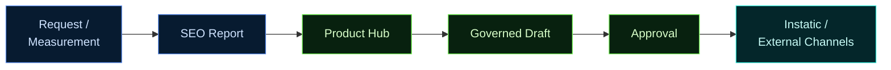
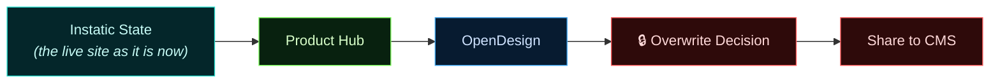
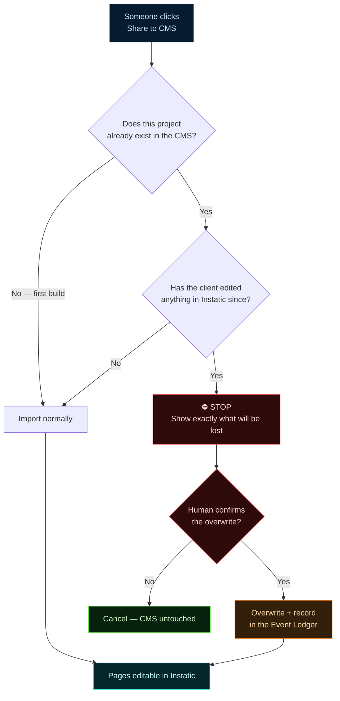
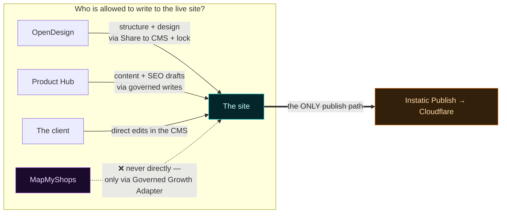

# MMSBUILD — Product Hub Operating System

_Transcription + analysis of the client's architecture poster (received 2026-08-03), redrawn as
rendered diagrams. Companion to [`mmsbuild-project-plan.md`](./mmsbuild-project-plan.md) (the
2026-07-06 plan this supersedes in places) and
[`../mmsbuild-handoff/10-integration-summary.md`](../mmsbuild-handoff/10-integration-summary.md)
(what is actually built today)._

> **The whole system in one line:**
> **Product Hub orchestrates. OpenDesign creates. Instatic operates and publishes.**
>
> And the footer rule: **Instatic remains the sole website publisher.**

---

## 1. Explain it like I'm not technical

Imagine a **restaurant**.

| Restaurant | MMSBUILD | What it actually does |
|---|---|---|
| **Front of house / manager** | **Product Hub** | Takes the client's order, tracks the job, decides what gets cooked and when, gets sign-off, sends the bill and the monthly report |
| **Kitchen** | **OpenDesign** | Actually cooks the dish — designs and builds the website |
| **The dining room + waiters** | **Instatic** | Where the food is served and kept fresh — the live, editable website, blog, preview, and the one place that publishes |
| **The delivery van** | **Cloudflare** | Takes the finished plate to the customer, fast, everywhere |
| **Health inspector / house rules** | **Operator Control Plane** | Standards, who's allowed to touch what, security, quality |
| **Suppliers + market research** | **Inputs + Intelligence** | Where the raw ingredients come from — what the client told us, what their old site says, what Google says |
| **Optional catering add-on** | **MapMyShops Service** | A separate paid service (ads, reviews, videos, bookings) the client can bolt on later |

**The one rule that never bends:** the kitchen never serves food directly to the customer. Everything
goes through the dining room. In our terms — **OpenDesign never publishes. Only Instatic publishes.**

### A worked example — "Bloom Beauty Studio, Kochi"

1. **Intake.** The owner fills a short form: business name, WhatsApp number, 6 services, old site
   `bloombeauty.in`, goal = "more WhatsApp bookings". → *Client Intake*
2. **Evidence.** The system reads her old site: 4 pages, no prices, no service pages, no reviews,
   last updated 2019. → *Existing Site Evidence*
3. **Intelligence.** Research finds 3 competitors ranking for "bridal makeup Kochi"; the SEO Engine
   flags 12 missing keywords; the Content Engine drafts service copy; the Design Catalog picks a
   salon look. → *Research / Content / SEO Engine, Design Catalog*
4. **The Hub packages it.** All of that becomes an **Approved Build Package** — a single instruction
   sheet: "build these 6 pages, this brand, this copy, these CTAs." → *Workflow Orchestrator*
5. **OpenDesign builds it.** Homepage + 5 subpages, in a **CMS-compatible** way (this is critical —
   see §5).
6. **Share to CMS.** One button. The design lands in Instatic as **real editable pages**.
7. **Approval.** The owner previews it, asks for one change, approves.
8. **Publish.** Instatic bakes the static site → Cloudflare → live.
9. **Every month after that:** the SEO Report says "add a bridal FAQ, refresh the pricing page." The
   Hub turns that into a **governed draft**, she approves, Instatic publishes. No redesign needed.
10. **Two years later** she wants a totally new look → **Major Redesign** track (§4.3).

---

## 2. The full system map

---

## 3. What each layer is for

### 3.1 Inputs + Intelligence — *"what do we know?"*
Everything the system learns **before** anyone designs anything.

| Block | Plain English | Example |
|---|---|---|
| Client Intake | The short form the owner fills in | "Bloom Beauty, Kochi, WhatsApp 98xxx, 6 services" |
| Existing Site Evidence | We read their current website | "4 pages, no prices, last updated 2019" |
| Research Engine | We look at the market | "3 competitors rank for 'bridal makeup Kochi'" |
| Content Engine | We draft the words | Service descriptions, FAQs, CTAs |
| SEO Engine | We find search opportunities | "12 keywords missing, no local schema" |
| Design Catalog | A shelf of proven looks | "Salon / premium / warm" |

**Why it matters:** the AI never starts from a blank page. It starts from a brief.

### 3.2 Product Hub — *"who decides what happens next?"*
The **brain**. Not an AI — a workflow system. Agents are workers; the Hub is the manager.

| Block | Plain English |
|---|---|
| Client Hub | The calm, non-technical screen the client actually uses |
| Workflow Orchestrator | The state machine: intake → build → review → publish → monthly |
| Operator Workbench | Our internal screen: all clients, all jobs, what's stuck |
| Client Project Record | One file per client — the single source of truth about them |
| Approval + QA | Nothing goes live without a checked box |
| Event Ledger | An append-only history: who did what, when, at what cost |
| Reports + Freshness | "This month we refreshed 3 pages and added 8 images" |

### 3.3 Integration Toolkit — *"how do we plug new abilities in?"*
**Skills** (a capability an agent can invoke), **Plugins** (extensions inside the CMS),
**Adapters** (connectors to outside services), **Optional MCP Verification** (an independent
machine-readable check that a job really did what it claimed).

### 3.4 Operator Control Plane — *"what are the house rules?"*
Standards, roles, access, quality, security, governance. Note it points **into OpenDesign**: the
rules constrain what the design engine is allowed to produce. This is exactly what
[`Operator/rules/templateRule.md`](../Operator/rules/templateRule.md) already does today.

### 3.5 Website Production Core — *the only part that touches the real site*
- **OpenDesign** = design + build. Design System, Homepage + Subpages, **CMS-Compatible Build**,
  Major Redesign.
- **Share to CMS** = the one bridge, with a **lock** on it.
- **Instatic** = live editable site, content + blog, preview + approval, publish.
- **Cloudflare** = delivery.

### 3.6 MapMyShops Service — *the optional upsell*
Local SEO, Google Profile, video, reviews, campaigns, bookings, analytics. It does **not** wire
straight into the website. It goes through a **Governed Growth Adapter**, which registers into the
Integration Toolkit. Translation: *paid growth services can never quietly change the client's
website; they have to come in through the front door and be governed like everything else.*

---

## 4. The three lifecycle tracks

### 4.1 Initial build — first launch

> *Bloom Beauty: form → brief → 6 pages built → shared → previewed → approved → live in days.*

### 4.2 Ongoing growth — the monthly loop (no redesign)

**Read this one carefully — it is the heart of the business model.** Routine improvement
**never goes back through OpenDesign**. The Hub writes governed content + SEO drafts straight into
Instatic. That keeps the monthly service cheap, safe and fast, and it is why the client can be sold
a recurring plan rather than one-off builds.

> *Bloom Beauty, month 3: GA4 shows the bridal page gets traffic but no bookings → Hub drafts a new
> FAQ + a WhatsApp CTA → she approves → published. OpenDesign was never opened.*

### 4.3 Major redesign — the round trip

The redesign **starts from the current live site**, not from scratch. Two years of the client's own
edits, blog posts and images are pulled back into the Hub, handed to OpenDesign as context, and only
then is a new design built.

---

## 5. The two ideas that carry the whole design

### 5.1 "CMS-Compatible Build" — the kitchen only cooks what the dining room can serve

Instatic's importer reads a page **as text**; it never runs the page's JavaScript. So a beautiful
page built the wrong way imports **blank**. OpenDesign is therefore constrained to build only what
the CMS can consume — the *veg-kitchen rule*.

**Simple version:** a chef can make anything the customer wants — but only using ingredients the
serving counter accepts. Want a filterable gallery? Fine — build it as real HTML with CSS
filtering, not JavaScript that generates the gallery at runtime.

Already fully implemented and documented: [`od-cms-compliance.md`](./od-cms-compliance.md).

### 5.2 "Explicit overwrite decision" — the red lock

**The problem it solves:** the client spends a week writing blog posts and fixing prices in the CMS.
Someone re-shares from OpenDesign. Without the lock, that work is silently gone.

⚠️ **This is a genuine change to a currently-documented invariant.**
[`od-cms-vision.md`](./od-cms-vision.md) today states: *"OD is the source of truth; a re-share
overwrites the CMS to match OD."* The poster overrides that with a human checkpoint. See §7.

---

## 6. Where the boundaries are (and why)

Three writers, one publisher. That single-publisher rule is what makes preview, approval, rollback
and audit possible at all — if two systems could publish, no one could ever say what is live.

---

## 7. Reality check — poster vs. what is actually built today

Legend: ✅ built and working · 🟡 partly exists · ❌ does not exist

| Poster block | What exists in `s:\SiteAgentHub` today | |
|---|---|---|
| Client Intake | — | ❌ |
| Existing Site Evidence | No crawler; old sites are rebuilt by hand | ❌ |
| Research Engine | — | ❌ |
| Content Engine | Instatic content workspace + in-editor AI agent (authoring only) | 🟡 |
| SEO Engine | Per-post SEO fields in the CMS only | 🟡 |
| Design Catalog | `OpenDesign/design-systems/` (23 brands) + `design-templates/` | 🟡 |
| **Client Hub** | — tenants log straight into the tools | ❌ |
| **Workflow Orchestrator** | — no state machine, no job model | ❌ |
| Operator Workbench | Astro operator console — **infrastructure only** (tenants, ports, keys) | 🟡 |
| Client Project Record | Only a `tenants` row (slug, ports, secrets) | ❌ |
| **Approval + QA** | — Publish goes straight live | ❌ |
| Event Ledger | `deploys` table + Instatic's audit log; nothing unified | 🟡 |
| Reports + Freshness | — | ❌ |
| Skills | `OpenDesign/skills/` | ✅ |
| Plugins | Instatic plugin system (QuickJS-WASM sandbox, permissioned) | ✅ |
| Adapters | Not as a Hub-level concept | ❌ |
| Optional MCP Verification | Instatic MCP server (`/_instatic/mcp`) + OD MCP routes exist; not used as *verification* | 🟡 |
| SEO Report (Audit · GSC · GA4) | — | ❌ |
| Operator Control Plane | `Operator/control-plane` — provisioning, roles/capabilities, AI gateway, `templateRule.md` | ✅ |
| OpenDesign engine | Per-tenant isolated daemon + web, managed AI, design + build | ✅ |
| CMS-Compatible Build | 3-layer compliance system (prevention → auto-repair → gate + AI self-heal) | ✅ |
| Share to CMS | Built and verified end-to-end, no duplicate pages on re-share | ✅ |
| **🔒 Explicit overwrite decision** | **Missing — today a re-share overwrites silently** | ❌ |
| Instatic live editable site / content + blog | Full CMS | ✅ |
| Preview + Approval | Preview ✅ · Approval ❌ | 🟡 |
| Publish + Cloudflare | Publish → token-authenticated webhook → operator-side CF deploy | ✅ |
| MapMyShops Service | Was "MMS Bridge" in the old plan; not built | ❌ |
| Governed Growth Adapter | — | ❌ |

**Summary:** the **bottom half of the poster is real and working**. The **top half — the Product Hub
— does not exist yet.** That is the actual gap between today and this diagram.

---

## 8. Five things this poster changes about our current plan

1. **The Product Hub is a new, fourth module.** Today the repo is three modules
   (`Operator/`, `Instatic/`, `OpenDesign/`). The poster deliberately draws **Operator Control
   Plane** and **Product Hub** as *two different boxes* — Operator is infrastructure and governance;
   the Hub is the product brain (clients, jobs, approvals, reports). We cannot bolt the Hub onto the
   control-plane and call it done.

2. **There are now two write paths into the CMS.** `Hub → Instatic` ("Governed Content + SEO
   Drafts") bypasses OpenDesign entirely. Today the only automated write path is the browser-side
   Share-to-CMS import. A governed server-side content/SEO write path is **new work**, and it must
   not become a second importer (see the "exactly one importer" rule in
   [`od-cms-vision.md`](./od-cms-vision.md)).

3. **The overwrite lock contradicts a documented invariant.** It has to be resolved explicitly —
   *when* is OpenDesign the source of truth, and when is Instatic? Proposed reading of the poster:
   OD owns **structure and design**; Instatic owns **content and copy**; a re-share may replace the
   former only after a human confirms what happens to the latter.

4. **Major Redesign requires a round trip that does not exist.** `Instatic State → Product Hub →
   OpenDesign` means reading the live CMS back out into a design brief. The pipeline today is
   strictly one-way. This is probably the single largest unbuilt technical item on the poster.

5. **"Ongoing growth" is the revenue engine, and it is the cheapest thing to build.** It needs no
   redesign, no OpenDesign round trip, no new importer — just: a report source, a draft generator, an
   approval step, and a governed write into the CMS. If we build one Hub slice first, build this one.

---

## 9. Naming note (important)

The poster uses the **internal codenames** *OpenDesign* and *Instatic*. Per our naming rule, anything
a client sees must say **MMS Design** and **MMS CMS** — never Instatic, OpenDesign, or OD. This
document is internal, so codenames are fine here; any client-facing version of this diagram must be
relabelled.

| Internal (this doc, the repo) | Client-facing |
|---|---|
| OpenDesign / OD | **MMS Design** |
| Instatic | **MMS CMS** |
| Operator Control Plane | (never shown to clients) |
| Product Hub | **MMSBUILD** |

---

## 10. Related documents

- [`mmsbuild-project-plan.md`](./mmsbuild-project-plan.md) — the 2026-07-06 plan (does not model
  OpenDesign at all; this poster supersedes parts of it)
- [`mmsbuild-user-cycle-flowchart.md`](./mmsbuild-user-cycle-flowchart.md) — the 10-stage client journey
- [`od-cms-vision.md`](./od-cms-vision.md) — the Share-to-CMS acceptance bar (**and the overwrite
  invariant this poster changes**)
- [`od-cms-compliance.md`](./od-cms-compliance.md) — the "CMS-Compatible Build" system, in full
- [`../Operator/docs/Architecture.md`](../Operator/docs/Architecture.md) — the real runtime topology today
- [`../mmsbuild-handoff/10-integration-summary.md`](../mmsbuild-handoff/10-integration-summary.md) —
  built vs. manual vs. missing, as of 2026-07-20
