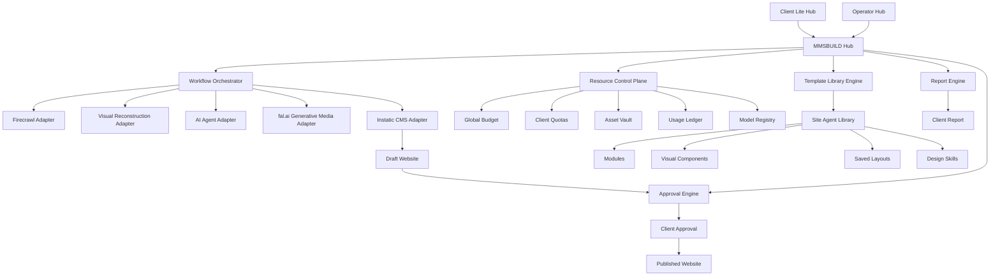
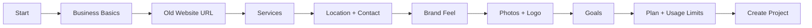
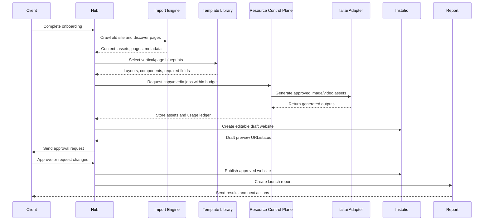
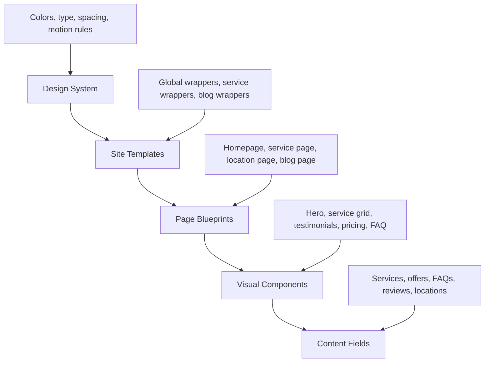
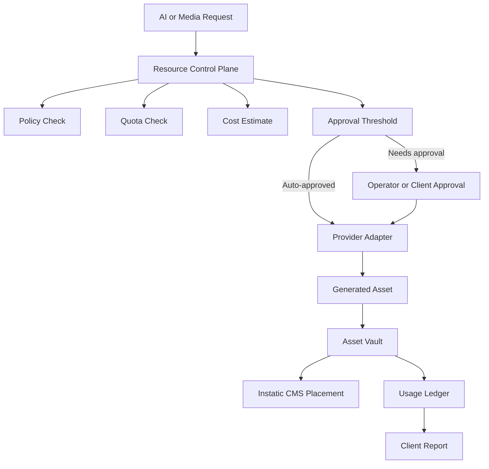

# MMSBUILD Project Plan

Date: 2026-07-06

## 1. Product Direction

MMSBUILD is a hub-and-spoke platform for reviving and maintaining old, abandoned, or weak local-business websites.

The product promise:

> We revive your old website, make it AI/search-ready, keep it fresh, and help collect enquiries through WhatsApp, without forcing you into a costly rebuild or full business platform.

This is not a generic website builder and not a replacement for MMS. MMS remains the upsell for deeper business operations. MMSBUILD focuses on the website, local discovery, trust, enquiries, content freshness, reporting, and simple monthly upkeep.

Primary wedge:

- Salons and beauty businesses first.
- Then clinics, restaurants, home services, local retailers, and other service businesses.

## 2. Strategic Architecture

The product should be built as our own Hub with specialist spokes connected through adapters.

The Hub owns:

- client onboarding
- business profile
- workflow orchestration
- template selection
- AI/resource governance
- approvals
- reports
- billing/usage summaries
- policy and quality control

The spokes do specialist work:

- Instatic for CMS, visual editing, templates, components, and static publishing
- Firecrawl for broad crawl, content extraction, page discovery, and old-site mapping
- browser/cloner workflow for visual reconstruction of important pages
- Site Agent Library for reusable design modules, layouts, and Visual Components
- AI writing/design agents for copy, planning, section generation, QA, and edits
- fal.ai for generated images, image-to-video, animation/video assets, and other media
- WhatsApp/email for approvals, updates, enquiries, and reports
- analytics/reporting systems for results and usage summaries

## 3. Visual System Map

## 4. Main Product Surfaces

### 4.1 Client Lite Hub

This is the only interface most clients should use. It should be calm, guided, and non-technical.

Client sees:

- onboarding wizard
- website health summary
- tasks that need their input
- draft preview
- approve/request changes
- generated assets for approval
- monthly report
- usage and included credits
- simple business settings

Client should not see:

- raw CMS page tree
- plugin settings
- AI provider keys
- model names unless helpful
- template internals
- data tables
- deployment controls
- detailed crawler logs

### 4.2 Operator Hub

This is the internal workbench for our team.

Operator sees:

- clients
- projects
- crawl/import jobs
- draft generation jobs
- media generation jobs
- template selections
- QA checklist
- approval status
- publishing queue
- usage/cost ledger
- report builder
- escalations and failed jobs

### 4.3 Instatic Advanced Editor

Instatic remains the power CMS/editor, not the client product.

Use Instatic for:

- advanced visual editing
- page/content management
- templates and post-type wrappers
- Visual Components
- saved layouts
- custom modules
- static publishing
- forms and data tables

Expose it as:

- internal operator tool by default
- optional advanced editor for power users
- not the normal client portal

### 4.4 Site Agent Library

The Site Agent Library is the shared builder library that every tenant gets.

It should include:

- first-party code modules
- reusable Visual Components
- saved layouts/page blueprints
- classes/design tokens
- vertical-specific design skills
- metadata for agent selection

Important implementation direction:

- Use one bundled first-party Instatic plugin for modules, layouts, Visual Components, pages, and classes.
- Add a generic bundled-plugin boot installer in Instatic.
- Treat this as an operator/builder library, not the client UI.
- Add Hub-side metadata outside Instatic so agents know when to use each asset.

## 5. Client Onboarding Wizard

The onboarding wizard should collect only the minimum useful data, then enrich it through crawl/import and operator review.

Wizard fields:

- business name
- category
- old website URL
- Google Business Profile link if available
- primary phone/WhatsApp
- address/service area
- top services
- preferred tone
- existing logo/photos
- main goal: more calls, WhatsApp leads, bookings, trust, local search, freshness
- package: Lite, Growth, Pro

Wizard output:

- Business Profile
- Brand Profile
- Service Map
- Location Map
- Content Gaps
- Media Needs
- Resource Budget
- First Draft Job

## 6. Website Revival Workflow

## 7. Import Engine

The Import Engine should use two passes.

### Pass 1: Firecrawl

Use Firecrawl for:

- sitemap/page discovery
- text extraction
- markdown/HTML extraction
- metadata extraction
- screenshots
- business details
- page classification
- structured content extraction

Firecrawl is the broad ingestion layer.

### Pass 2: Visual Reconstruction

Use a browser/cloner-style workflow only where fidelity matters.

Use it for:

- homepage hero
- important service pages
- design-token extraction
- computed CSS
- layout reconstruction
- interaction sweep
- screenshot-based QA

Visual reconstruction is not needed for every old page. Use it selectively to control cost and complexity.

## 8. Template Reuse Model

Templates should be treated as four layers, not one object.

Mapping to Instatic:

- Design System: site framework tokens, classes, fonts, spacing, brand rules
- Site Templates: Instatic templates for wrappers and post-type layouts
- Page Blueprints: saved layouts/page snapshots selected by the Hub
- Visual Components: reusable sections with params and slots
- Content Fields: custom post types/data rows for services, offers, FAQs, testimonials, locations, and forms

## 9. AI And Agent Layer

Agents should not be the product brain. The Hub should be the product brain.

Agents are specialist workers:

- copy agent
- local SEO/AEO/GEO agent
- design-selection agent
- Instatic editing agent
- QA agent
- report-writing agent
- media prompt agent
- brand extraction agent

Possible agent surfaces:

- Instatic built-in site/content agent
- external MCP-connected agents
- Hermes/Open Design/Codex-style specialist agents
- custom Hub workers

Rule:

> Agents execute bounded jobs. The Hub owns workflow, policy, budget, approvals, and narrative.

## 10. Resource Control Plane

This is the missing system layer for global and per-client AI, image, and video usage.

Every AI/media request should flow through this system before it reaches a provider like fal.ai.

### 10.1 Global Resource Controls

Global account settings:

- provider keys
- monthly hard cap
- warning thresholds
- allowed models
- blocked models
- default quality tiers
- fallback providers
- retry limits
- safety rules
- provider outage rules

### 10.2 Client Resource Controls

Client settings:

- included monthly credits
- overage rules
- allowed asset types
- max images per month
- max video seconds per month
- max resolution
- approval threshold
- brand restrictions
- usage report visibility

Example Lite package:

- 20 AI copy tasks/month
- 20 generated or edited images/month
- 15 generated video seconds/month
- 1 homepage animation/month
- approval required above included allowance

### 10.3 Job-Level Controls

Every job should have:

- client ID
- project ID
- requester
- provider
- model
- task type
- prompt
- input assets
- estimated cost
- actual cost
- status
- retries
- output URLs
- CMS placement
- approval status
- safety notes
- reuse permission

### 10.4 fal.ai Adapter

Use fal.ai as a generative media spoke.

fal.ai can support:

- text-to-image
- image editing
- background removal/upscale style tasks
- image-to-video
- short website animations
- product/service visuals
- local-business hero media
- possible future 3D/audio use cases

Adapter responsibilities:

- model registry sync
- request creation
- async queue handling
- webhook/status polling
- cost estimation
- output validation
- retry/fallback
- storage into Asset Vault
- usage ledger write
- error reporting

Important rule:

> Clients request outcomes, not model runs.

Example:

- Client asks: "Make my bridal hair service page look premium."
- Hub translates: copy update, image prompt, optional short animation, layout choice, approval preview.

## 11. Asset Vault

The Asset Vault stores every reusable media output and source input.

Store:

- original client uploads
- crawled old-site assets
- generated images
- generated videos
- animation loops
- thumbnails/posters
- prompt and negative prompt
- model/provider
- cost
- license/usage notes
- approval status
- which CMS page/section uses it
- replacement history

Rules:

- reuse before regenerate
- compress before publish
- generate mobile-safe alternatives
- keep posters for video
- never autoplay heavy media without fallback
- keep original prompt and model for audit

## 12. Website Animation Rules

Use generated video/animation only where it improves trust or conversion.

Good uses:

- subtle salon hero ambience
- before/after service teaser
- product/service visual loop
- local place/experience mood loop
- seasonal campaign visual

Avoid:

- heavy full-page video
- distracting motion
- video where a photo is enough
- expensive animation for low-value pages
- autoplay with sound

Technical rules:

- WebM/MP4 output
- poster image
- lazy loading
- mobile fallback
- size budget per page
- reduced-motion fallback
- CDN delivery
- track asset cost and reuse

## 13. Client Report System

Reports should be simple, useful, and tied to what changed.

Monthly report sections:

- what changed on the website
- pages refreshed
- AI/media usage
- generated assets approved
- enquiries or form events
- website health
- local SEO/AEO/GEO actions
- pending client inputs
- next recommended actions
- MMS upsell signals when relevant

Example report line:

> This month we refreshed 3 service pages, added 8 new salon images, reused 5 approved assets, generated one 6-second hero loop, and found 4 missing FAQ opportunities.

## 14. System Modules

| Module | Owner | Purpose |
| --- | --- | --- |
| Client Lite Hub | Hub | Non-technical client portal |
| Operator Hub | Hub | Internal operations, jobs, QA, publishing |
| Workflow Orchestrator | Hub | Controls state machine and job sequencing |
| Business Profile Engine | Hub | Canonical client/business data |
| Import Engine | Adapter layer | Crawl, extract, classify old site |
| Template Library Engine | Hub + Instatic | Select page blueprints, components, design skill |
| Site Agent Library | Instatic plugin | Shared modules, layouts, Visual Components |
| Resource Control Plane | Hub | Quotas, costs, AI/media governance |
| Asset Vault | Hub | Store generated and imported media |
| AI Agent Adapter | Adapter layer | Copy, design, QA, report, CMS actions |
| fal.ai Adapter | Adapter layer | Image/video generation |
| Instatic Adapter | Adapter layer | CMS drafts, publish, components, pages |
| Approval Engine | Hub | Client/operator approvals |
| Report Engine | Hub | Client and operator reports |
| MMS Bridge | Adapter layer | Upsell/full-suite handoff |

## 15. Data Model Sketch

Core Hub tables/collections:

- clients
- businesses
- projects
- onboarding_sessions
- business_profiles
- brand_profiles
- service_catalog
- locations
- crawl_jobs
- page_inventory
- template_catalog
- template_versions
- component_catalog
- build_jobs
- ai_jobs
- media_jobs
- resource_budgets
- resource_usage_ledger
- generated_assets
- approvals
- publish_events
- reports
- subscriptions/plans
- mms_handoff_events

## 16. Sequential Delivery Plan

### Phase 0: Foundation Decisions

Goal: lock architecture and build only the proof path.

Deliverables:

- architecture spec
- adapter contracts
- Hub workflow state machine
- resource governance schema
- first target vertical: salon/beauty
- first plan tiers: Lite, Growth, Pro

Exit criteria:

- one end-to-end flow is defined from onboarding to report
- no direct client access to Instatic or fal.ai is required

### Phase 1: Hub MVP

Goal: create the product control center.

Deliverables:

- Client Lite Hub shell
- Operator Hub shell
- client/project records
- onboarding wizard
- workflow orchestrator
- approval states
- basic report view

Exit criteria:

- operator can create a client project
- client can complete onboarding
- project has a visible status timeline

### Phase 2: Instatic Integration

Goal: use Instatic as the CMS/publisher substrate.

Deliverables:

- Instatic adapter
- project-to-Instatic tenant mapping
- draft page creation
- publish trigger
- preview URL capture
- optional advanced editor link

Exit criteria:

- Hub can create or update a draft site in Instatic
- operator can open advanced editor when needed
- client sees preview through Lite Hub

### Phase 3: Site Agent Library Proof

Goal: prove reusable modules/layouts/components can ship to every instance.

Deliverables:

- `siteagent.library` proof plugin
- one module
- one Visual Component
- one saved layout
- one class set
- bundled-plugin boot installer
- locked/always-on semantics decision
- idempotent install/upgrade tests

Exit criteria:

- library appears in Add to Canvas
- restart does not duplicate items
- version upgrade updates items safely

### Phase 4: Import Engine

Goal: turn old websites into structured project input.

Deliverables:

- Firecrawl adapter
- crawl job model
- page inventory
- extracted content map
- old-site asset intake
- visual reconstruction worker for selected pages
- import QA checklist

Exit criteria:

- operator can enter an old URL and receive a structured page/content inventory
- key pages can be converted into draft-ready inputs

### Phase 5: Template Library Engine

Goal: stop agents from building from blank.

Deliverables:

- salon design skill
- template catalog metadata
- page blueprint selection rules
- required-field schema per page type
- service page blueprint
- homepage blueprint
- FAQ/testimonial/location sections

Exit criteria:

- Hub can select a page blueprint based on business profile and service type
- agent receives structured constraints and reusable sections

### Phase 6: Resource Control Plane And fal.ai

Goal: govern all AI/media usage.

Deliverables:

- global budget settings
- client quotas
- resource ledger
- asset vault
- media job queue
- fal.ai adapter
- approval thresholds
- compression/poster/fallback rules

Exit criteria:

- every generated image/video has cost, provider, model, prompt, output, approval, and CMS placement tracked
- client report can show usage clearly

### Phase 7: Reporting And Monthly Upkeep

Goal: make the product feel alive after launch.

Deliverables:

- monthly report generator
- content freshness checklist
- service page refresh workflow
- WhatsApp enquiry summary
- pending client task reminders
- MMS upsell signal capture

Exit criteria:

- client receives a useful monthly report
- operator sees next recommended actions

### Phase 8: Scale And Hardening

Goal: make the system reliable across many clients.

Deliverables:

- job retries and failure recovery
- queue monitoring
- cost anomaly alerts
- provider fallback
- tenant/resource isolation checks
- audit logs
- permission model
- package tier enforcement
- documentation

Exit criteria:

- operators can manage many clients without manual spreadsheet tracking
- resource spend is controlled globally and per client

## 17. First MVP Scope

Build first:

- salon onboarding wizard
- old-site URL import
- business profile extraction
- homepage draft
- one service page draft
- WhatsApp CTA
- basic media generation request with approval
- Instatic draft/preview
- client approval
- launch report

Defer:

- marketplace
- full multi-agent autonomy
- complex custom animations
- full MMS features
- automated backlink systems
- ranking guarantees
- unlimited client self-editing

## 18. Key Risks And Controls

| Risk | Control |
| --- | --- |
| AI/media cost blowout | Resource Control Plane, quotas, approval thresholds |
| Clients overwhelmed by CMS | Lite Hub only, Instatic behind advanced access |
| Weak design output | Site Agent Library, design skills, reusable blueprints |
| Fragile tool coupling | Hub adapters and provider abstraction |
| Bad old-site imports | Two-pass Import Engine and QA checklist |
| Template edits overwritten | clone-to-customize or protected seeded assets |
| Heavy animation hurts performance | page media budgets, compression, lazy loading, fallback |
| Scope becomes MMS clone | MMS Bridge only, website/local-discovery focus |

## 19. Source Decisions Already Validated

- Instatic supports reusable Visual Components, templates, layouts, custom modules, plugin packs, AI tools, static publishing, and clean HTML/CSS output.
- Instatic should be used as CMS/publisher substrate, not the client-facing product.
- Firecrawl is better for broad ingestion.
- A browser/cloner-style workflow is better for visual reconstruction.
- Reusable templates need four layers: design system, site templates, page blueprints, Visual Components, and content fields.
- A first-party Site Agent Library plugin is the right primitive for distributing modules, layouts, and components.
- A Resource Control Plane is required for AI/image/video usage across global and client scopes.
- fal.ai should be an adapter behind the Hub, not a direct client dependency.

References:

- Instatic: https://github.com/CoreBunch/Instatic
- Instatic plugin system: https://github.com/CoreBunch/Instatic/blob/main/docs/features/plugin-system.md
- Instatic module inserter: https://github.com/CoreBunch/Instatic/blob/main/src/admin/pages/site/module-picker/moduleInserterModel.ts
- Firecrawl: https://github.com/firecrawl/firecrawl
- AI Website Cloner Template: https://github.com/JCodesMore/ai-website-cloner-template
- fal.ai docs: https://fal.ai/docs
- fal.ai pricing: https://fal.ai/pricing

## 20. Immediate Next Actions

1. Confirm first vertical: salon/beauty.
2. Confirm first package tiers and included usage limits.
3. Write adapter contracts for Instatic, Firecrawl, visual reconstruction, AI agents, fal.ai, WhatsApp, and reports.
4. Write the Resource Control Plane schema.
5. Build a small visual prototype of Client Lite Hub and Operator Hub.
6. Build the Site Agent Library proof plugin.
7. Run one end-to-end simulated client project from onboarding to launch report.
