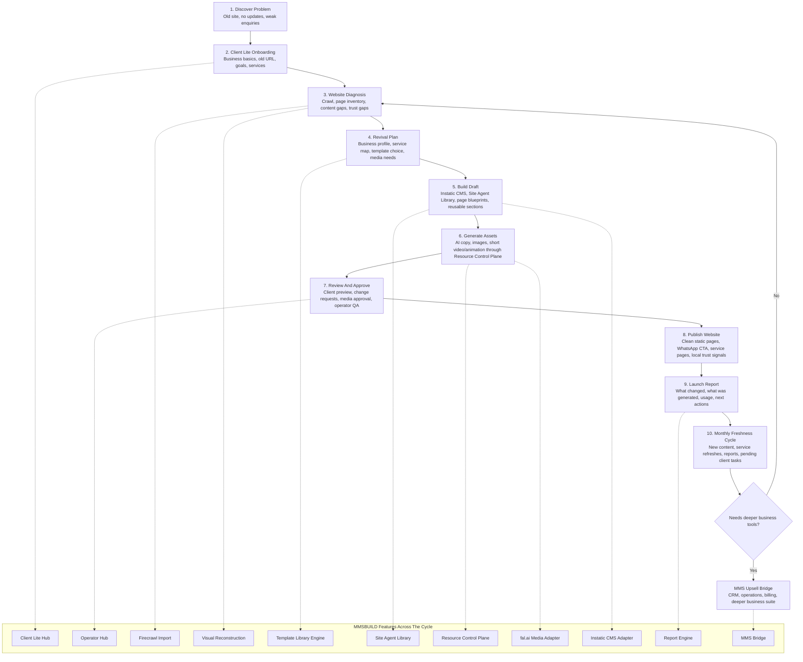

# MMSBUILD User Cycle Flow Chart

This chart explains MMSBUILD from the client/user cycle: how a local business owner moves from first website problem to launch, reporting, monthly improvements, and possible MMS upsell.

## User Cycle Feature Explanation

| Cycle Stage | What The Client Experiences | MMSBUILD Features Working Behind The Scenes |
| --- | --- | --- |
| 1. Discover Problem | "My website is old, weak, or abandoned." | Offer positioning, website health framing |
| 2. Client Lite Onboarding | Simple guided questions, old URL, services, goals | Client Lite Hub, onboarding wizard, business profile engine |
| 3. Website Diagnosis | Clear diagnosis of what is broken or missing | Firecrawl adapter, visual reconstruction, page inventory, content gap detection |
| 4. Revival Plan | A practical rebuild plan, not a confusing CMS | Template Library Engine, brand profile, service map, media needs |
| 5. Build Draft | A previewable site draft appears | Instatic adapter, Site Agent Library, page blueprints, Visual Components |
| 6. Generate Assets | Better photos, copy, and optional animation are proposed | Resource Control Plane, AI agents, fal.ai adapter, Asset Vault |
| 7. Review And Approve | Approve, reject, or request edits | Approval Engine, Operator Hub, QA checklist |
| 8. Publish Website | Refreshed site goes live | Instatic publisher, WhatsApp CTA, local trust sections, clean static output |
| 9. Launch Report | Client sees what changed and what was used | Report Engine, usage ledger, generated asset summary |
| 10. Monthly Freshness | Site keeps improving without client overwhelm | freshness engine, service refreshes, reports, reminders |
| 11. MMS Upsell Bridge | Client moves to deeper business tooling when ready | MMS Bridge, upsell signals, handoff events |
