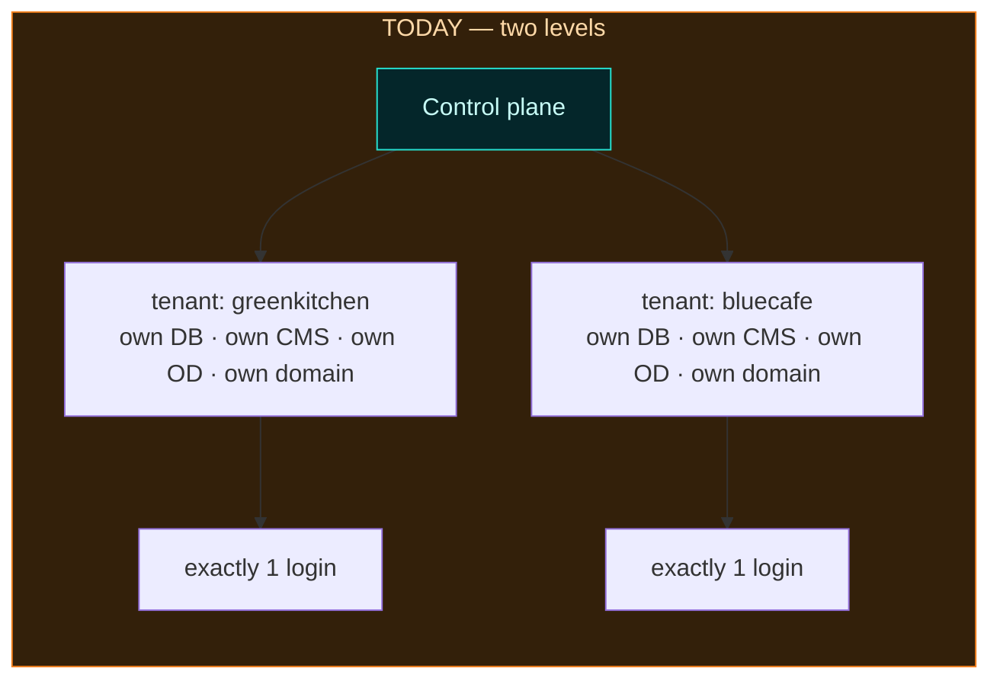
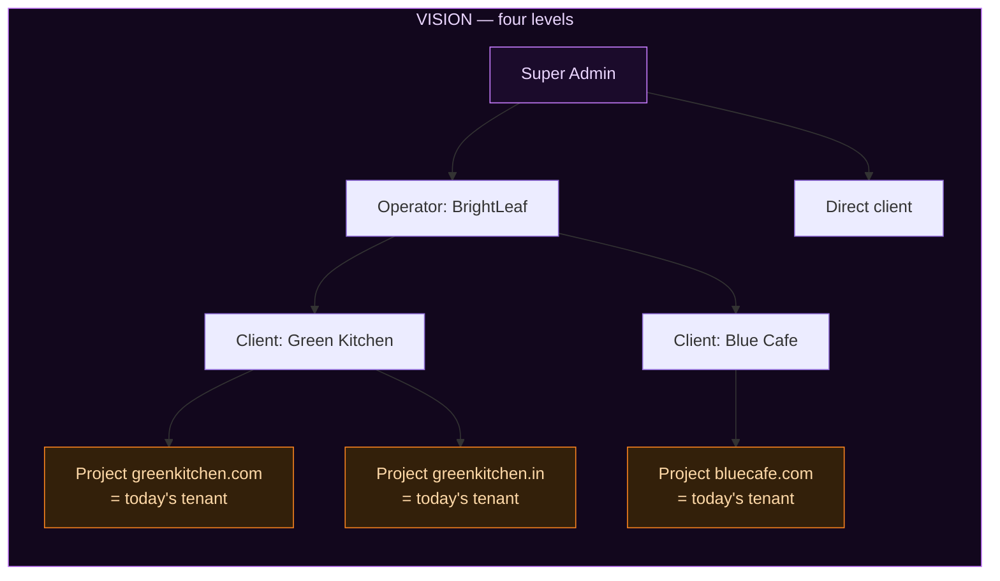

# MMSBUILD — The Vision vs What Is Actually Built Today

_Companion to [`mmsbuild-platform-vision.md`](./mmsbuild-platform-vision.md). That file describes the
target. **This file puts the target next to the current code**, section by section, and says exactly
what exists, what is half-there, and what has not been started. Every claim here was checked against
the source — file paths and line numbers are given so you can verify any of it yourself._

_Scope note: this document is about the **hierarchy** — Super Admin, Operator, Client, Project, and
how they are kept apart. For the built-vs-not status of the **poster blocks** (research engine, SEO
engine, knowledge base, event ledger, approvals, reports) there is already a maintained table in
[`mmsbuild-product-hub-os.md` §7](./mmsbuild-product-hub-os.md). This file does not repeat it._

_For **how the platform scales** — whether each project needs its own database, whether the code is
copied per customer, and how growth is absorbed without a redesign — read
[`mmsbuild-scale-architecture.md`](./mmsbuild-scale-architecture.md). It also corrects one claim below:
each project gets its own **schema**, not its own database._

Legend used throughout: ✅ built and working · 🟡 partly there · ❌ does not exist yet.

## The headline

> **Today's "tenant" is exactly the vision's "project". The two levels above it — Client and Operator
> — do not exist at all.**

This is better news than it sounds. The hard part of the vision — giving each website its own
database, its own media, its own CMS, its own design workspace, its own domain, all physically
separated — **is already built and working today.** It is just built one level too low, with no way
to group projects under a client, or clients under an agency.

What is missing is:

1. The **Client** and **Operator** levels above the project.
2. A **role model** — right now everyone is hardcoded as "operator".
3. A **per-project** CMS target, instead of one target per workspace.
4. The **Hub**, the **branding**, and the **AI orchestration**.

## Side by side





The orange boxes are the same thing in both diagrams. Everything above them is new work.

## The comparison table

| Area | Vision | Today | The gap | Where in code |
|---|---|---|---|---|
| **Super Admin level** | One platform owner above everything; creates operators and direct clients; sees usage-only for clients under an operator | ❌ No such account, no platform-wide view, no plans, no usage roll-up | The whole level | — |
| **Operator level** | Agencies with their own client list, staff, plan, branding | ❌ No `operators` table, no client list, no agency concept | The whole level | `registry/schema.sql` — tables are `settings`, `tenants`, `deploys`, `tenant_users` only |
| **Client level** | One business owning many projects | ❌ No `clients` table; `tenants` has no `client_id` | The whole level | `registry/schema.sql:16` |
| **Project level** | One domain, fully self-contained | ✅ Exists as `tenant` — and it is genuinely self-contained | Rename and re-parent it under a client | `provisioner/provision.mjs`, `registry/schema.sql:16` |
| **Container isolation** | Nothing leaks between projects | ✅ **Already strong** — own DB schema, own DB user, own uploads, own OD data dir, own ports, own domain | None at project level | see [the good news](#the-good-news--isolation-is-already-real) |
| **Roles** | Super admin / operator / client, plus "act as" | ❌ Hardcoded — every session is `role: 'operator'`; `tenant_users` has no role column | A real role model, and act-as with audit | `hub/hub.mjs:111` sets `hubRole='operator'`; `gateway/proxy.mjs:92` sets `role:'operator'` |
| **Team members** | A client can invite team roles | ❌ `tenant_users.tenant_slug` is `unique` — **exactly one login per tenant** | Many users per client, with roles | `registry/schema.sql` — `tenant_users` |
| **White-label** | Operator uploads a logo; it flows down to all their clients | ❌ One global constant for the whole platform | Per-operator brand storage, upload, and inheritance | `Operator/ui/src/brand.ts` — `BRAND_NAME = 'MMS Operator'` |
| **Design → CMS binding** | Each project pushes into **its own** CMS | 🟡 Correct across tenants, **broken within one tenant** — see below | Make the CMS target a property of the project, not the workspace | `OpenDesign/apps/daemon/src/server.ts:3061`; `runtime/odRuntime.mjs:106` |
| **Project Hub** | Landing screen with project cards, actions, insights, AI | ❌ The current hub is only invite/login/SSO card routing | The whole Hub | `hub/hub.mjs` |
| **AI: prompt → page → publish** | Ask for a landing page, get a published page | ❌ No orchestrator, no job model, no state machine | The chaining layer | nothing to point at |
| **AI: the pieces it would chain** | Research, SEO, content, CMS actions | 🟡 Mixed — the CMS agent is real and large; research is a thin search wrapper; SEO and content engines do not exist | Build the missing engines, then chain them | `Instatic/server/ai/` ✅; `OpenDesign/apps/daemon/src/research/` 🟡; SEO/content ❌ |
| **Approvals** | Nothing publishes without approval | ❌ Publish goes straight live | An approval gate | see `mmsbuild-product-hub-os.md` §7 |
| **Share to CMS itself** | Pixel-perfect, editable, no duplicates on re-share | ✅ Built and verified end to end | None | `od-share-to-cms.ts`, `cms-compliance.ts`, `od-cms-vision.md` |

## The good news — isolation is already real

This is worth saying loudly, because it is the expensive part of the vision and it is **done**.

When the control plane creates a tenant today
([`provisioner/provision.mjs`](../Operator/control-plane/provisioner/provision.mjs)), that tenant
gets its own everything:

| What | How it is separated | Where |
|---|---|---|
| Database | its own Postgres schema `t_<slug>` | `provision.mjs` → `mintDb()` |
| Database user | its own least-privilege role `r_<slug>` | `provision.mjs` → `mintDb()` |
| Uploaded media | `Operator/tenant-users/<slug>/uploads` | `runtime/tenantRuntime.mjs` → `tenantPaths()` |
| MMS-Design data | its own data directory under `siteagent-od/<slug>` | `runtime/odRuntime.mjs` → `odPaths()` |
| MMS-CMS process | its own process on its own port, from 3101 up | `env.mjs:50` `tenantBasePort` |
| MMS-Design daemon | its own process on its own port, from 7500 up | `env.mjs:61` `odBasePort` |
| MMS-Design web port | its own port, from 8100 up | `env.mjs:64` `odWebBasePort` |
| Domain + publish | its own Cloudflare project and custom domain | `tenants.cf_project`, `tenants.custom_domain` |
| Secrets | its own encrypted secret key and DB password | `tenants.secret_key_enc`, `tenants.db_password_enc` |

Two shared things, both deliberate and both harmless:

- **The MMS-CMS front-end build is shared, read-only** (`Instatic/dist`). Each tenant runs its own
  server process against it; only the *code* is shared, never the data.
- **MMS-Design runs one shared web server** with the per-tenant daemon behind it, routed by the
  login cookie (`startSharedWeb()`, base path `/design`, routed in `gateway/proxy.mjs`). Again, the
  *data* is per-tenant.

So when the Client and Operator levels are added, **the project container does not have to be
rebuilt.** It has to be re-parented.

## Your doubt, answered in full

You asked:

> *"Same client selects another project, opens MMS-Design, imports into the CMS — it opens a
> different CMS, not re-importing into the old one. So design and CMS stay connected per project,
> no conflict. Is this possible?"*

**Yes — and across separate tenants it already behaves exactly like that today.** But there is a real
catch, and it is the opposite of where you expected it.

**Across tenants: already correct.** Two different tenants have two different CMS instances on two
different ports with two different databases. A design shared inside tenant A physically cannot reach
tenant B.

**Within one tenant: this is where it breaks today.** A single tenant's MMS-Design workspace can hold
**many** projects — that already works, the multi-project UI exists
([`ProjectsScreen.tsx`](../OpenDesign/apps/web/src/components/ProjectsScreen.tsx)), and projects are
stored as separate folders under the daemon's projects directory
([`server.ts:875`](../OpenDesign/apps/daemon/src/server.ts#L875)). But when you press **Share to
CMS**, the target is read from an environment variable:

```
OpenDesign/apps/daemon/src/server.ts:3059
  app.post('/api/projects/:id/push/instatic', ...)
OpenDesign/apps/daemon/src/server.ts:3061
  const instaticUrl = (process.env.OD_INSTATIC_URL ?? '').trim()...
```

and that variable is set **once, for the whole daemon**, when the control plane starts it:

```
Operator/control-plane/runtime/odRuntime.mjs:106
  ...(tenant.instaticUrl ? { OD_INSTATIC_URL: tenant.instaticUrl } : {})
```

Read those two lines together and the consequence is clear: **the CMS target is a property of the
workspace, not of the project.** Every project inside one workspace pushes into the *same* CMS. Since
the import runs as `merge-overwrite` — which is exactly right for re-sharing the same project,
because it updates pages instead of duplicating them — two *different* projects that happen to have a
page called `index` will overwrite each other.

So today, the arrangement you described only works if **each project is its own tenant**. Which is
fine — because in the vision, each project *is* its own container anyway.

**What has to change.** Two options, and they are not exclusive:

1. **The straightforward one, and the one that matches the vision:** a project *is* a tenant. Creating
   a project provisions its own container, exactly as adding a tenant does today. The existing
   `OD_INSTATIC_URL` wiring keeps working unchanged, because there is only ever one project per
   workspace. All the isolation you want comes for free.
2. **The flexible one:** keep many projects in one workspace, but store the CMS target **on the
   project record** and pass it per request instead of reading `process.env`. Needed if you ever want
   several projects sharing one design workspace.

Option 1 is the smaller change and it is what the four-level model implies. Option 2 is worth keeping
in mind if "one workspace, many sites" ever becomes a requirement.

**One more thing to be aware of.** Cleanup is currently tenant-wide:
[`Operator/scripts/clear-tenant-cms.ts`](../Operator/scripts/clear-tenant-cms.ts) wipes a whole
tenant's CMS — pages, design, media, published files — and recycles the process. If a workspace ever
holds several projects, that script would need a project-level version, or it would take the
neighbours down with it.

## Build order to close the gap

Roughly dependency-ordered. Each line is one piece of work, not a plan.

1. **Registry tables** — add `operators` and `clients`; add `operator_id` + `client_id` to `tenants`;
   backfill every existing tenant to a default client under the Super Admin so nothing breaks.
2. **Rename the concept** — `tenant` becomes `project` in the product language and the UI. The
   internal slug can stay as-is; it is not brand text.
3. **Role model** — replace the hardcoded `role: 'operator'`
   ([`proxy.mjs:92`](../Operator/control-plane/gateway/proxy.mjs#L92),
   [`hub.mjs:111`](../Operator/control-plane/hub/hub.mjs#L111)) with real roles, and allow many users
   per client by dropping the `unique` constraint on `tenant_users.tenant_slug`.
4. **Session scoping** — stamp the session with operator + client + project, and fill in the
   `project: null` that [`proxy.mjs:97`](../Operator/control-plane/gateway/proxy.mjs#L97) currently
   sends. Reject any request that does not match its stamp.
5. **Act-as** — let an Operator enter one of their clients, with both identities written to the audit
   log.
6. **Per-project CMS binding** — pick option 1 or 2 above and make the target explicit.
7. **The Hub** — project cards, actions inbox, pending insights. This is a new surface, not an
   extension of `hub.mjs`.
8. **White-label** — per-operator logo and name storage, upload, and inheritance down to their
   clients. Replaces the single constant in `brand.ts`.
9. **Super Admin overview** — usage counts and health per operator, with **no** access to the work
   itself.
10. **AI orchestration** — the job model that chains research → SEO → content → CMS → approval →
    publish, plus the missing SEO and content engines. The CMS agent it would call already exists.

## Where each piece lives

- **The vision this is compared against** — [`mmsbuild-platform-vision.md`](./mmsbuild-platform-vision.md)
- **Poster-block status (engines, ledger, approvals, reports)** — [`mmsbuild-product-hub-os.md`](./mmsbuild-product-hub-os.md) §7
- **Tenant creation** — [`Operator/control-plane/provisioner/provision.mjs`](../Operator/control-plane/provisioner/provision.mjs)
- **What exists, recorded** — [`Operator/control-plane/registry/schema.sql`](../Operator/control-plane/registry/schema.sql)
- **Ports and paths** — [`Operator/control-plane/lib/env.mjs`](../Operator/control-plane/lib/env.mjs),
  [`runtime/tenantRuntime.mjs`](../Operator/control-plane/runtime/tenantRuntime.mjs),
  [`runtime/odRuntime.mjs`](../Operator/control-plane/runtime/odRuntime.mjs)
- **Login, roles, routing** — [`hub/hub.mjs`](../Operator/control-plane/hub/hub.mjs),
  [`gateway/proxy.mjs`](../Operator/control-plane/gateway/proxy.mjs)
- **Share to CMS push route** — [`OpenDesign/apps/daemon/src/server.ts:3059`](../OpenDesign/apps/daemon/src/server.ts#L3059)
- **MMS-Design projects on disk** — [`OpenDesign/apps/daemon/src/routes/project/index.ts`](../OpenDesign/apps/daemon/src/routes/project/index.ts),
  [`server.ts:875`](../OpenDesign/apps/daemon/src/server.ts#L875)
- **Brand wordmark** — [`Operator/ui/src/brand.ts`](../Operator/ui/src/brand.ts)
- **The CMS AI agent that already exists** — [`Instatic/server/ai/`](../Instatic/server/ai/)
- **Tenant cleanup** — [`Operator/scripts/clear-tenant-cms.ts`](../Operator/scripts/clear-tenant-cms.ts)
