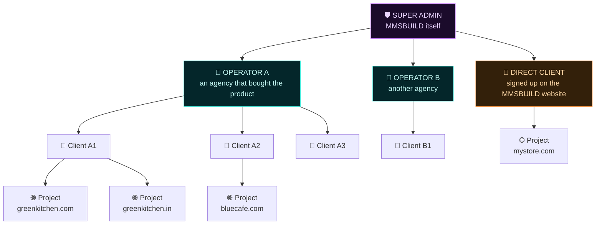
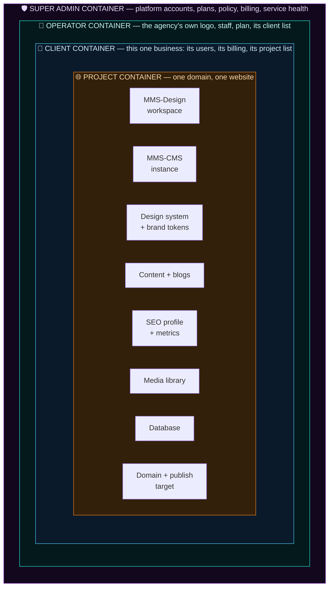
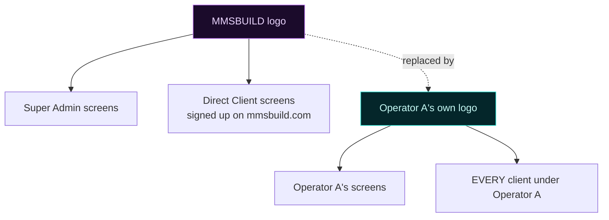
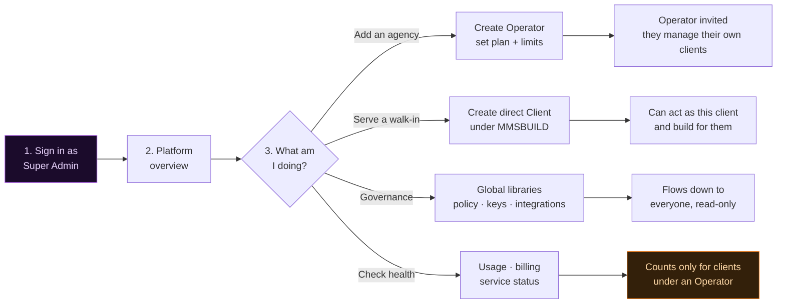
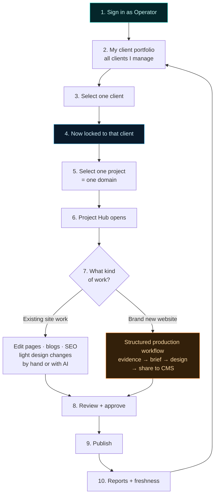
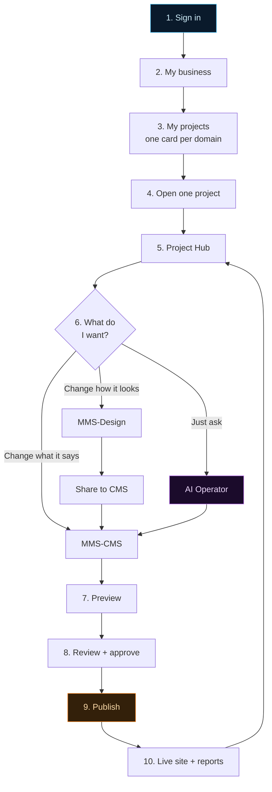
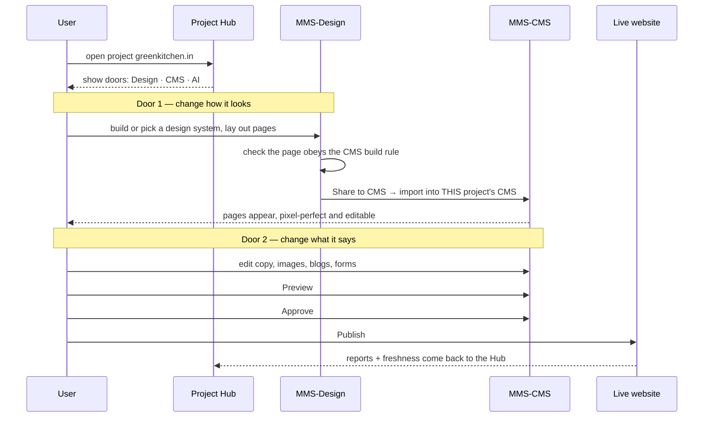
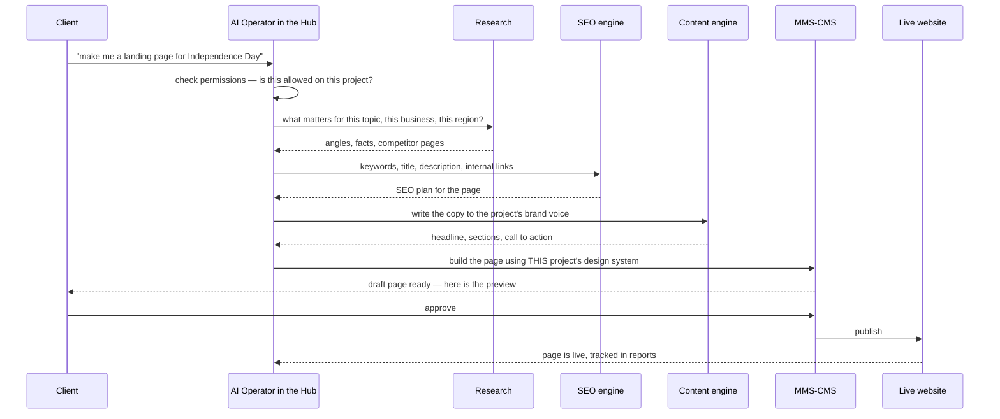

# MMSBUILD — Platform Hierarchy, Containers & Role Workflows

_This is the full picture of **how MMSBUILD is meant to work**: who sits above whom, what a project
is, what stays locked inside its own box, and exactly what a Super Admin, an Operator and a Client
each do, step by step. It is written in plain words — if you have never opened this repo, you should
still be able to read it end to end._

_This file describes the **target**. It says nothing about what is already built. For that, read the
companion file [`mmsbuild-vision-vs-today.md`](./mmsbuild-vision-vs-today.md), which puts this vision
side by side with the current code. For the level below this one — how a design becomes a real page
in the CMS — read [`od-cms-vision.md`](../integration/od-cms-vision.md). For **how this holds up at scale** —
one database or many, one build or many, and what stops one customer slowing down the rest — read
[`mmsbuild-scale-architecture.md`](./mmsbuild-scale-architecture.md)._

## Name map (product name vs repo name)

The names on screen and the names in the folders are different on purpose. **Users only ever see the
MMS names.**

| What users see | What it is | Where it lives in this repo |
|---|---|---|
| **MMSBUILD** | The whole platform | the monorepo |
| **MMS-Design** | The design studio — build the look of a website | `OpenDesign/` (upstream name: OpenDesign) |
| **MMS-CMS** | The live content system — edit pages, write blogs, publish | `Instatic/` (upstream name: Instatic) |
| **Control Plane** | The machinery that creates accounts, databases, ports, domains | `Operator/control-plane/` |
| **Operator Console** | The internal admin screen for the machinery | `Operator/ui/` |
| **Product Hub** | The screen a client lands on: their projects, their AI, their reports | *the new layer this document describes* |
| **AI Operator** | The built-in assistant inside the Hub | *the new layer this document describes* |

> Never write "Instatic", "OpenDesign" or "OD" in anything a user can see. In code, comments and
> folder names they are fine.

## The four levels

MMSBUILD has exactly **four levels**. Everything else in this document follows from these four.



Read it as four sentences:

1. **Super Admin is MMSBUILD.** One at the top. It owns the platform.
2. **An Operator is an agency that bought the product.** Under the Super Admin there can be many
   Operators. An Operator manages many businesses that are not their own.
3. **A Client is one business.** A Client can sit under an Operator, *or* directly under the Super
   Admin if they signed up on the MMSBUILD website themselves.
4. **A Project is one website.** A Client can have many Projects.

## The golden rule: one project = one domain

This is the rule everything else is built around, so it gets its own section.

> **One project is one domain is one website.**
> If a business has two domains, that is **two projects** — never one project holding two domains.

Why it matters: a project is not just a folder of pages. A project owns a database, a design system,
a media library, an SEO profile and a publish target. Two domains sharing one of those would mean two
websites fighting over the same content. So the split is made at the very bottom and never blurred.

**Example.** "Green Kitchen" is a restaurant business. It runs `greenkitchen.com` for the restaurant
and `greenkitchen.in` for its India franchise enquiries.

- ✅ Correct: **one client** called Green Kitchen, with **two projects** — `greenkitchen.com` and
  `greenkitchen.in`. Two databases, two designs, two publish buttons.
- ❌ Wrong: one project called "Green Kitchen" with both domains pointed at it.

## Containers — nothing leaks sideways

Think of the platform as boxes inside boxes. **Each box only sees what is inside it.** A box can
never reach into a box beside it.



**What lives in each box**

- **Super Admin container** — the list of all Operators, the list of direct Clients, plans and
  limits, platform policy, security keys, integration settings, service health. This is the only
  place where secret integration configuration lives.
- **Operator container** — the agency's own logo and brand, its staff logins, its plan, and **its own
  private client list**. One Operator's container never contains another Operator's clients.
- **Client container** — this one business: its team members, its billing, and **its own project
  list**.
- **Project container** — one domain and everything that domain needs: its MMS-Design workspace, its
  own MMS-CMS instance, its design system, its content, its media, its SEO data, its own database,
  and its own publish target.

**The wall rules**

1. **Nothing crosses sideways.** Operator A can never see Operator B's clients. Client A1 can never
   see Client A2's projects. Project 1 can never see Project 2's pages, media or database.
2. **Things only flow downward, and only by permission.** An Operator reaches into a Client because
   that Client is theirs. A Client reaches into a Project because that Project is theirs.
3. **Every single stored record carries its full address** — which Operator, which Client, which
   Project. Nothing is stored without an address. See
   [How the IDs keep everything apart](#how-the-ids-keep-everything-apart).

## Who can see what

| | Their own data | Their Clients' actual work | Clients under an Operator | Can "act as" a Client |
|---|---|---|---|---|
| **Super Admin** | Everything platform-wide | ✅ full access to **direct** Clients | 📊 **counts and usage only** — cannot open the work | ✅ but only for **direct** Clients |
| **Operator** | Their own agency box | ✅ full access to all their Clients | ❌ never sees another Operator's clients | ✅ for any Client of theirs |
| **Client** | Their own business box | — | ❌ | — |

Two points that are easy to get wrong, so they are stated plainly:

**The Super Admin is deliberately blind inside an Operator.** If Green Kitchen is a client of agency
"BrightLeaf", the Super Admin can see *that* BrightLeaf has a client with 2 projects, how many pages
and how much AI usage they consumed, whether the service is healthy, and what to bill BrightLeaf.
The Super Admin **cannot open** Green Kitchen's pages, content or designs. That is the agency's
business, and the agency promised its client privacy.

**"Act as" is a real, logged mode.** When an Operator picks a Client from their list and enters, they
are *inside that client* — they see the same Hub the client sees and can add pages, edit content and
publish exactly as the client could. It is not a read-only preview; it is doing the work on the
client's behalf. Every action taken this way is written to the audit log as *"BrightLeaf staff member
X, acting as Green Kitchen"*, never as the client themselves.

## White-label — whose logo shows

When an agency buys MMSBUILD, they are not reselling somebody else's tool — to their clients it is
**their** tool. So the logo follows ownership.



The rules:

- **An Operator uploads their own logo.** It replaces the MMSBUILD logo on the Operator's own panel.
- **It flows down automatically.** Every Client under that Operator sees the Operator's logo too, not
  the MMSBUILD logo. From the client's point of view they bought a product from BrightLeaf.
- **Direct Clients keep the MMSBUILD logo**, because they really did buy from MMSBUILD.
- If an Operator has not uploaded a logo, the MMSBUILD logo is the fallback.
- Branding covers the logo, the product name shown in the header, and the accent colour. It does not
  change how anything works.

## Super Admin workflow



**Step by step**

1. **Sign in.** Lands on the platform overview: total operators, total clients, total projects, usage
   and service health.
2. **Create Operators.** An agency buys the product → the Super Admin creates their Operator account,
   sets their plan and limits, and sends an invite. After that the agency runs itself.
3. **Create direct Clients.** Someone registers on the MMSBUILD website wanting a service, not a
   licence. They become a Client sitting directly under the Super Admin.
4. **Govern the shared libraries.** Templates, components, design framework, do's and don'ts, design
   guides, SEO guides, skills, plugins, adapters and MCP configuration. These are defined once at the
   top and are visible downward, read-only. Secret integration configuration is visible **only** here
   — Operators and Clients never see it, they only get the benefit of it.
5. **Watch, don't peek.** For Clients under an Operator, the Super Admin sees usage counts, project
   counts, plan consumption and health — enough to bill and support, never enough to read the work.

**Example.** BrightLeaf Agency pays for MMSBUILD. The Super Admin creates the Operator "BrightLeaf",
plan = 25 clients, and mails the invite. A month later the overview shows *BrightLeaf: 7 clients, 11
projects, 2.1M AI tokens this month*. The Super Admin bills on that number and never opens a single
BrightLeaf page.

## Operator / Agency workflow



**Step by step**

1. **Sign in.** The Operator sees their own logo, not MMSBUILD's.
2. **The client portfolio.** A list of every business they manage, each with a health signal — needs
   action, blocked, healthy — plus an inbox of tasks and alerts across all of them.
3. **Select a client.** From here on **everything is locked to that client.** There is no way to
   accidentally edit another client's site, because the whole session is scoped.
4. **Select a project.** One domain. Now the session is scoped to a client *and* a project.
5. **Do the work.** Either by hand, or by asking the AI Operator. Same permissions either way.
6. **Review, approve, publish.** MMS-CMS is the only thing that publishes.
7. **Back to the portfolio.** Reports and freshness feed the inbox, which is where the next task
   comes from.

**Example.** BrightLeaf signs in. Their portfolio shows Green Kitchen (needs action), Blue Café
(healthy), Nova Gym (blocked). They open Green Kitchen → project `greenkitchen.com` → the AI Operator
→ *"our Diwali menu changed, update the menu page and write a short blog about it."* The AI drafts
both, a BrightLeaf reviewer approves, publish goes out. The audit log records BrightLeaf acting as
Green Kitchen. Nothing about Blue Café was reachable at any point in that session.

## Client workflow



**Step by step**

1. **Sign in.** They see their Operator's logo, or MMSBUILD's if they are a direct client.
2. **My business.** One business. Their team, their billing, their settings.
3. **My projects.** One card per domain. Each card shows the domain, when it was last published, and
   anything waiting for them.
4. **Open a project → the Hub.** Everything from here is inside that one project.
5. **Choose a door.** Design, content, or just ask the AI. It is their choice — nothing forces them
   down one path.
6. **Preview, approve, publish.**

**Example.** Green Kitchen's owner signs in. Two cards: `greenkitchen.com` and `greenkitchen.in`.
They open `greenkitchen.in`, go to MMS-Design, generate a fresh design system, share it to the CMS,
tidy up the wording in MMS-CMS, and publish. `greenkitchen.com` is completely untouched — different
design, different content, different database, different published site.

## Inside one project — the Hub

The Hub is the screen you land on after picking a project. It has three doors and they all end at the
same place.



**The two doors, in plain words**

- **MMS-Design** is where the *look* is decided: the design system, the layout, a new page pattern, a
  major redesign. It is not the live site. Work here is pushed across with **Share to CMS**.
- **MMS-CMS** is the live site: real content, blogs, images, galleries, forms — and it is the **only
  thing that publishes.** MMS-Design never publishes.
- MMS-Design comes back into the picture only for a **substantial design change**. Day-to-day
  content work never needs it.

**Why project B never lands in project A's CMS**

This is the part that must be exactly right, so it is spelled out.

Each project owns **its own MMS-CMS instance** — its own database, its own media, its own published
site, its own address. When you press *Share to CMS* inside project B's MMS-Design workspace, the
target is not "the CMS", it is **project B's CMS**, because the target is a property of the project
itself, not a global setting.

> **Share to CMS always pushes into the CMS instance recorded on that project. A project's design
> can only ever reach its own CMS.**

So the sequence in the example works as expected:

1. Client opens project `greenkitchen.com` → designs → Share to CMS → it imports into
   `greenkitchen.com`'s CMS.
2. Same client opens project `greenkitchen.in` → designs → Share to CMS → it imports into a
   **different, separate** CMS belonging to `greenkitchen.in`.
3. Nothing from step 2 touches anything from step 1. No re-import, no overwritten pages, no mixed
   media, no conflict.

And re-sharing the *same* project a second time updates its own pages rather than duplicating them —
MMS-Design is the source of truth for structure. The details of that contract live in
[`od-cms-vision.md`](../integration/od-cms-vision.md).

## The AI section in the Hub

Every project Hub has an AI Operator. It is one conversation that already knows **who you are, which
client you are in, and which project is open** — so you never have to tell it.

Here is your example — *"I want a landing page about Independence Day"* — from the first sentence to
a live page.



**What the AI is allowed to do**

- Add a page to an existing website, and design it using the project's existing design system.
- Write and publish blog posts.
- Edit copy, swap images, update a gallery or a form.
- Plan and apply SEO — titles, descriptions, internal links, on-page fixes.
- Pull the numbers: site audit, search metrics, leads, what is going stale.
- Make **light** design changes.

**What the AI is not allowed to do**

> **The AI Operator cannot build an entire new website.**

A whole new site — new brand, new design system, new structure, new domain — goes through the
**structured production workflow**: evidence about the old site, a brief, content, an MMS-Design
build, Share to CMS, then review and publish. That is deliberate. A full site is the thing a client
is actually paying for; it gets human eyes, a real approval step and an audit trail. A single
landing page is small, reversible and safe to automate.

Everything the AI does still goes through the same gate a human does: **it uses the permissions of
the person who asked, it produces a draft, and a human approves before anything is published.** The
AI never gets a private shortcut to the live site.

## How the IDs keep everything apart

The wall between boxes is not a UI trick. It is enforced by the way things are addressed and stored.

**Every record carries its full address.** Nothing is stored with just a project id — it carries the
operator, the client and the project. A query without that address returns nothing at all, rather
than returning everything.

```
operator_id  →  client_id  →  project_id  →  the actual thing
```

**Storage is named after the address.** Each project gets its own separated storage rather than a
shared pool with a filter on top:

| Thing | Separated by |
|---|---|
| Database | its own schema and its own database user, per project |
| Uploaded media | its own folder, per project |
| MMS-Design data | its own data directory, per project |
| Running services | its own MMS-CMS process and its own MMS-Design service, per project |
| Domain + published site | its own publish target, per project |

Because the separation is physical, a bug in a query cannot leak one client's content into another
client's site — there is nothing shared to leak *from*.

**Sessions carry the address too.** When an Operator picks a client and then a project, the session
itself is stamped with operator + client + project. Every request is checked against that stamp. A
request that does not match its stamp is refused, not silently corrected.

**Acting as someone is recorded, not disguised.** The audit log stores both identities: who really
did it, and who they were acting as.

## One full story, start to finish

Putting all four levels together.

1. **BrightLeaf Agency** buys MMSBUILD. The Super Admin creates the Operator "BrightLeaf", plan = 25
   clients, and sends an invite.
2. BrightLeaf signs in, uploads their logo. From now on BrightLeaf staff — and every BrightLeaf
   client — sees the BrightLeaf logo. The MMSBUILD name never appears.
3. BrightLeaf adds a client: **Green Kitchen**.
4. Green Kitchen has two domains, so BrightLeaf creates **two projects**: `greenkitchen.com` and
   `greenkitchen.in`. Each gets its own database, its own MMS-CMS, its own MMS-Design workspace.
5. BrightLeaf opens `greenkitchen.com` → MMS-Design → builds a design system and a five-page site →
   **Share to CMS** → the pages land in `greenkitchen.com`'s own CMS, pixel-perfect and editable →
   tidy the copy → approve → publish. The site is live.
6. Later, BrightLeaf opens `greenkitchen.in` → MMS-Design → a different design → **Share to CMS** →
   it lands in `greenkitchen.in`'s **own separate CMS**. `greenkitchen.com` is untouched. No
   conflict, no re-import, no mixed pages.
7. Green Kitchen's owner gets their own login. They see the BrightLeaf logo and their two project
   cards — and nothing else on the platform.
8. In August the owner opens `greenkitchen.com` → the AI Operator → *"make a landing page for
   Independence Day."* The AI researches, plans the SEO, writes the copy, builds the page in the
   project's existing design system, and hands back a draft. The owner approves. It publishes.
9. Meanwhile the Super Admin's overview shows *BrightLeaf: 1 client, 2 projects, N pages, N tokens
   used.* The Super Admin bills BrightLeaf on that, and has never seen a single Green Kitchen page.

## Where the pieces live

Vision items with no path yet are the ones that still need to be built — see
[`mmsbuild-vision-vs-today.md`](./mmsbuild-vision-vs-today.md).

- **MMS-Design app** — [`OpenDesign/`](../../OpenDesign/), daemon at
  [`OpenDesign/apps/daemon/src/server.ts`](../../OpenDesign/apps/daemon/src/server.ts)
- **MMS-CMS app** — [`Instatic/`](../../Instatic/)
- **Control plane** — [`Operator/control-plane/`](../../Operator/control-plane/); account and
  infrastructure creation in
  [`provisioner/provision.mjs`](../../Operator/control-plane/provisioner/provision.mjs); the record of
  what exists in [`registry/schema.sql`](../../Operator/control-plane/registry/schema.sql)
- **Login and routing** — [`hub/hub.mjs`](../../Operator/control-plane/hub/hub.mjs) and
  [`gateway/proxy.mjs`](../../Operator/control-plane/gateway/proxy.mjs)
- **Brand wordmark** — [`Operator/ui/src/brand.ts`](../../Operator/ui/src/brand.ts)
- **Share to CMS contract** — [`od-cms-vision.md`](../integration/od-cms-vision.md) and
  [`od-cms-compliance.md`](../integration/od-cms-compliance.md); the build rule at
  [`Operator/rules/templateRule.md`](../../Operator/rules/templateRule.md)
- **The poster blocks — engines, hub, ledger** — [`mmsbuild-product-hub-os.md`](./mmsbuild-product-hub-os.md)
- **Scale, tenancy and isolation** — [`mmsbuild-scale-architecture.md`](./mmsbuild-scale-architecture.md);
  the data tiers, the cell model and the process lifecycle
