# MMSBUILD — Scale & Tenancy Architecture

_This document decides **how MMSBUILD stores data and runs software as it grows**: whether every
project gets its own database or shares one, whether the code is copied per customer, and what stops
one busy customer from slowing down everyone else._

_It is a companion to [`mmsbuild-platform-vision.md`](./mmsbuild-platform-vision.md), which
describes **what** the platform is (Super Admin → Operator → Client → Project), and to
[`mmsbuild-vision-vs-today.md`](./mmsbuild-vision-vs-today.md), which measures the vision against
the current code. This one describes **how it holds up under load.**_

_It is written in plain words. If you have never opened this repository, you should still be able to
read it end to end._

---

## 1. Purpose & scope

### What this document decides

1. **Where project data lives** — one shared database split by id columns, one schema per project,
   or one database per project.
2. **Whether the code is copied per customer** — one shared build, or a build per project.
3. **How the platform grows** — what you add when the current server is full.
4. **What stops one customer degrading another** — the isolation and resource model.

### What it deliberately leaves open

- **Which hosting to use.** Bare servers, containers or managed cloud all fit this architecture
  unchanged. That choice can be made later on cost and convenience. The one place it matters is
  named in §7.2.
- **How published sites are served.** The publishing and CDN path is a separate decision and is out
  of scope here.

### The pressure this is designed for

50 operators × 100–200 clients each × several projects per client = **10,000–30,000 projects**.
Every number in this document is checked against that ceiling.

---

## 2. Concepts

Four terms are used throughout. None are exotic, and none are used before they are defined.

### 2.1 Vocabulary

**Process** — one running copy of a program. When a project's CMS is "up", a program is running on a
server holding that one website's data and answering the browser. Stop the program and the CMS is
gone; the data is untouched.

**Daemon** — the same thing, under the name the design tool uses. MMS-Design is not only a web page.
Behind it a program runs on the server that holds the projects and their files, runs the AI, opens a
hidden browser for screenshots, and writes the design system.

> A daemon is **mandatory** — MMS-Design cannot work without one. The architectural question is never
> *whether* to have daemons. It is **how many**, and **when they are running**.

**Schema** — a named compartment inside a Postgres database, with its own tables and its own owner.
It is not a separate database; it is a walled-off section of one.

**Cell** — one complete, self-sufficient copy of the platform's machinery: one Postgres, the
machines that run tenant programs, and the gateway in front of them. Explained in full in §8.

### 2.2 A running program is not a build

This distinction governs the entire compute design, so it comes before everything else.

Microsoft Word is installed **once**. Open five documents and five windows appear — Word is still
installed exactly once. Nobody installs Word five times.

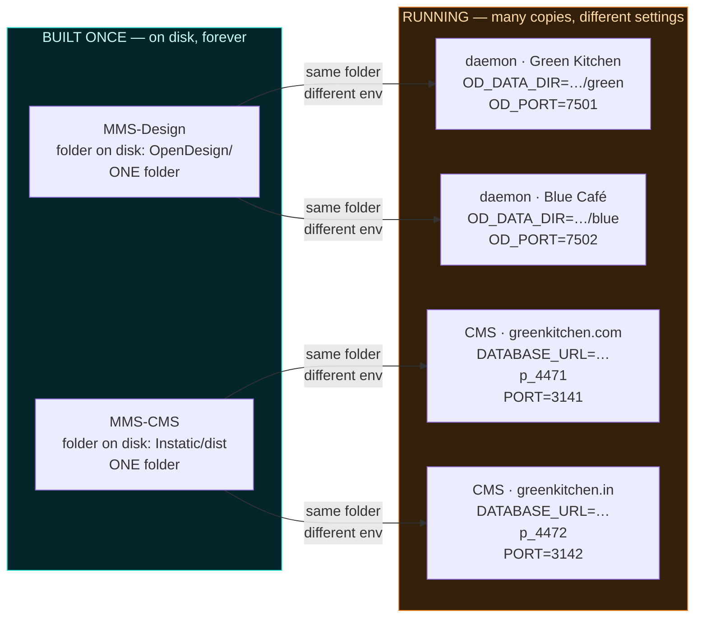

| | Built / installed on disk | Running copies |
|---|---|---|
| Word | 1 installation | 5 windows, one per document |
| **MMS-Design** | **1 build. One `OpenDesign` folder. Forever.** | 1 daemon per client, each given a different data folder and port |
| **MMS-CMS** | **1 build. One `Instatic/dist` folder. Forever.** | 1 process per project being edited, each given a different `DATABASE_URL` and uploads folder |

> **The repository is never copied and the build is never repeated per customer** — not at 10
> customers, not at 10,000. One build, one folder on disk, for the entire platform.

**This already holds in production.** Every tenant's program launches from the *same shared folder*;
only the environment differs:

```js
spawn('bun',  ['server/index.ts'],         { cwd: config.instaticDir, env })  // ONE Instatic folder
spawn('node', ['bin/od.mjs', '--port', …], { cwd: daemonCwd,          env })  // ONE OpenDesign folder
STATIC_DIR: distDir()                                                         // ONE shared dist
```

[`tenantRuntime.mjs:140`](../../Operator/control-plane/runtime/tenantRuntime.mjs) ·
[`odRuntime.mjs:291`](../../Operator/control-plane/runtime/odRuntime.mjs) ·
[`tenantRuntime.mjs:48`](../../Operator/control-plane/runtime/tenantRuntime.mjs)

The lesson is already recorded in the code. A per-customer build of the design web was tried and
removed, and [`odRuntime.mjs:127-133`](../../Operator/control-plane/runtime/odRuntime.mjs) carries the
warning: *"50 tenants meant 50 builds and 50 Node processes."* It was replaced by **one shared build
for the whole fleet.** It must not be reintroduced.

### 2.3 The real constraint is running programs, not builds

Builds are free at any scale. What is not free is that **every active customer today keeps two
programs running permanently**, whether anyone is using them or not.

| | Builds on disk | Programs running | RAM needed | Viable |
|---|---|---|---|---|
| Today's model @ 100 projects | 1 | 200 | ~140–200 GB | ⚠️ Already exceeds this 86 GB host |
| Today's model @ 10,000 projects | 1 | **20,000** | **~14–20 TB** | 🔴 **Impossible** |
| **Target model @ 10,000 projects** | **1** | **~200–400** | **~200–400 GB** | 🟢 **~4–8 ordinary servers** |

The reduction comes from three changes — detailed in §7 and §8 — **none of which touch the build**:

1. **Run a program only while it is in use.** Of 10,000 projects, roughly 1–3% have somebody editing
   at any moment. A published website stays online with **zero** programs running.
2. **One daemon per client, not per project.** A client with five domains needs one daemon, not five.
3. **Spread the survivors across cells**, so those ~300 programs sit on several ordinary machines
   rather than one impossible one.

> **~20,000 programs → ~300. A 50× reduction, from one build, in one folder.**

---

## 3. Architecture at a glance

> **Neither one database for everything, nor a database per project. Three tiers, plus cells.**

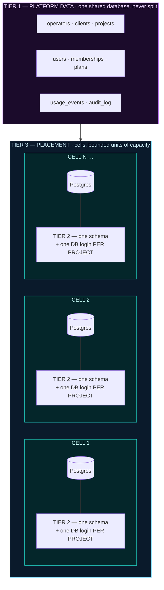

| Tier | Holds | Model | Why |
|---|---|---|---|
| **1 — Platform** | operators, clients, projects, users, plans, usage, audit | **One shared database, one set of tables**, split by id columns + Row-Level Security | Small, and must add up across everyone for billing |
| **2 — Project content** | pages, blogs, media, settings for one website | **One schema + one database login per project** | Physical isolation; works with the CMS unchanged |
| **3 — Placement** | which machine and which Postgres a project sits on | **Cells** — bounded capacity units, recorded in `projects.cell_id` | Growth without redesign; bounded blast radius |

---

## 4. Current state

Verified against the code, not inferred from documentation.

| Area | Reality today | Source |
|---|---|---|
| Database | **ONE** Postgres database `siteagent_platform`. There is no `CREATE DATABASE` anywhere in the provisioner. | [`provision.mjs:79-93`](../../Operator/control-plane/provisioner/provision.mjs) |
| Per project | own schema `t_<slug>` + own login role `r_<slug>`, `search_path` pinned at the role | same |
| Registry | `settings`, `tenants`, `deploys`, `tenant_users`, `mcp_*`. **No `operators`, no `clients`, no `client_id`.** | [`schema.sql`](../../Operator/control-plane/registry/schema.sql) |
| Users | `tenant_users.tenant_slug` is `UNIQUE` → **exactly one login per tenant**, and no role column | [`schema.sql:80`](../../Operator/control-plane/registry/schema.sql) |
| Operator config | `settings` is a **singleton** (`check (id = 1)`) — one AI configuration platform-wide | [`schema.sql:5-13`](../../Operator/control-plane/registry/schema.sql) |
| Programs | **2 permanent programs per tenant** — a CMS process and a design daemon | [`tenantRuntime.mjs:140`](../../Operator/control-plane/runtime/tenantRuntime.mjs), [`odRuntime.mjs:291`](../../Operator/control-plane/runtime/odRuntime.mjs) |
| Lifecycle | `resumeAll()` starts **every active tenant** at boot. **There is no idle shutdown anywhere.** | [`provision.mjs:466-485`](../../Operator/control-plane/provisioner/provision.mjs) |
| Code | **shared** — one `Instatic/dist`, one `OpenDesign` tree, one shared design web | [`tenantRuntime.mjs:48`](../../Operator/control-plane/runtime/tenantRuntime.mjs) |
| Resource caps | **none** — no memory cap, no CPU cap, no per-role `CONNECTION LIMIT`, no rate limit | — |
| Ports | `max()+1`, never reused, no unique constraint → concurrent provisions race | [`provision.mjs:61-75`](../../Operator/control-plane/provisioner/provision.mjs) |
| Known DB ceiling | *"~5–8 tenant containers at `max_connections = 100`"* before a pooler | `docs/architecture/DB-Architecture.md:145` |

Measured on the current host: **86 GB RAM, 40 CPUs**; 13 node/bun processes using 1.9 GB.

### What is already right and must be kept

This is the expensive part of the vision, and it is **already built and working**:

- Per-project database compartment, with its own least-privilege login
- Per-project uploads folder, design data directory, secrets and publish target
- One shared code build for the whole fleet
- On-demand start (`ensure()`) and a "Starting…" waiting page on the request path

The gaps are **above** it (no Operator or Client level) and **around** it (nothing bounds growth,
nothing stops a program once started). Neither requires rebuilding the project container.

---

## 5. Data architecture

### 5.1 Storage models compared — single database vs multiple databases

There are exactly three ways to keep one project's content apart from another's.

| | **A) One DB, one set of tables, a `project_id` column** | **B) One DB, one schema per project** *(today)* | **C) One separate database per project** |
|---|---|---|---|
| How data is kept apart | `where project_id = …` in every single query | Separate schema **and** separate database login | Separate database entirely |
| If a query has a bug | 🔴 **Leaks another client's pages** | 🟢 Returns nothing — that login cannot see other schemas | 🟢 Returns nothing |
| Works with our CMS as-is? | 🔴 **No** — its `site` table is a single row and its pages/blogs have no project column. Requires a permanent fork. | 🟢 **Yes — running in production today** | 🟢 Yes |
| Cost per project | Almost nothing — just rows | One catalog entry plus its tables | **~7–10 MB catalog each**, own connection pool, own vacuum, own backup job |
| At 5,000 projects | Fine on paper | 🟢 Large but ordinary | 🔴 5,000 catalogs to vacuum and back up; Postgres degrades |
| Back up ONE project | 🔴 Hard — filter rows out of shared tables | 🟢 `pg_dump -n p_4472` | 🟢 Dump the database |
| Move ONE project to another server | 🔴 Hard | 🟢 Dump schema → restore → update `cell_id` | 🟢 Easy |
| Other project **names** visible? | n/a | 🟠 Yes — **names only, never data** (§5.4) | 🟢 No |
| **Verdict** | ❌ **Ruled out for content** | ✅ **Use for project content** | Escape hatch only |

**The decisive row is "works with our CMS as-is".** Option A would mean forking the CMS forever. Its
own rule book states: *"The product is self-hosted only. The codebase should not carry assumptions
about multi-tenant SaaS operation."* ([`Instatic/CLAUDE.md`](../../Instatic/CLAUDE.md)) Its content
model — `data_tables` and `data_rows`, with `site` as a single row — has no project column anywhere.
Adding one means owning that fork and abandoning the upgrade runbooks in this folder.

**Option C is ruled out on cost, not on safety.** It is genuinely more isolated. But paying ~7–10 MB
of catalog, a connection pool, a vacuum cycle and a backup job for every brochure site with four
visitors a month does not scale to 10,000 of them. It stays available as a per-project escape hatch
(§5.4).

**The answer is A and B together, not one or the other** — different data, different model.

### 5.2 Tier 1 — the platform layer

**One shared database, one set of tables, split by id columns.**

This data is small — one row per project, not one row per page — and it must aggregate across
everybody. Splitting it per operator would turn *"what do I bill BrightLeaf this month"* into a
50-database query with the results stitched together by hand.

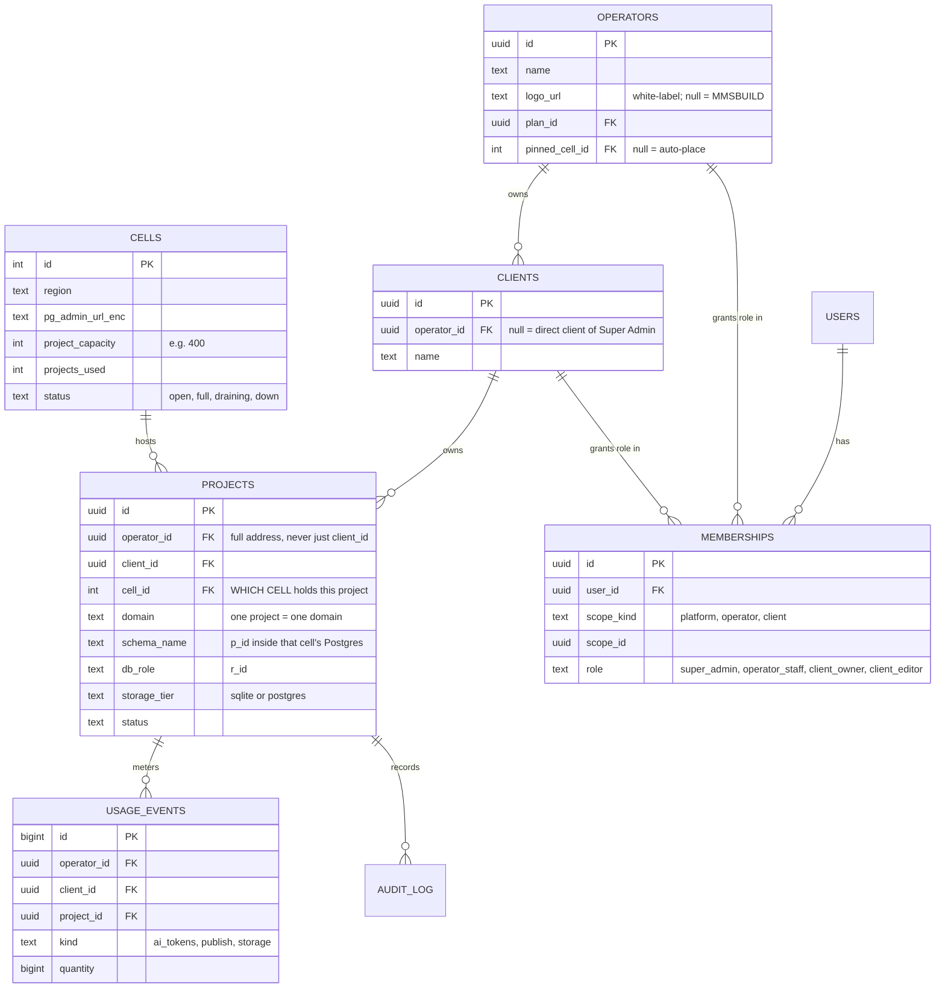

Three details carry the whole design:

- **`projects.cell_id`** — the single column that makes §8 possible. On day one every row is `1`.
- **`operators.pinned_cell_id`** — how *"BrightLeaf's data stays in India"* works with no special
  case in the code.
- **Every row carries its full address** — `operator_id` **and** `client_id`, not merely its
  immediate parent.

#### The full-address rule

Nothing is stored with only a project id. Every record carries the complete chain, and Row-Level
Security is written against it, so a query that omits the address returns **nothing at all** rather
than everything.

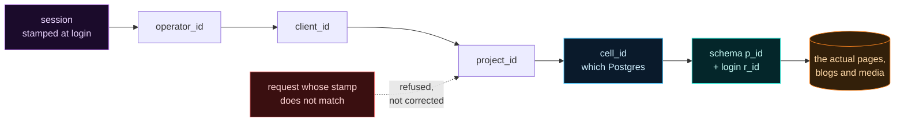

Sessions carry the stamp too. When an Operator selects a client and then a project, the session is
stamped with operator + client + project, and every request is checked against it. A request that
does not match is **refused, not silently corrected**.

### 5.3 Tier 2 — the project content layer

**One schema plus one database login per project** — exactly what is built today, kept.

The isolation is not a filter in application code. It is `GRANT` / `REVOKE` at the database level:
the project's login owns its own schema, has `public` revoked, and has its `search_path` pinned by
`ALTER ROLE` so it survives pooled connections. A buggy query cannot get past it, because there is
nothing shared to reach.

**Optional storage tier for small sites.** The CMS already speaks **both Postgres and SQLite**,
selected purely by `DATABASE_URL`
([`Instatic/server/db/index.ts:63-81`](../../Instatic/server/db/index.ts)), with both migration sets
held at parity by a test. A small brochure site can therefore be **one SQLite file** — no schema, no
connection, no pooler slot, near-zero cost — and be promoted to a Postgres schema when it grows.
`projects.storage_tier` records which, and promotion is a migration, not a redesign.

**Per-project operations stay first-class:**

| Operation | How |
|---|---|
| Back up one project | `pg_dump -n p_4472` (or copy one SQLite file) |
| Export / hand over a project | The same dump — it is the complete website |
| Move a project to another cell | Dump → restore on the target → update `projects.cell_id` |
| Delete a project | `drop schema … cascade`, `drop owned by`, remove its folders |

### 5.4 Isolation model, and its one documented limit

The wall is at the database level. There is exactly one thing it does not cover, and it is stated
plainly rather than buried: **Postgres system catalogs are world-readable.**

| Could another tenant see… | |
|---|---|
| The list of **schema names** (revealing project slugs) | 🟠 Yes |
| **Table and column names** | 🟠 Yes — but identical for every project, since all run the same CMS migrations, so they reveal nothing |
| Any **page, blog post, image or form entry** | 🟢 **No** |
| Any **user, email, password hash or session** | 🟢 **No** |
| Any **setting, API key or AI credential** | 🟢 **No** |
| **A single row of anything** | 🟢 **No** — a `select` against another schema returns `permission denied` |

So the entire exposure is **a list of project slugs**.

And reading even that requires a **raw Postgres login**. Customers reach the CMS through a browser;
it exposes no SQL console and never hands out the database password. Exploiting this therefore means
someone has **already stolen a project's database credentials** — at which point the slug list is
the least of the problems.

**Two escape hatches, neither requiring re-architecture**, if a client ever cannot accept it (two
direct competitors on the platform, or a contractual requirement):

1. Place that client on **their own cell** — set `operators.pinned_cell_id`.
2. Give that one project **option C** — its own database, recorded in `projects.storage_tier`.

Both are per-project decisions the `cell_id` model already supports.

---

## 6. Application architecture

### 6.1 Shared code, per-project data

Following directly from §2.2: **per-project means data and configuration only.**

| Per project | Shared by the whole fleet |
|---|---|
| A database schema (or SQLite file) and its login | The `Instatic` build (`dist`) |
| An uploads / media folder | The `OpenDesign` tree |
| A design data directory | The design web server |
| Secrets, domain, publish target | The control plane and gateway |
| A set of environment variables | Bundled plugins, skills, design catalogue |

A repository or build per project would mean N builds to keep in sync, N upgrade paths, and would
break the upgrade runbooks that already exist in this folder. **It is not on the table.**

### 6.2 Design and CMS hold projects differently — by design

MMS-Design lets one customer keep several projects open. MMS-CMS does not, and that asymmetry is
deliberate.

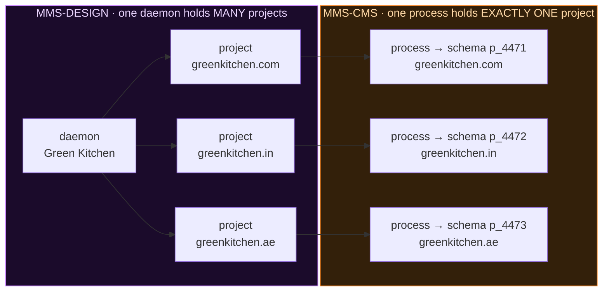

| | **MMS-Design (daemon)** | **MMS-CMS (process)** |
|---|---|---|
| Projects per running program | **Many** — it has a project list built in | **Exactly one. Always.** |
| Why | It is a workspace. Switching project is switching folder. | Its `site` table is a **single row**; pages and blogs live in `data_tables` / `data_rows` with **no project column**; and it holds per-website state in memory — render cache, publish lock, plugin sandboxes, live co-editing documents |
| Can two projects collide? | 🔴 **Today, yes** — see §6.3 | 🟢 **No, and it cannot be made to** — different schema, different login, nothing shared to collide over |

> **How a customer works across several projects:** projects are switched **at the Hub**, never
> inside one CMS. Selecting a project scopes the entire session, and the gateway routes to *that
> project's own* CMS. This is safe by construction — each project has its own schema, its own login,
> its own uploads folder and its own process.

### 6.3 The Share-to-CMS binding

The one place where two projects **can** collide today is on the design side, and it is a real bug
already recorded in [`mmsbuild-vision-vs-today.md`](./mmsbuild-vision-vs-today.md).

The CMS address is set on the **daemon** (`OD_INSTATIC_URL`), not on the project. So every project
inside one daemon pushes into the *same* CMS — and because the import runs as merge-overwrite, two
projects that both have a page called `index` overwrite each other.

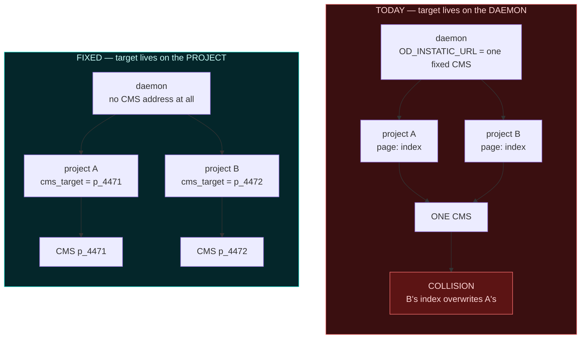

**The fix:** move the CMS target off the daemon's environment and onto the **project record**, passed
per request. This does two things at once:

1. **Removes the correctness bug** — each project's Share to CMS lands in its own CMS, and can reach
   nothing else.
2. **Collapses the heaviest program from per-project to per-client** — once a daemon can safely hold
   several projects, a client with five domains needs one daemon instead of five. A 3–10× reduction
   in the most expensive process on the platform.

One change, two results.

---

## 7. Runtime architecture

### 7.1 Request lifecycle

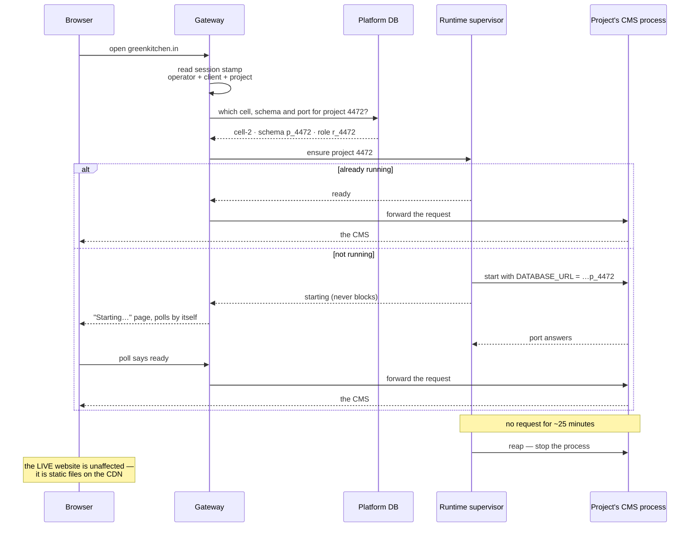

The scope check happens **before** the lookup, and a request whose stamp does not match its target is
refused rather than corrected. Both the on-demand start (`ensure()`) and the waiting page
([`gateway/starting.mjs`](../../Operator/control-plane/gateway/starting.mjs)) already exist today.

### 7.2 Process lifecycle

The compute wall is that every active customer runs two programs permanently, started for everyone
at boot, and never stopped. Four changes, in order:

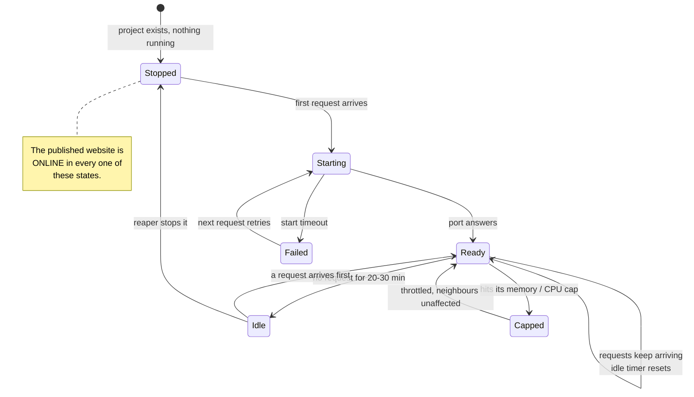

1. **Stop booting everyone.** Remove the boot-time fan-out in `resumeAll()`, which today starts every
   active customer's programs at once with no staggering and no concurrency limit.
2. **Add an idle reaper.** Stop a project's programs after ~20–30 minutes without a request. A
   published site is static files on the CDN and does not need the CMS running to stay online.
3. **Cap everything.** A per-process memory and CPU cap, a per-role `ALTER ROLE … CONNECTION LIMIT`,
   and a connection pooler in front of Postgres. Without caps, one customer's AI run starves the
   host — precisely the noisy-neighbour failure this architecture exists to prevent.
   > **This is the one place the hosting choice matters:** Linux provides cgroups, Windows provides
   > Job Objects. Either works; the architecture does not care which.
4. **One daemon per client** rather than per project, enabled by §6.3.

**Blocking prerequisite.** The daemon's cold start must come down from *minutes*. It is a
15,500-line server with 287 imports that re-registers 460 bundled plugins on **every** boot, read off
a network share ([`odRuntime.mjs:14-19`](../../Operator/control-plane/runtime/odRuntime.mjs)). Move its
data onto local disk — it is SQLite and cannot correctly live on the share anyway — and pre-index the
plugins instead of re-walking them each time. **Until that lands, idle-stop simply means customers
wait minutes**, so this is a blocker, not a nice-to-have.

### 7.3 Capacity model & sizing knobs

**Sizing follows concurrent editors, not project count.** That is the whole shift.

| Projects | Concurrent editors @ 1–3% | Live programs (1 CMS + shared daemons) | Cells @ 400 projects | Ordinary servers |
|---|---|---|---|---|
| 500 | 5–15 | ~20–40 | 2 | 1–2 |
| 2,000 | 20–60 | ~50–100 | 5 | 2–3 |
| 10,000 | 100–300 | ~200–400 | 25 | 4–8 |
| 30,000 | 300–900 | ~600–1,200 | 75 | 12–20 |

Every number above is a **knob**, to be re-tuned from real measurements rather than trusted:

| Knob | Starting value | Re-tune when |
|---|---|---|
| Schemas per cell | 400 | Postgres catalog operations or provisioning slow down |
| Idle timeout | 20–30 min | Users complain about waiting, or hosts sit idle |
| Concurrency assumption | 1–3% | Real usage data arrives — this is the highest-leverage number |
| CMS pool size per project | Bun default | Connection pressure appears at the pooler |
| Per-process memory cap | Measure first | Any customer is being throttled unfairly |

---

## 8. Scale architecture — cells

### 8.1 What a cell is

**One complete, self-sufficient copy of the platform's machinery.**

A restaurant chain with 300 branches does not build one gigantic kitchen serving all of them. It
builds a normal-sized kitchen per branch. **A cell is one normal kitchen.**

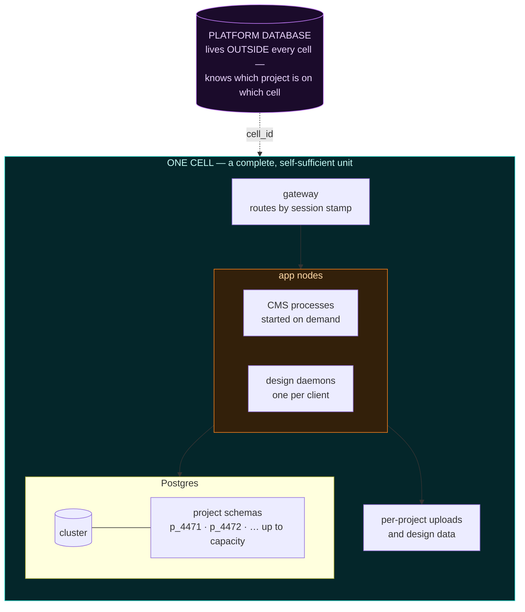

> ### Today's Postgres already **is** cell-1.
>
> The current setup — one Postgres, one host, one gateway — is a complete cell. **Nothing is bought
> or built to begin.**
>
> The entire day-one change is **one column**: `projects.cell_id`, with every existing project set
> to `1`. That column is what later allows cell-2 to be added **without touching a single existing
> project.**

### 8.2 Placement & growth

New projects go to the **least-full open cell**, unless their operator is pinned. Existing projects
never move on their own.

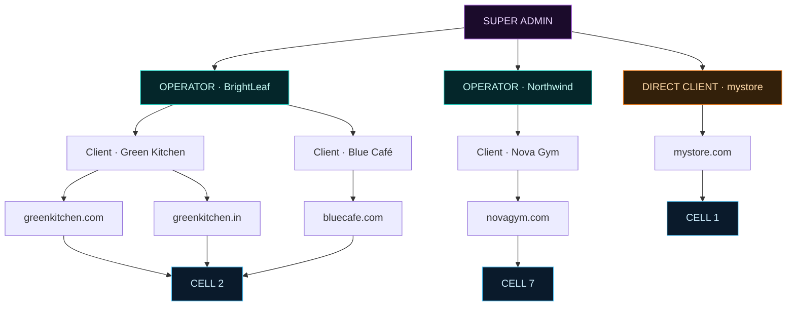

Notice that the hierarchy and the placement are **independent**. Green Kitchen's two projects both
happen to sit on cell-2; Nova Gym sits on cell-7. The four-level model does not dictate physical
placement, and physical placement does not leak into the product.

**Growth, month by month:**

| When | Situation | Action |
|---|---|---|
| **Month 1** | 40 projects, all on cell-1 | Nothing. Cell-1 is the host already owned. |
| **Month 8** | 380 projects. Postgres coping, host at 70% RAM, provisioning slowing. The dashboard shows cell-1 at **95% of its 400-project capacity**. | Nothing yet — but it is visible *in advance*, which is the point. |
| **Month 9** | Cell-1 is full | Add a second host and Postgres; register it as **cell-2**. Provisioning sends new projects there automatically. **No existing project moves. No downtime. No code change.** |
| **Month 20** | BrightLeaf (200 clients) requires data residency in India | Add **cell-3** in an Indian region and set `operators.pinned_cell_id`. New BrightLeaf projects land there. Same architecture, no special case, no second codebase. |

### 8.3 Cost model

A cell is real hardware — a host (or several) plus a Postgres. It is a real bill. The value is in
**when** it is paid.

> **Cell-N is only purchased once cells 1…N-1 are full of paying customers.** Cost tracks revenue
> instead of leading it.

| Approach | What you pay | Problem |
|---|---|---|
| **Cells** | One ordinary machine at a time, only when the last one filled | — |
| One machine large enough for everyone | Peak capacity from day one | Worst price per project, and half a machine cannot be bought |
| A separate database per project | ~7–10 MB catalog + a maintenance job **per site** | Paid even for sites with four visitors a month |

### 8.4 Failure & blast radius

This is the reason cells exist. Suppose cell-3 fails, holding 300 of 5,000 projects.

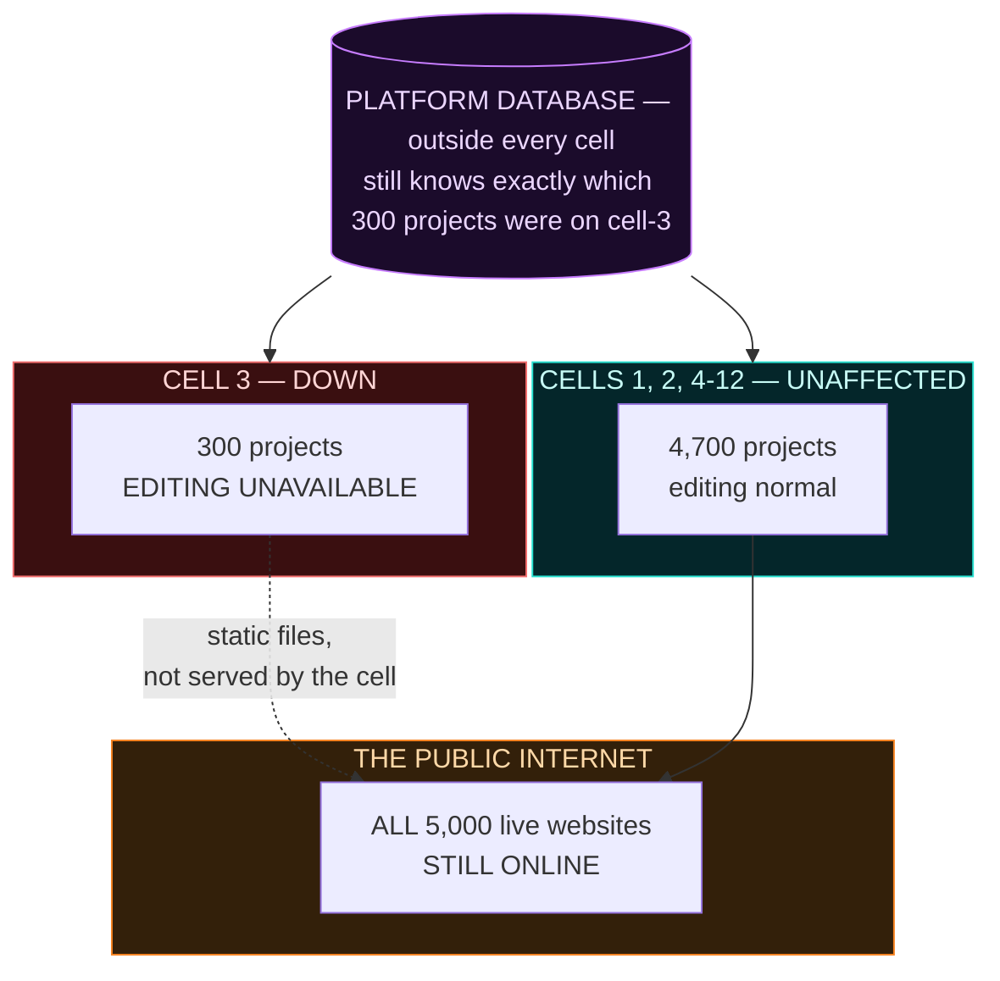

| | |
|---|---|
| Who is affected | **Only those 300.** The other 4,700 notice nothing at all. |
| Do live websites go down | **No.** Published sites are static files on the CDN, not served from the cell. Visitors are unaffected. |
| What actually breaks | **Editing.** Those 300 customers cannot sign in and change their site until the cell returns. |
| Recovery | Restore that cell's Postgres from backup. The platform database lives **outside** the cells and still knows exactly which projects belonged to cell-3, so nothing is lost track of. |
| The same failure on one shared database | **All 5,000 customers down at once.** |

**Bounding the blast radius is the point.** A cell caps how much of the business a single bad
migration, full disk, corrupt Postgres or bad deploy can reach.

---

## 9. End-to-end example

BrightLeaf is an operator with 150 clients. Green Kitchen is one of them, with two domains.

**The records** — all in the one shared platform database: one row in `operators`, 150 in `clients`,
about 300 in `projects`. Two of those are `#4471 greenkitchen.com` and `#4472 greenkitchen.in`, both
stamped `operator_id = BrightLeaf, client_id = GreenKitchen`.

**The content** — project `#4471` is placed on **cell-2** as schema `p_4471` with login `r_4471`.
Project `#4472` also lands on cell-2, as `p_4472` with `r_4472`. Different schema, different database
login — so `greenkitchen.in`'s CMS **cannot read** `greenkitchen.com`'s pages even with a buggy
query. There is nothing shared to leak from.

**At rest** — nobody is editing, so **zero programs are running for Green Kitchen**. Both live
websites are still online, because published sites are static files on the CDN.

**Opening `greenkitchen.in`** — the gateway reads the session stamp, sees it scoped to project
`#4472`, looks up cell-2, starts a CMS process bound to `p_4472`, shows the "Starting…" page, then
hands over. About 25 minutes after the tab closes, the reaper stops it again.

**Opening MMS-Design** — **one** daemon starts, for *Green Kitchen the client*, holding both `#4471`
and `#4472` as separate projects inside it. The owner switches between them freely. Pressing **Share
to CMS** on `#4472` reads the target from project `#4472`'s own record, so the pages land in
`p_4472`'s CMS and cannot touch `greenkitchen.com`. One heavy program serves the entire client
instead of one per domain.

**Concurrently** — Nova Gym, on cell-7, runs a large AI job. It cannot reach Green Kitchen: different
Postgres, different machine. And its own process is capped, so it cannot degrade even its own
neighbours on cell-7.

**The Super Admin opens billing** — `select operator_id, sum(quantity) from usage_events group by 1`.
One query, one database, instant. That works precisely *because* Tier 1 is not split.

---

## 10. Known ceilings to fix before they bite

Real limits found in the current code. None block the architecture; all block scale.

| Ceiling | What happens | Where |
|---|---|---|
| **Port allocation** is `max()+1`, never reused, with no unique constraint | Two concurrent provisions race for the same port; deprovisioned ports are burned permanently | [`provision.mjs:61-75`](../../Operator/control-plane/provisioner/provision.mjs) |
| **`tenant_users.tenant_slug` is `UNIQUE`** | Exactly one login per customer. The four-level model needs many users per client, plus a role column | [`schema.sql:80`](../../Operator/control-plane/registry/schema.sql) |
| **`settings` is a singleton** (`check (id = 1)`) | One AI configuration for the entire platform; operators cannot have their own | [`schema.sql:5-13`](../../Operator/control-plane/registry/schema.sql) |
| **Control-plane pool is `max: 10`** | Shared by everything, including a per-request, uncached tenant lookup on the proxy path | `registry/db.mjs` |
| **No per-role `CONNECTION LIMIT`** and no pooler | One customer can exhaust the cluster's connections | §7.2 |
| **Postgres catalog name-leak** | A stolen database login can list project slugs | Accepted, scoped and mitigated in §5.4 |

_The publishing / CDN path has its own limits; they are out of scope for this document._

---

## 11. Migration path

Five phases. **Each is shippable on its own, and each leaves the platform working.** Nothing here
requires a flag day.

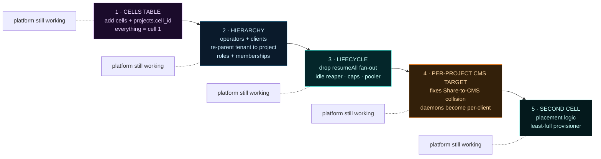

| Phase | What ships | Why this order |
|---|---|---|
| **1 — Cells table** | `cells` table; `projects.cell_id` defaulting to `1` | Cheapest possible step. Nothing changes behaviourally; it just makes phase 5 possible later. |
| **2 — Hierarchy** | `operators`, `clients`, re-parent `tenants` → `projects`, roles and memberships, drop the one-login-per-tenant constraint | Everything above the project level depends on this. Existing customers backfill to a default client. |
| **3 — Lifecycle** | Remove the `resumeAll()` fan-out, add the idle reaper, add memory/CPU caps, per-role connection limits and a pooler | This is what actually removes the noisy-neighbour risk and the 80–100 customer wall. Requires the daemon cold-start fix from §7.2 first. |
| **4 — Per-project CMS target** | Move the CMS address from daemon environment to project record | Fixes a live correctness bug *and* collapses daemons to per-client, which is the largest single compute saving. |
| **5 — Second cell** | Placement logic, least-full-cell provisioner, per-cell dashboards | Only worth doing once cell-1 is genuinely near capacity. |

---

## 12. Relationship to existing documents

| Document | Relationship |
|---|---|
| [`mmsbuild-platform-vision.md`](./mmsbuild-platform-vision.md) | **Unchanged and still authoritative** for what the platform is. This document supplies the scale layer beneath it. |
| [`mmsbuild-vision-vs-today.md`](./mmsbuild-vision-vs-today.md) | **Corrected on one point.** It states each project has *"its own database"*; the code only ever creates a **schema** ([`provision.mjs:89`](../../Operator/control-plane/provisioner/provision.mjs)). §5 here is the accurate statement. Its Share-to-CMS finding is confirmed and given a fix in §6.3. |
| `docs/architecture/DB-Architecture.md` | **Extended.** Its shared-database, schema-per-tenant decision is kept and reaffirmed in §5. Its *"~5–8 tenants at `max_connections = 100`"* ceiling is addressed by the pooler and connection limits in §7.2. It puts sharding explicitly out of scope; **§8 supersedes that** — cells are the sanctioned growth path. |
| [`od-cms-vision.md`](../integration/od-cms-vision.md) | **Unaffected.** The Share-to-CMS contract is unchanged; §6.3 only changes *where the target address is stored*, not how the import works. |
| [`mmsbuild-product-hub-os.md`](./mmsbuild-product-hub-os.md) | **Unaffected.** The Hub is the surface on which project switching (§6.2) happens. |

### Where the pieces live

- **Control plane** — [`Operator/control-plane/`](../../Operator/control-plane/); provisioning in
  [`provisioner/provision.mjs`](../../Operator/control-plane/provisioner/provision.mjs); the registry in
  [`registry/schema.sql`](../../Operator/control-plane/registry/schema.sql)
- **Runtime supervisors** — [`runtime/tenantRuntime.mjs`](../../Operator/control-plane/runtime/tenantRuntime.mjs)
  (CMS) and [`runtime/odRuntime.mjs`](../../Operator/control-plane/runtime/odRuntime.mjs) (design daemons)
- **Gateway and waiting page** — [`gateway/proxy.mjs`](../../Operator/control-plane/gateway/proxy.mjs),
  [`gateway/starting.mjs`](../../Operator/control-plane/gateway/starting.mjs)
- **CMS database layer** — [`Instatic/server/db/`](../../Instatic/server/db/); dialect selection in
  [`index.ts`](../../Instatic/server/db/index.ts)
- **MMS-Design daemon** — [`OpenDesign/apps/daemon/src/server.ts`](../../OpenDesign/apps/daemon/src/server.ts)
