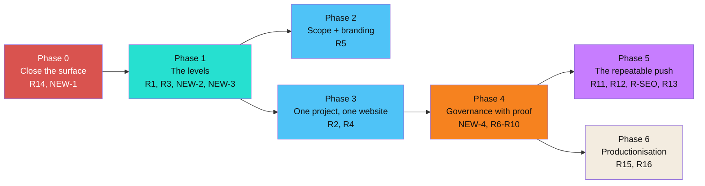
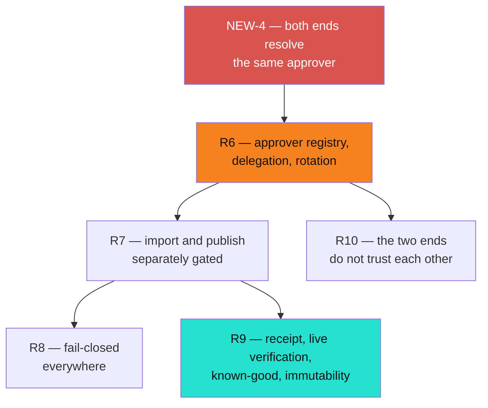

# MMSBUILD — Product Requirements

_What the platform must become, as outcomes that can be checked rather than trusted. Every requirement carries its acceptance test inline. Written from three sources: the as-is baseline [`../current-state/mmsbuild-current-state.md`](../current-state/mmsbuild-current-state.md), the requirements brief, and the acceptance criteria. The design these requirements specify against: [`mmsbuild-target-architecture.md`](./mmsbuild-target-architecture.md). The same material, drawn: [`mmsbuild-prd.html`](./mmsbuild-prd.html)._

---

## 1. The goal

MMSBUILD is a **governed website factory** — sellable and runnable for many businesses, where **a business asks for a change and it goes live with proof**.

The current pilots exist to prove it works. They are not the objective. Every requirement below serves that one sentence, and anything that does not is a non-goal.

Two decisions are load-bearing and are never traded away:

> **Approval is a per-property configurable approver, not one platform key.**
>
> **No check may fail open.** A check that cannot run reports failure — never a zero-findings pass.

**Legend:** ✅ works today · 🟡 partly there · ❌ not built

---

## 2. Status of the six items claimed as already built

The brief lists six items as built and asks that the PRD treat them as present rather than to-build. Each was checked against the working software. Two hold. Three are partial in ways that change what the requirements must say. One is miscredited.

**All six live in uncommitted work — so none is deployed.** "Built" and "running" are different claims, and the acceptance suite tests the second.

| Claimed | Verdict | What is actually there, and what is missing |
|---|---|---|
| Per-property approver key | 🟡 **Partial — and blocked** | The side that **checks** approvals can resolve a per-property approver and is tested for it, including the case where a property-specific key must not be satisfied by the platform key. But the live policy carries **no property entries**, so every property still resolves to the platform identity — and the side that **issues** approvals verifies everything against one platform-wide identity, so it would refuse to issue a property-signed approval before the checking side ever saw it. There is no registration and no rotation. |
| Render-aware pre-flight | 🟡 **Partial** | It reports all four required items — surviving style-rule count, dropped classes, resolved routes and what is missing — and computes them by running the real publishing logic rather than an approximation. But **nothing blocks on its findings**: a bundle where a handful of style rules survive imports anyway if it carries a valid approval. It also runs only on the import path; the publish tools have no projection at all, and publishing is the step that renders. |
| Strict argument validation | ✅ **Holds** | Enforced centrally before any tool runs, so no individual tool can forget it. Every tool's schema was checked and all declare it. A wrong or unknown setting now fails with a message naming the accepted set, rather than being silently discarded. |
| Revision stamp | 🟡 **Partial** | Present on the software and returned alongside an approved action's result. **Absent from every durable record** — the approval receipt, the approval ledger and the deploy record all carry no build identity. So nobody reading the record of a past deploy can say which build performed it, which is the reason the stamp was wanted. |
| Font install on the machine path | ✅ **Holds** | Exists, downloads the font files so published pages never call out to a third party, and is genuinely idempotent — a family already installed with the same variants and subsets is skipped and reported as such. A partial match re-installs with the union of old and new rather than destroying what was there. |
| Notify-on-creation | ⚠️ **Miscredited** | Notification on creation already shipped and is not new. What is new is notification on **every message**. Both are silently disabled unless a notification destination is configured — and unlike every other missing setting, an unset destination does not stop the system starting. If it was never configured, no notification of any kind has ever been delivered. Worth confirming before anyone relies on it. |

**Consequence for this PRD.** Requirement **R6** cannot be marked partially done and moved past: per-property approval is **non-functional end to end** until both sides resolve the same approver. That is stated as a blocker, not a caveat.

---

## 3. Principles

Four. Each is testable, and each has at least one acceptance criterion that exists solely to defend it.

| # | Principle | Defended by |
|---|---|---|
| **P1** | **A per-property configurable approver, with no master key.** A key that approves one property fails on another. A property with a broken approver entry refuses rather than falling back to a wider identity. | AC-B6.1, AC-B6.3 |
| **P2** | **Nothing fails open.** A check that cannot run reports failure. Missing configuration refuses; it does not proceed quietly. | AC-B8.1, AC-B8.2, AC-B8.3 |
| **P3** | **One project is one domain is one website.** A design reaches only its own project's CMS. A second website is refused or lands separately — never a silent overwrite. | AC-A2.1, AC-A2.2, AC-A2.3 |
| **P4** | **MMS-CMS is the sole publisher of platform sites.** Design creates; the CMS publishes; nothing else reaches the public internet. | AC-A2.3, AC-B9.2 |

---

## 4. Requirements

Numbering follows the brief so the mapping is obvious. Requirements marked **NEW** are additions — each says why it is here and what breaks without it.

Every requirement has the same five rows: **Outcome** (what must be observably true), **Why** (the failure it prevents), **Acceptance** (the test, by its id), **Depends on**, **Status**.

---

### Phase 0 — Close the surface

Promoted from the brief's last group to first, because every requirement after it assumes an authenticated admin. Building the levels and roles on an open control plane means building them twice.

#### R14 — Admin authentication

| | |
|---|---|
| **Outcome** | Every administrative action requires a signed-in administrator. An unauthenticated request to any admin action is refused. |
| **Why** | Today the admin surface is reachable on the public address with no sign-in at all. That includes deleting a project and minting a machine key. This is the brief's honest-list item 7. |
| **Acceptance** | **AC-D14.1** — an unauthenticated request to any admin/operator action is refused; the console requires sign-in. |
| **Depends on** | Nothing. This is the first thing. |
| **Status** | ❌ Not started. The password hashing, signed-session and invite primitives it needs all already exist elsewhere in the system and should be reused rather than rewritten. |

#### NEW-1 — The admin surface reveals no secret it does not have to

| | |
|---|---|
| **Outcome** | No administrative response returns a credential in a form that can be used. Specifically: an existing machine key is never returned in plaintext after it is minted, and a project listing returns neither a working invite link nor a live capacity token. |
| **Why** | Not in the brief. Found while checking R14: authentication alone does not fix this — an authenticated administrator with a narrow role would still be handed credentials belonging to every project. Closing the door without fixing what is behind it leaves the blast radius intact. |
| **Acceptance** | **NEW-1a** — mint a machine key, then attempt to read it back: the plaintext is unavailable, only its identity and metadata. **NEW-1b** — list projects as an administrator: the response contains no usable invite link and no usable capacity token. |
| **Depends on** | R14 |
| **Status** | ❌ Not started. |

---

### Phase 1 — The levels

#### R1 — Operator and Business levels above Project

| | |
|---|---|
| **Outcome** | An Operator owns many Businesses; a Business owns many Projects. Each level resolves its children, and the chain is queryable. Every stored record carries its full address, so a query that does not name one returns nothing. |
| **Why** | The single largest gap. Today's project is exactly the target's project — the two levels above it do not exist at any layer, so the platform cannot be sold to an agency. |
| **Acceptance** | **AC-A1.1** — create an Operator owning ≥2 Businesses, each owning ≥2 Projects; the chain is queryable and each level resolves its children. **AC-A1.2** — as a user scoped to one Business, attempt to read *and* to modify a Project under another Business by direct call: both denied at the server, and no data from the other Business appears in any listing. |
| **Depends on** | R14 |
| **Status** | ❌ Not started. Per-project isolation beneath it is ✅ already real and enforced by the database — this adds levels above, it does not redo the isolation. |

#### R3 — Roles, and more than one person per project

| | |
|---|---|
| **Outcome** | A project can have several people, each with a role. An action permitted to one role is denied to a lesser role, and the denial holds when the interface is bypassed. |
| **Why** | Today every signed-in person is treated identically, and a project holds exactly one login. Without roles there is no way to give a business's staff access without giving them everything. |
| **Acceptance** | **AC-A3.1** — a project has ≥2 logins with different roles; an action allowed for a publisher role is attempted by an author role: allowed for the first, denied for the second. **AC-A3.2** — repeat the denied action by direct call, bypassing the interface: still denied. |
| **Depends on** | R1 |
| **Status** | ❌ Not started. The CMS's own role and capability system — four roles, around forty capabilities, already enforced on every request — should be adopted rather than duplicated. |

#### NEW-2 — Inviting a second person must not overwrite the first

| | |
|---|---|
| **Outcome** | Inviting an additional person to a project adds an account. It never replaces an existing person's account. |
| **Why** | Not in the brief. Today a project is constrained to exactly one login, and the invite path resolves the collision by **overwriting the existing person's account**. That is silent data loss, and it is the concrete blocker sitting underneath R3 — R3 cannot be demonstrated until it is fixed. |
| **Acceptance** | **NEW-2a** — invite person A, accept, then invite person B to the same project: both accounts exist and both can sign in. |
| **Depends on** | R1 |
| **Status** | ❌ Not started. |

#### NEW-3 — A portal sign-in must arrive with its own role, not as the owner

| | |
|---|---|
| **Outcome** | A person arriving in the CMS from the portal is bound to their own role, and any step-up the CMS requires is still required of them. |
| **Why** | Not in the brief. Today a portal sign-in lands in the CMS as a full owner **with the password re-entry already satisfied**, so the CMS's role system is bypassed entirely. Roles built above this would be decorative: AC-A3.2 would fail on exactly this path. |
| **Acceptance** | **NEW-3a** — sign in as an author role and attempt an owner-only action inside the CMS: denied. **NEW-3b** — attempt a step-up-protected action: the step-up is demanded, not pre-satisfied. |
| **Depends on** | R3 |
| **Status** | ❌ Not started. The wire format already carries a role field and already recognises four role names, so this is a matter of honouring it rather than inventing it. |

---

### Phase 2 — Scoped visibility and branding

#### R5 — Platform Owner sees counts, not work; Operators are branded

| | |
|---|---|
| **Outcome** | The platform-owner role can list counts and status across the estate but cannot open a business's design or content. An Operator's surfaces carry the Operator's branding, not the platform's. |
| **Why** | An agency cannot resell a product that shows the platform's name to its own customers, and the platform owner should not be able to read a customer's work by default. Opening the work must be a distinct, logged "acting as" mode. |
| **Acceptance** | **AC-A5.1** — as the platform-owner role, list project and business counts and status, then attempt to open a business's design or content: counts visible, opening denied. **AC-A5.2** — an Operator's project surfaces render the Operator's branding on the branded surfaces this PRD names. |
| **Depends on** | R1, R3 |
| **Status** | ✅ Built 2026-09-18. Branding was a single global value; it is now per-Operator, and opening a business's work goes through a logged act-as mode. |

##### The branded surfaces (authored here)

> ⚠️ **AC-A5.2 referred to a list this PRD never contained.** As with the locked
> ten in §4, the list below is **authored as part of this PRD** rather than
> cited from an earlier decision. Until it existed, AC-A5.2 could not be tested:
> "the surfaces this PRD names" named none.

The rule it follows is the target architecture's: **branding flows down exactly
one level.** An Operator's branding replaces the platform's across everything
that Operator owns; a Business directly under the Platform Owner keeps
MMSBUILD's. Anything an Operator leaves unset falls back to the platform's.

| # | Surface | What carries the Operator's brand | Seen by |
|---|---|---|---|
| S1 | Hub invite, project chooser, product chooser, "no products" | logo, page title, favicon, accent | the customer |
| S2 | The "Starting…" interstitial | logo, product name, accent | the customer |
| S3 | MMS-CMS shared header, rows 1 and 2 | logo, product name, accent | the customer |
| S4 | MMS-CMS browser tab title and icon | title, favicon | the customer |
| S5 | MMS-Design shared header | logo, product name, accent | the customer |
| S6 | MMS-Design browser tab title and icon | title, favicon | the customer |
| S7 | Operator Console header, title, favicon | logo, product name, accent | the agency's staff |
| S8 | Operator Console invite-accept card | logo, product name | the agency's staff |

**Branding covers** the logo, the product name shown in the header, and the
accent colour — the three the platform vision names. The product name takes the
Operator's: *MMS-CMS* reads *BrightLeaf CMS*, *MMS Design* reads *BrightLeaf
Design*.

**Deliberately not branded.** The published website: that is the customer's own
design, and rewriting it was never asked for. Internal identifiers, route
prefixes, cookie and storage names: contracts, not brand text. A project's own
name and favicon: they belong to the customer, not to the agency.

**One named limit.** The cold hub sign-in page carries no session and no token,
and one funnel origin serves every Operator, so there is no way to know whose
brand to show before someone identifies themselves. It stays platform-branded.
Branding it from the typed email is deliberately refused — that would reveal
which agency an address belongs to. Every surface after sign-in is branded, and
an invite link is branded because its token names the project.

##### How far "cannot open the work" reaches

The Outcome and the target architecture both say "**a business's** design or
content" without qualification, so the restriction covers **every** Business,
agency-owned or direct, and act-as is the one way in. (`mmsbuild-platform-vision.md`
predates this PRD and lets platform staff open direct clients freely; where they
differ, this PRD governs.)

---

### Phase 3 — One project, one website

#### R2 — A second website cannot silently destroy the first

| | |
|---|---|
| **Outcome** | Sharing a second, different design into a project that already has a published website either fails with a clear message or lands as a distinct website. The first website's routes still resolve, with the first website's content, afterwards. |
| **Why** | This is the worst behaviour in the as-is system and the honest-list item 2: the second share blanks the CMS and rebuilds it, so the first website is destroyed with no warning, no conflict prompt and no duplicate. It reads exactly like a successful update. |
| **Acceptance** | **AC-A2.1** — in a project with published site A, share a different design B: the platform refuses with a clear message, or lands B as a distinct site; **site A's routes still resolve with A's content afterwards.** A silent overwrite is a FAIL. |
| **Depends on** | R1 |
| **Status** | ❌ Not started. |

#### R4 — The CMS destination belongs to the project

| | |
|---|---|
| **Outcome** | A design resolves its CMS destination through its own project. There is no argument, setting or configuration by which a design can be aimed at another project's CMS. A change published in one project never appears on another project's domain. |
| **Why** | Today the destination belongs to the design *workspace*, not to the individual design — which is the mechanism behind R2's failure. Fixing R2 without fixing this leaves the aiming problem in place. |
| **Acceptance** | **AC-A2.2** — attempt to point a design's destination at another project's CMS: not possible; the destination resolves to the design's own project only. **AC-A2.3** — publish to project A only, then fetch both domains: the change appears on A's domain and not on B's. |
| **Depends on** | R1, R2 |
| **Status** | ❌ Not started. |

---

### Phase 4 — Governance, with proof

**NEW-4 is first, and it is a blocker rather than a task.** Nothing in the approver work functions until both ends agree.

#### R6 — Per-property approver: registration, delegation, rotation

| | |
|---|---|
| **Outcome** | An approver is registered per property and resolved by walking up Project → Business → Operator where delegation is configured. A property's approver approves only that property. Registration, rotation and revocation are first-class operations, and a rotated-out identity stops being accepted immediately. |
| **Why** | The platform key is the pilot arrangement only. An agency cannot be sold a product in which the platform holds the only signature that authorises changes to its customers' sites. |
| **Acceptance** | **AC-B6.1** — an approval for property P signed by P's approver is accepted; the identical action signed by another property's approver is refused. **AC-B6.2** — after rotating P's approver, an approval signed by the old identity is refused and one signed by the new identity is accepted. **AC-B6.3** — no single identity satisfies two different properties' approvals. **AC-B6.4** — a Business-level approver can approve its own projects when configured, and cannot approve another Business's projects. |
| **Depends on** | R1, **NEW-4** |
| **Status** | 🟡 Partial and **blocked** — see NEW-4. The checking side can resolve a per-property approver; nothing else of this requirement exists. |

#### NEW-4 — The issuing side must resolve per-property approvers too

| | |
|---|---|
| **Outcome** | The side that issues approvals and the side that checks them resolve the **same** approver for the same property. Neither has a privileged identity the other does not recognise. |
| **Why** | Not in the brief, and it is the reason R6 is blocked rather than merely incomplete. The issuing side today verifies every approval against a single platform-wide identity — so a property-signed approval is refused at issue time and the checking side's per-property support never comes into play. AC-B6.1 fails on day one without this. |
| **Acceptance** | **NEW-4a** — register a property-specific approver, then obtain an approval for that property from the issuing side: it is issued, and the checking side accepts it. Today this fails at the first step. |
| **Depends on** | R1 |
| **Status** | ❌ Not started. **This is the first thing in Phase 4.** |

#### R7 — Import and publish each gated, bound, and gated separately

| | |
|---|---|
| **Outcome** | Import and publish each refuse without a valid approval bound to the exact artefact — unexpired, unspent, single-use. One approval never covers both, and the imported rows can be inspected between the two gates. Enforcement is at the server, so holding valid machine credentials does not bypass it. |
| **Why** | The whole "with proof" claim rests on this. An approval that can be replayed, reused across artefacts, or spent on a different action is not an approval. |
| **Acceptance** | **AC-B7.1** — import with no approval: refused; nothing imported. **AC-B7.2** — import or publish presenting an approval bound to a different artefact: refused. **AC-B7.3** — an approval past expiry: refused. **AC-B7.4** — consume an approval, then present it again: the second use is refused. **AC-B7.5** — a single approval cannot cover both import and publish; rows can be inspected between the two. **AC-B7.6** — repeat B7.1–B7.4 as a caller holding valid machine credentials: still refused. |
| **Depends on** | R6 |
| **Status** | 🟡 Partial. The gate exists across eight actions, binds to the artefact, expires, is single-use, and spends the approval before acting. What is missing is per-property resolution (R6) and the guarantee that a property currently exempted from the gate cannot remain exempt in production. |

#### R8 — Fail-closed everywhere

| | |
|---|---|
| **Outcome** | No check may fail open. If a checker crashes the action is blocked, and the blocked result is distinguishable from a success. If the approval policy is missing or unreadable, every gated action refuses. A check that cannot run reports failure, never a zero-findings pass. |
| **Why** | Principle P2. Today the importability check passes the share through **unchecked** when it crashes — the honest-list item 3 — which means a crash looks like a success. That is the most dangerous shape a bug can take. |
| **Acceptance** | **AC-B8.1** — fault-inject a crash into the importability check, then share: the action is **blocked**, and the blocked result is distinguishable from a success. Going through unchecked is a FAIL. **AC-B8.2** — with the approval policy missing or unreadable, attempt every gated action: all refused. **AC-B8.3** — force a check not to run: the result is a failure or blocked state, never a zero-findings pass. |
| **Depends on** | R7 |
| **Status** | 🟡 Partial. The approval policy already fails closed correctly. The importability check does not, and the pre-flight does not block at all (R11). |

#### R9 — The proof chain: receipt, live verification, known-good, immutability

| | |
|---|---|
| **Outcome** | Every publish produces an immutable receipt naming the approved content's identity, the deploy identity, the live-verification result, the timestamp, the previous known-good reference — and the build that performed it. Verification fetches the deployed site and confirms the served content. A known-good bundle is retained before every push and is retrievable. Receipts cannot be edited or deleted. |
| **Why** | Without this, "it went live" is an assertion. Today a deploy is marked live purely because the deploy tool exited cleanly, and nothing has ever fetched the result. The published-site incident that motivated this — a site that went live essentially unstyled — was caught by a person looking at it, which is exactly the dependency this removes. |
| **Acceptance** | **AC-B9.1** — each publish emits an immutable receipt with all named fields present. **AC-B9.2** — verification fetches the deployed site and confirms served content: a deliberately missing route serving a fallback is caught as a FAIL. An HTTP-200 check is not sufficient. **AC-B9.3** — a known-good bundle is retained before each push and is retrievable for reconstruction. **AC-B9.4** — attempt to edit or delete a past receipt or approval record: denied. |
| **Depends on** | R7 |
| **Status** | ❌ Not started, and further from done than the brief implies — **none** of receipt, live verification, known-good retention or rollback exists on the platform's publish path. Two mitigations: the approval store is already append-only and immutable by construction, which satisfies B9.4's shape; and the studio's own deploy path already polls a deployed address until reachable and already keeps a richer deploy record — adopt both rather than writing new ones. Note also that the current publish mechanism **wipes the previous generation at the start of each publish**, so retention has to be added before B9.3 is even possible. |

#### R10 — The two ends do not trust each other

| | |
|---|---|
| **Outcome** | The side that acts verifies an approval with code it does not share with the side that issued it, and succeeds with the issuing side unreachable. A tampered approval fails on the acting side regardless of what the issuing side recorded. Both sides pass one shared test suite. |
| **Why** | Two independent implementations kept honest by shared test cases is the difference between a signature and a formality. |
| **Acceptance** | **AC-B10.1** — the acting side verifies the signature with code not shared with the issuing side; verification succeeds with the issuer offline. **AC-B10.2** — a tampered approval fails on the acting side regardless of the issuer's record; both sides pass the shared suite. |
| **Depends on** | R6 |
| **Status** | ✅ Largely holds. The two implementations already share no code and are already pinned together by a shared set of test vectors. It must survive the per-property change in R6 — the shared vectors have to grow to cover per-property resolution. |

---

### Phase 5 — The repeatable push

#### R11 — Pre-flight is the gate

| | |
|---|---|
| **Outcome** | A bundle that would publish broken is caught **before** import, not by looking at the result. The pre-flight's output is complete and machine-readable so it can gate automatically, its predictions match what actually lands, and it covers the publish path and not only import. |
| **Why** | The motivating incident: a bundle whose style rules were almost entirely removed by the publish step went live nearly unstyled, and was found by screenshot afterwards. A check that reports but does not block would not have prevented it. |
| **Acceptance** | **AC-C11.1** — run the pre-flight on a known-broken bundle: it reports the low surviving-rule count **and** blocks or marks the bundle not-importable **before** any import. **AC-C11.2** — its result includes surviving style-rule count, the dropped classes and rules, the resolved route list, and a "what is missing" list, in a form that can gate automatically: all four present and parseable. **AC-C11.3** — a clean bundle passes, and the routes it predicted exist after import. |
| **Depends on** | R8 |
| **Status** | 🟡 Partial. AC-C11.2 already passes — all four items are reported, computed from the real publishing logic. **AC-C11.1 fails**: nothing blocks on the findings. Extending it to the publish path is also outstanding. |

#### R12 — Fonts: idempotent install, and survival across a replace

| | |
|---|---|
| **Outcome** | Installing a named font set returns the installed identities and re-running changes nothing. After a replace-style import, the intended fonts still render on the live page. |
| **Why** | A re-share clears the site's colour tokens and font registry as part of replacing the design — the honest-list item 4 — so a correct push is followed by an unstyled result unless someone remembers to reinstall. That memory requirement is exactly what Goal 2 removes. |
| **Acceptance** | **AC-C12.1** — install a named font set; it returns installed ids, and re-running is a no-op. **AC-C12.2** — after a replace-style import, the computed font family on the live page matches the intended one, whether the pipeline preserved the fonts or reinstalled them. |
| **Depends on** | — |
| **Status** | 🟡 AC-C12.1 ✅ already passes and is genuinely idempotent. AC-C12.2 ❌ — nothing preserves or reinstalls fonts across a replace today. |

#### R-SEO — Per-page SEO renders unconditionally

| | |
|---|---|
| **Outcome** | SEO fields set through the machine path — title, description, canonical, social preview, structured data — appear in the served page from the core renderer, with no per-project add-on required. |
| **Why** | Carried by the acceptance criteria but not numbered in the brief; included so the matrix is complete. A site that needs a per-project add-on to emit its own canonical tag is not a factory output. |
| **Acceptance** | **AC-C-SEO** — SEO fields set through the machine path appear in the live page HTML from the core renderer; no per-project plugin needed. |
| **Depends on** | — |
| **Status** | 🟡 Partly there; must be verified as rendering from the core path rather than an installed extra. |

#### R13 — A staging project the studio drives itself

| | |
|---|---|
| **Outcome** | The studio runs preview, import and publish against its own staging project with **zero developer actions**, and a full push of a new site completes with **zero developer round-trip messages**. |
| **Why** | Goal 2, and the milestone test for the whole programme. Today the developer's environment is the only place a bundle can be tested, which makes every push a two-party operation. |
| **Acceptance** | **AC-C13.1** — the studio completes preview → import → publish on a staging project with developer action count = 0. **AC-C13.2** — a full push of a **new** site completes end-to-end with developer round-trip count = 0. *This is the milestone test.* |
| **Depends on** | R11, R12 |
| **Status** | ❌ Not started. |

---

### Phase 6 — Productionisation

#### R15 — Safe replace, and a complete clear-all

| | |
|---|---|
| **Outcome** | A replace-style import does not irrecoverably destroy published history: either history survives, or a known-good snapshot is retained and can be restored. After the documented clear-all, a deleted page does not reappear from any store. |
| **Why** | Honest-list items 5 and 6. A replace destroys every published version of every page, and published state lives in several stores at once — one of which will re-create pages that were deleted from the others. |
| **Acceptance** | **AC-D15.1** — after a replace, the prior published state is recoverable. **AC-D15.2** — after the documented clear-all, a deleted page stays gone from every path: database, baked files, cache and collaboration log. |
| **Depends on** | R9 |
| **Status** | 🟡 A clear-all covering all four stores exists and is correct, and it takes a snapshot first. But **nothing ever reads that snapshot back** — there is no restore — and the replace path takes no snapshot at all. |

#### R16 — Cold-start clarity

| | |
|---|---|
| **Outcome** | A request to a studio that is still starting returns an unambiguous "starting" state, distinguishable from "crashed" and from "never installed". Once warm it serves normally. |
| **Why** | Honest-list item 8. A studio takes minutes from cold, and the state currently renders in the console identically to "the extension was never installed" — which has repeatedly sent people to reinstall something that was fine. |
| **Acceptance** | **AC-D16.1** — a request to a cold studio returns a clear "starting" state, not an error that reads as "not installed"; once warm it serves normally. |
| **Depends on** | — |
| **Status** | 🟡 The waiting page itself is already correct and polls properly. The defect is in the administrative view, which collapses "not up yet" into "not installed" because its probe cannot tell the two apart. |

---

### Security acceptance — the locked ten

The acceptance criteria require ten security test classes, run **by someone other than the builder**, on a throwaway or staging project and never on a live site.

> ⚠️ **These ten are not recorded anywhere in the codebase or its documents.** The nearest thing that exists is a ten-item approval acceptance list, which overlaps on four items but is a different list. The ten below must be **authored as part of this PRD**, not cited from an earlier decision — and each needs its own written test before the suite can be run.

| # | Test class | Covered by |
|---|---|---|
| E1 | Secret access blocked | NEW-1 |
| E2 | Network and tool allowlists enforced | new test needed |
| E3 | Prompt-injection attempts rejected | new test needed |
| E4 | Spending limits enforced | new test needed — no spend cap exists today |
| E5 | Cross-account access blocked | AC-A1.2 |
| E6 | Expired and replayed permits rejected | AC-B7.3, AC-B7.4 |
| E7 | CSRF and secure-cookie behaviour | new test needed |
| E8 | Unsafe HTML and script input neutralised | new test needed |
| E9 | Audit-record tampering prevented | AC-B9.4 |
| E10 | Failed deployment and rollback exercised | AC-B9.3, plus a rollback receipt |

E2, E3, E4, E7 and E8 have no existing coverage and no existing control. They are net-new work, and E4 in particular has been an accepted omission until now.

---

## 5. The brief's open questions, answered

The brief asks the PRD to resolve five. Here they are, with reasoning.

### 5.1 Do the two publishers converge?

**Yes — one publisher. MMS-CMS remains the sole publisher of platform sites, and the platform's deploy path adopts the studio path's deploy record and live-reachability verifier.**

The finding that decides it: the studio already has a complete, independent deploy path of its own, and it is **better at proof than the platform's**. It keeps the provider's deploy identity, a reachability timestamp, a status message and the target, and it polls the deployed address until it is actually reachable before calling a deploy done. The platform's own path records none of that and marks a deploy live on the deploy tool's exit code.

So the convergence is not "retire one and rebuild the other". It is: keep one publisher — the CMS — and move the studio path's proof mechanisms into it. That satisfies AC-B9.1 and AC-B9.2 with code that exists and is tested, instead of writing a second verifier.

**What it costs.** The two paths share nothing today — different credential stores, different transports, different record shapes, different status vocabularies, and neither can see the other's deploys. The adoption is a real piece of work, but it is smaller than building live verification from nothing, and it removes a whole class of "which publisher did this site go through?" ambiguity.

**What it means for the studio-built sites currently deploying themselves:** they migrate onto the CMS publish path as part of Phase 4. Until they do, they are outside the proof chain, and the PRD should say so plainly rather than imply coverage they do not have.

### 5.2 Where do governance records live?

**The issuing side is already the authoritative store, and receipts join it there.**

It is already append-only and immutable by construction — not by the absence of an edit route but by the store itself refusing edits — which is exactly the property AC-B9.4 tests. Adding receipts to it means they inherit that immutability rather than needing their own.

The acting side keeps its own independent ledger of what it spent and what happened, because R10 requires the two ends not to depend on each other. The two records are reconciled, not merged.

**What a projection needs**, if governance records are surfaced in a portal: read-only, addressed by the full hierarchy (Operator → Business → Project) so scoped visibility under R5 applies to it, and explicitly derived — the projection is never the source of truth, so a disagreement is always resolved in favour of the store.

### 5.3 Approver registration, delegation and rotation

- **Registration** attaches an approver identity to a property with an effective-from stamp. The registry is the only place this mapping lives, and **both ends read the same registry** — that is NEW-4, and nothing else in R6 works until it is true.
- **Delegation** is explicit, never implied. A Business-level approver covers its own projects only when configured to, and never another Business's. A property with a broken approver entry **refuses** rather than falling back up the chain — a fallback that widens scope on error is a master key by another name.
- **Rotation** takes effect immediately: approvals signed by the retired identity stop being accepted the moment the new one is registered. History is retained so an old receipt can still be explained, but a retired identity can never authorise anything new.
- **Revocation** without a replacement leaves the property with no approver, and every gated action there refuses. That is the correct failure, and it is what AC-B8.2 tests in the small.

### 5.4 Staging self-service for the studio

A studio provisions its own staging project through the same path that creates any project, with the machine door as the caller — which is already how a new site is created today. What is missing is not the creation but the **loop**: pre-flight, import under approval, inspect, publish under a second approval, all driven from the studio without a developer holding the credentials.

Two practical requirements fall out: the staging project must be gated exactly like a production one, so the loop being exercised is the real one — a staging project exempted from the approval gate proves nothing; and the pre-flight must block (R11), because a self-service loop with a non-blocking check will push a broken bundle at machine speed.

### 5.5 A correction the PRD should not inherit

The brief describes the "no CSS" bundle as the **v7** case. It was **v4** — a bundle where eight of 617 style rules survived the publish step, so the site went live essentially unstyled. v7 was the recovery build and reached 600 of 666. The mislabel came from a working note and has propagated.

This matters because the pre-flight threshold in R11 is being specified against that incident. Specifying it against the wrong build would set the threshold against a bundle that was fine.

---

## 6. Non-goals

- **Route B** — several websites inside a single project. Route A is the path: a project stays the unit of isolation and the levels are added above it. Unless the owner decides otherwise.
- Anything that relaxes P1 (per-property approver, no master key), P2 (nothing fails open), P3 (one project, one website) or P4 (one publisher).
- Rebuilding what already works: per-project isolation, the design-to-CMS handover, the role and capability system inside the CMS, and the atomic publish swap are extended, not replaced.

---

## 7. Acceptance matrix

Every criterion from the acceptance document, mapped to its requirement. **40 criteria**, plus the ten security classes.

| Id | Requirement | Phase | Pass means |
|---|---|---|---|
| AC-A1.1 | R1 | 1 | The Operator → Business → Project chain is queryable; each level resolves its children |
| AC-A1.2 | R1 | 1 | Cross-Business read **and** write denied at the server; no foreign data in any listing |
| AC-A2.1 | R2 | 3 | A second design is refused or lands distinctly; site A still resolves with A's content |
| AC-A2.2 | R4 | 3 | A design's destination cannot be pointed at another project's CMS |
| AC-A2.3 | R4 | 3 | Publishing to A changes A's domain and not B's, verified by fetching both |
| AC-A3.1 | R3 | 1 | Publisher-role action allowed; the same action denied to an author role |
| AC-A3.2 | R3 | 1 | The denial holds when the interface is bypassed |
| AC-A5.1 | R5 | 2 | Counts visible to the platform-owner role; opening the work denied |
| AC-A5.2 | R5 | 2 | Operator branding renders on the named surfaces |
| AC-B6.1 | R6 | 4 | P's approver accepted; another property's approver refused for the same action |
| AC-B6.2 | R6 | 4 | After rotation: old identity refused, new identity accepted |
| AC-B6.3 | R6 | 4 | No identity satisfies two properties — a key approving P1 fails on P2 |
| AC-B6.4 | R6 | 4 | Business approver covers its own projects, never another Business's |
| AC-B7.1 | R7 | 4 | Import with no approval: refused, nothing imported |
| AC-B7.2 | R7 | 4 | Approval bound to a different artefact: refused |
| AC-B7.3 | R7 | 4 | Expired approval: refused |
| AC-B7.4 | R7 | 4 | A spent approval presented again: refused |
| AC-B7.5 | R7 | 4 | Import and publish need separate approvals; rows inspectable between them |
| AC-B7.6 | R7 | 4 | B7.1–B7.4 still refused when the caller holds valid machine credentials |
| AC-B8.1 | R8 | 4 | A crashed importability check **blocks**, distinguishably from a success |
| AC-B8.2 | R8 | 4 | Missing or unreadable policy: every gated action refuses |
| AC-B8.3 | R8 | 4 | A check that cannot run yields failure, never a zero-findings pass |
| AC-B9.1 | R9 | 4 | A receipt per publish with every named field present |
| AC-B9.2 | R9 | 4 | Verification fetches the site; a missing route serving a fallback is caught as FAIL |
| AC-B9.3 | R9 | 4 | A known-good bundle is retained and reconstructs the prior state |
| AC-B9.4 | R9 | 4 | Editing or deleting a past receipt is denied |
| AC-B10.1 | R10 | 4 | Verification succeeds with the issuing side offline, using unshared code |
| AC-B10.2 | R10 | 4 | A tampered approval fails on the acting side; both sides pass the shared suite |
| AC-C11.1 | R11 | 5 | A known-broken bundle is reported **and blocked before import** |
| AC-C11.2 | R11 | 5 | Surviving-rule count, dropped rules, routes and what-is-missing, all parseable |
| AC-C11.3 | R11 | 5 | Predicted routes equal published routes |
| AC-C12.1 | R12 | 5 | Font install returns ids; re-running changes nothing |
| AC-C12.2 | R12 | 5 | Intended fonts render on the live page after a replace-style import |
| AC-C-SEO | R-SEO | 5 | SEO fields render in the served page from the core renderer, no add-on |
| AC-C13.1 | R13 | 5 | Studio completes preview → import → publish with zero developer actions |
| AC-C13.2 | R13 | 5 | **Milestone** — a new site pushed with zero developer round trips |
| AC-D14.1 | R14 | 0 | Unauthenticated admin request refused; the console requires sign-in |
| AC-D15.1 | R15 | 6 | Prior published state recoverable after a replace |
| AC-D15.2 | R15 | 6 | A deleted page stays gone from every store after clear-all |
| AC-D16.1 | R16 | 6 | A cold studio returns "starting", not something that reads as "not installed" |

**Additions beyond the source set**, each traceable to a finding rather than an opinion:

| Id | Requirement | Phase | Pass means |
|---|---|---|---|
| NEW-1a / 1b | NEW-1 | 0 | A minted machine key cannot be read back in plaintext; a project listing leaks no usable invite link or capacity token |
| NEW-2a | NEW-2 | 1 | A second invite adds an account rather than replacing the first |
| NEW-3a / 3b | NEW-3 | 1 | A portal sign-in carries its own role, and step-up is demanded rather than pre-satisfied |
| NEW-4a | NEW-4 | 4 | A property-specific approval is **issued** and then accepted — the blocker under R6 |

**How the suite is run**, unchanged from the acceptance document: each criterion produces evidence — the exact request, the raw result, and a PASS or FAIL. It runs on a throwaway or staging project, never on a live site. It is **run by someone other than the builder**. "Refused" always means the *server* refuses, re-tested with valid credentials so a credential holder cannot bypass it.

---

## 8. Risks

| Risk | Consequence | Mitigation |
|---|---|---|
| **The two approval ends disagree** | Phase 4 cannot start. AC-B6.1 fails at the first step, and R6 looks partially done while being non-functional. | NEW-4 is sequenced first inside Phase 4 and treated as a blocker, not a task. |
| **No rollback exists anywhere** | The first proven-failed deploy has nowhere to go. AC-B9.3 cannot pass, and AC-B9.2's value is halved — catching a bad deploy is only useful if it can be undone. | R9 builds retention before verification, not after. Note the current publish wipes the previous generation at the start of each publish, so there is nothing to recover from today. |
| **All six claimed items are uncommitted** | The acceptance suite tests what is running, not what is written. Items believed present would fail. | §2 states it. The suite runs against a deployed system, and commitment and deployment are prerequisites for testing any of the six. |
| **The suite must be run by someone other than the builder** | The milestone is unverifiable if no second party runs it. | Resourced explicitly as part of Phase 4, not assumed. |
| **Five of the ten security classes have no control at all** | E2, E3, E4, E7 and E8 have neither a test nor a mechanism. Spending limits in particular have been an accepted omission. | Authored as net-new work in this PRD rather than cited as already-locked decisions. |
| **The studio-built sites are outside the proof chain** | Sites that deploy through the studio's own path today get none of the receipt, verification or rollback guarantees. | Stated plainly rather than papered over; migration onto the single publish path is part of Phase 4. |

---

## 9. Where else to read

| For | Read |
|---|---|
| How the platform works today, in plain language | [`../current-state/mmsbuild-current-state.md`](../current-state/mmsbuild-current-state.md) |
| The target design these requirements specify against | [`mmsbuild-target-architecture.md`](./mmsbuild-target-architecture.md) |
| The full product vision — four levels, the hub, the AI operator | [`../platform/mmsbuild-platform-vision.md`](../platform/mmsbuild-platform-vision.md) |
| The target placed next to the current code, point by point | [`../platform/mmsbuild-vision-vs-today.md`](../platform/mmsbuild-vision-vs-today.md) |
