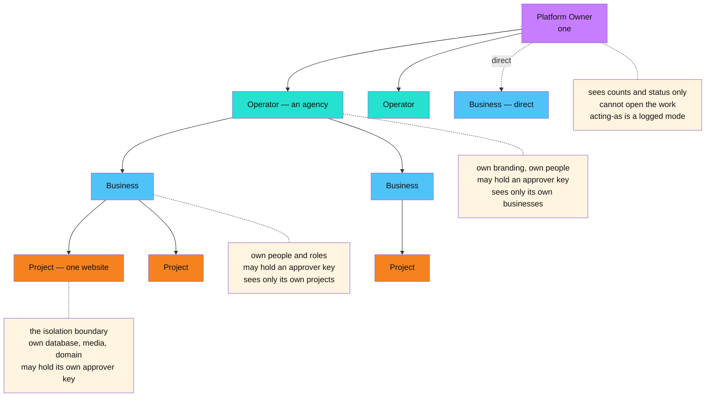
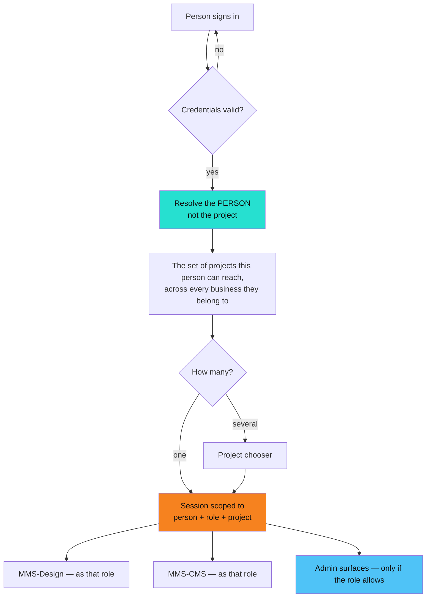
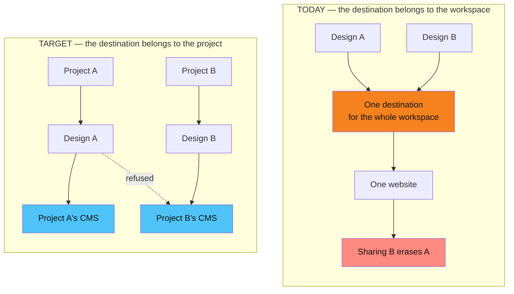
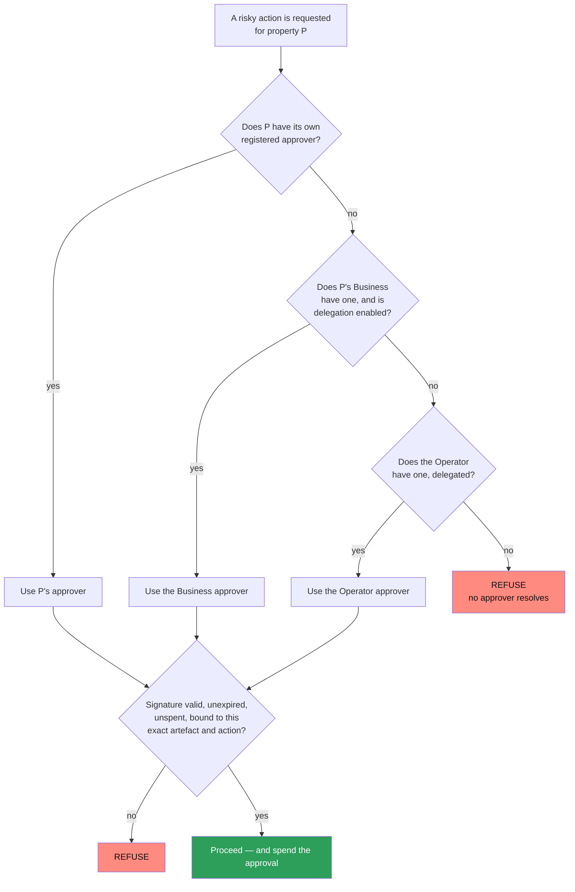
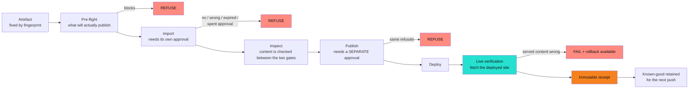
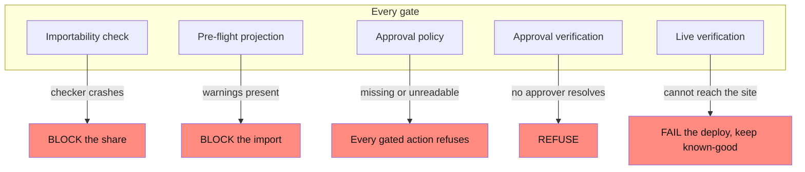
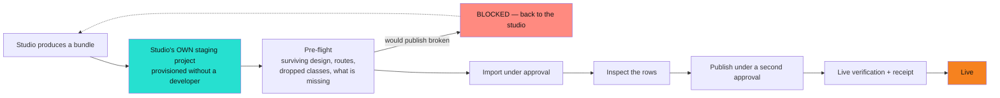
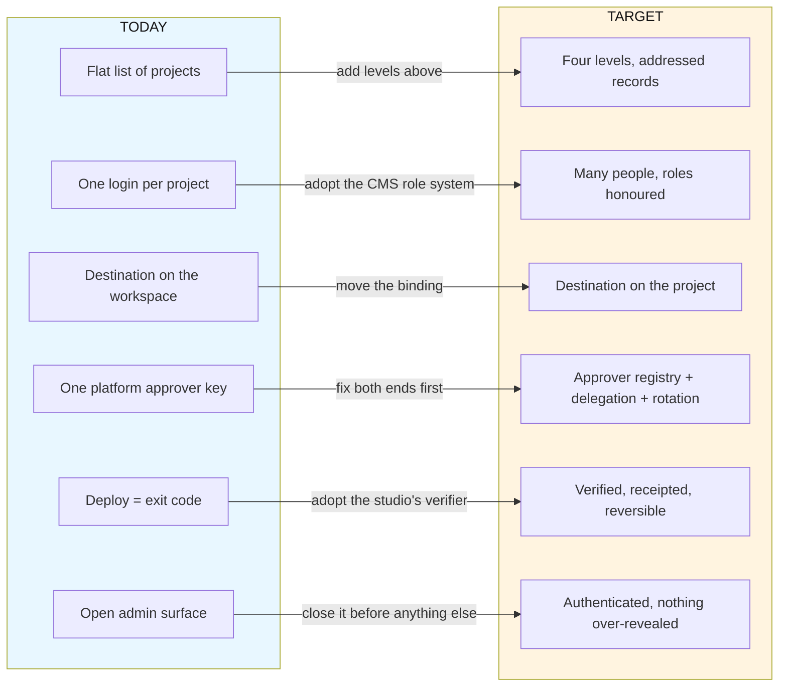

# MMSBUILD — Target Architecture

_The system re-drawn to meet the goal: **many businesses, and a change goes live with proof**. This is the design the PRD specifies against. It is an extension of what exists, not a rewrite — the expensive half is already built. Read the as-is first: [`../current-state/mmsbuild-current-state.md`](../current-state/mmsbuild-current-state.md). The requirements and their acceptance tests: [`mmsbuild-prd.md`](./mmsbuild-prd.md). The same material, drawn: [`mmsbuild-target-architecture.html`](./mmsbuild-target-architecture.html)._

---

## 0. How to read this

**Legend:** ✅ already works and is kept · 🟡 exists but changes shape · ❌ does not exist yet

**The words used here**

| Term | Meaning |
|---|---|
| **Platform Owner** | MMSBUILD itself. One. |
| **Operator** | An agency that resells the platform. Many. |
| **Business** | One company that owns websites. Many per Operator, or direct. |
| **Project** | One website. The unit of complete isolation. |
| **MMS-Design** | The AI design studio. Creates; never publishes. |
| **MMS-CMS** | The content system. The only thing that publishes. |
| **Control Plane** | The orchestrator: creates projects, routes people, deploys. |
| **Connector** | The machine door — an AI agent working a website without a person clicking. |
| **Relay** | The approval system. Issues owner-signed permission. |
| **Approver** | The identity whose signature authorises a risky action for a given property. |
| **Property** | Anything an approver can be attached to: an Operator, a Business or a Project. |

Two decisions are load-bearing throughout and are never traded away:

> **Approval is a per-property configurable approver, not one platform key.**
>
> **No check may fail open.** A check that cannot run reports failure — never a zero-findings pass.

---

## 1. What changes, and what does not

The argument for this design is that most of it already exists. Six things are kept exactly as they are.

| Kept unchanged | Why it survives |
|---|---|
| ✅ Per-project isolation — own database area, media, design workspace, domain, secrets | Enforced by the database itself, not by application code remembering to filter. This is the expensive half, and it is finished. |
| ✅ The design → CMS handover, with no duplicates on re-share | Works end to end. Only its *destination* changes. |
| ✅ Publishing to a real domain | Each project already has its own publishing target. |
| ✅ Central AI capacity | Projects draw on the platform's capacity; no per-project keys to manage. |
| ✅ Machine access for AI agents | Two doors already exist. Their reach becomes scoped, their capability does not change. |
| ✅ Signed approval, independently verified at both ends | The shape is right. The *key selection* is what changes. |

Six things change shape.

| Changes | From | To |
|---|---|---|
| 🟡 The hierarchy | One flat list of projects | Platform Owner → Operator → Business → Project |
| 🟡 Identity | One login per project, everyone treated the same | Many people per project, each with a role |
| 🟡 The CMS destination | Belongs to the design workspace | Belongs to the project |
| 🟡 The approver | One platform key for everything | Registered per property, delegated down, rotatable |
| ❌ Proof of a publish | A deploy is "live" because the deploy tool exited cleanly | Verified against the deployed site, recorded in an immutable receipt, reversible |
| ❌ The admin surface | Open on the public address | Authenticated, and nothing reveals a secret it does not have to |

---

## 2. The four levels, and where authority lives

Every level answers three questions: who can sign in here, what can they see, and **whose signature authorises a risky action here**.

### Diagram A — the levels



> 🔑 **The addressing rule.** Every stored record carries its full address — which Operator, which Business, which Project. A query that does not name an address returns **nothing**, never everything. This is what makes cross-business isolation a property of the data rather than a promise from the code.

**The Platform Owner is deliberately blind inside an Operator.** Counts, status and usage are visible; the work is not. Opening a business's work is a distinct, explicitly logged "acting as" mode, recorded as *platform staff, acting as that business* — not as the business itself.

**Branding flows down one level.** An Operator's branding replaces the platform's across everything that Operator owns. A Business that sits directly under the Platform Owner keeps the platform's branding.

---

## 3. Identity and session

Today the sign-in names a project and everybody is treated identically. The target separates three things that are currently one.

### Diagram B — signing in



**Three things must change to get there:**

1. **More than one person per project.** Today a project holds exactly one login, and inviting a second person **overwrites the first person's account** rather than adding one. That is a data-loss defect, not merely a missing feature.
2. **A role on the session.** The session must carry who the person is and what they may do, not just which project they are in.
3. **The role must be honoured downstream.** Today a portal sign-in arrives in the CMS as a full owner with the password re-entry already satisfied — so the CMS's own role system is bypassed entirely. The target keeps that system and *maps into* it, rather than stepping over it.

> **This is cheaper than it looks.** The CMS already has a complete role and capability system — four roles and around forty named capabilities, already enforced on every request. The portal's own wire format already carries role, business, project and site fields and already recognises four role names. The target adopts both rather than inventing a third role model.

---

## 4. One project, one website

This is the fix for the worst behaviour in the as-is system: a second design shared into the same project silently destroys the first website.

### Diagram C — the destination moves



**The rule, stated once:** *one project is one domain is one website*, and a design can only ever reach its own project's CMS. Two domains are two projects, never one.

**What must be observably true:**

- A design resolves its destination **through its own project**. There is no way to aim it elsewhere, by argument or by configuration.
- A second website shared into a project that already has one is either **refused with a clear message** or **lands as its own project**. It is never a silent overwrite, and the first website's pages still resolve afterwards.
- A change published in one project never appears on another project's domain.

---

## 5. Governance — the approver registry

The platform key is the pilot arrangement. The target is an approver registered per property.

### Diagram D — resolving an approver



**Registration, delegation, rotation — all three are first-class:**

- **Register** — an approver is attached to a property with an effective-from stamp. The registry is the only place the mapping lives.
- **Delegate** — a Business-level approver may cover its own projects when that is configured. It can never cover another Business's projects.
- **Rotate** — replacing a property's approver takes effect immediately: approvals signed by the retired identity stop being accepted from that moment. History is retained so an old receipt can still be explained, but a retired identity can never authorise anything new.
- **Revoke** — removing an approver without a replacement means the property has **no** approver, and every gated action there refuses. That is the correct failure.

> ⚠️ **The blocker to fix first.** Today the two ends disagree. The side that *checks* approvals can already resolve a per-property approver. The side that *issues* them still verifies every approval against a single platform-wide identity — so it would refuse to issue a property-signed approval before the checking side ever saw it. **Per-property approval cannot function end to end until both sides resolve the same approver for the same property.** Everything else in this section depends on that.

**No master key.** A key that approves one property must fail on another. There is no identity that satisfies two properties' approvals, and no fallback that quietly widens scope: a property whose approver entry is broken **refuses** rather than falling back to the platform identity.

---

## 6. The proof chain

The spine of the whole target: a change goes live *with proof*. Six links, each of which refuses rather than degrades.

### Diagram E — approval to proof



**Import and publish are gated separately, on purpose.** One approval cannot cover both. Between them the rows are inspectable, so a person or an agent can look at what actually landed before anything reaches the public.

**Live verification is a real fetch, not a status code.** It retrieves the deployed site and confirms the *served content* — specifically, a deliberately missing route serving a fallback page must be caught as a failure. A deploy tool exiting cleanly is not evidence that a website works.

**The receipt names five things** and cannot be edited or deleted afterwards: the approved content's identity, the deploy identity, the live-verification result, the timestamp, and the previous known-good reference. It should also name the build that performed the deploy — today that is known at the moment of action but never written down.

**Known-good is retained before every push**, and recovery is reconstruction from it rather than a hope that something old is still lying around. Today the publish mechanism wipes the previous generation at the *start* of each publish, so there is currently nothing to return to.

> **This is cheaper than it looks, too.** The studio already has a deploy path that polls the deployed address until it is reachable, and already keeps a deploy record carrying the provider's deploy identity, a reachability timestamp, a status message and the target. The target adopts that verifier and that record rather than writing new ones — see §9.

---

## 7. Fail-closed by construction

One rule, applied everywhere: **a check that cannot run reports failure.** No check is permitted to pass by accident, by crash, or by absence of configuration.

### Diagram F — every gate and its failure edge



**Three holes exist today and each is closed by the target:**

| Hole | Today | Target |
|---|---|---|
| The importability check | If the checker crashes, the share goes through **unchecked** and looks successful | The share is blocked, and the blocked result is distinguishable from a success |
| The pre-flight | Reports correctly, then **nothing blocks on it**; a bundle that would publish broken imports anyway | The pre-flight is the gate, and it covers publish as well as import |
| The notifier | Silently does nothing if its destination is unset — so "no notifications" and "nothing happened" look identical | Missing configuration is a startup failure, the way every other missing setting already is |

---

## 8. The repeatable push

Goal 2: the next website goes in with **zero developer round trips**. That is a metric, and it is the milestone test.

### Diagram G — the push, with nobody in the way



**What makes this possible, and what is missing:**

| Needed | State |
|---|---|
| A pre-flight that reports surviving design, dropped classes, resolved routes and what is missing | 🟡 Reports all four correctly — but does not block, and does not cover publish |
| A staging project the studio drives itself | ❌ The developer's environment is still the only place a bundle can be tested |
| Font installation as a standard step | ✅ Works, and is idempotent — re-running with the same set changes nothing |
| Fonts surviving a replace-style import | ❌ A re-share clears the site's colour tokens and fonts as part of replacing the design |
| Per-page SEO rendering without a per-project add-on | 🟡 Must render from the core renderer in the served page |

---

## 9. Today → target, as a delta

### Diagram H — what has to be built



### The reuse inventory

The case that this is affordable rests on five things that already exist and are adopted rather than rebuilt:

1. **The CMS's role and capability system** — four roles, around forty named capabilities, already enforced on every request, with the deliberate design that a new capability is a conscious decision rather than an automatic grant. The target maps portal roles into it instead of inventing a parallel model.
2. **The portal's wire format** — it already carries role, business, project and site, and already recognises four role names. The levels can be expressed without a new protocol.
3. **The agent permission model** — verbs, presets and per-content-type scoping. A working, tested role model that the people-facing roles can mirror.
4. **The studio's deploy path** — it already polls a deployed address until it is reachable and keeps a deploy record with the provider's deploy identity, a reachability timestamp, a status message and the target. This is precisely what the proof chain needs, and it is written and tested.
5. **The atomic publish swap** — already correct, already guarantees a visitor sees one complete generation or the other. It needs retention added, not redesign.

### What genuinely has to be built from nothing

| ❌ | Why it is unavoidable |
|---|---|
| The Operator and Business levels | No concept of them exists at any layer |
| An approver registry with delegation and rotation | Today's approver is a single identity in a configuration file |
| Per-property approval on the issuing side | The blocker in §5 — the checking side alone is not enough |
| Publish receipts | Nothing durable records what went live |
| Live verification on the platform's own deploy path | The studio has one; the platform's does not |
| Known-good retention and rollback | No rollback exists anywhere in the system |
| Admin authentication | The admin surface has none |

---

## 10. Sequencing

The order is forced by dependency, not preference.

```
Phase 0  Close the admin surface          ← everything below assumes an authenticated admin
Phase 1  Operator and Business levels; roles and multiple people
Phase 2  Scoped visibility and Operator branding
Phase 3  One project, one website — the destination moves to the project
Phase 4  Governance: approver registry, separate gates, fail-closed, proof chain
Phase 5  The repeatable push — pre-flight as the gate, staging self-service
Phase 6  Productionisation — safe replace, complete clear-all, cold-start clarity
```

Phase 0 is first because every later phase assumes an authenticated admin; building levels and roles on an open control plane means building them twice. Phase 4's approver work cannot start until the issuing side supports per-property approvers. Phase 3 depends on the levels existing, because a per-project destination needs a project record to hang from.

The requirement-by-requirement detail, with an acceptance test attached to each, is in [`mmsbuild-prd.md`](./mmsbuild-prd.md).
